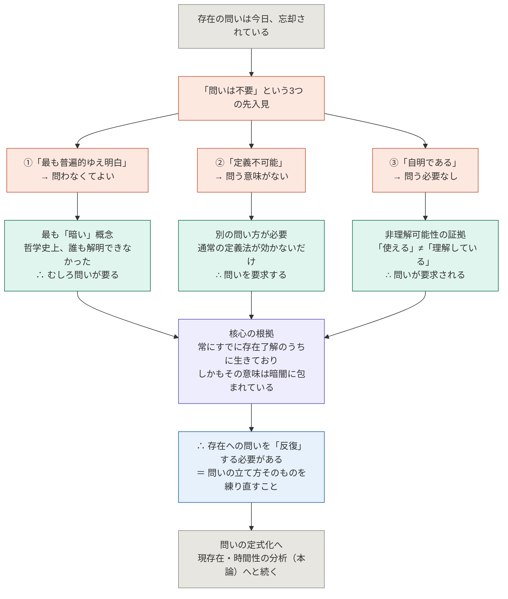

## 「存在への問いを明示的に反復することの必要性」はどこにあるのか

*ハイデガー『存在と時間』第1節*

---

### まず「反復」という言葉の意味

この節が論じるのは、**なぜ存在への問いを今さら立て直さなければならないのか**という問いです。著者は最後にこう言っています。「存在への問いを反復するとは、まずもって問いの立て方を十分に練り上げることを意味する」と。

「反復」は「同じことをやり直す」ではなく、忘れられ歪んでしまった問いを正しく立て直すことを指します。答えを出すためではなく、問いそのものを再構成するために「反復」が必要なのです。

---

### 論証の全体構造

著者は「存在の問いは不要だ」とする三つの先入見を順番に取り上げ、それぞれを論駁することで、逆に問いの必要性を炙り出す構成をとっています。

---

### 先入見①「存在はもっとも普遍的な概念だから、問いは不要」

この先入見は「普遍なら明白なはずだ」という直観に乗っかっています。しかし著者が指摘するのは、存在の普遍性は**類（Gattung）の普遍性とはまったく別物だ**ということです。犬という概念が哺乳類・動物という上位概念で規定されるように、類の普遍性はより高次の概念によって内容が確定されます。ところが存在はそのような上位概念を持たず、あらゆる類的普遍性を「超越する」ものです。

アリストテレスはこれをアナロギアの統一として捉え、中世哲学はトマス派・スコトゥス派でさまざまに論じ、ヘーゲルに至っても問題を引き継いだ——しかし誰一人として明晰な解答を出せなかった。この哲学史の事実が示すのは、「存在」は最も明晰な概念どころか「**最も暗い概念**」だということです。だからこそ問わなければならない。

---

### 先入見②「存在は定義不可能だから、問うても無駄」

「定義は最近類と種差によってなされる」という伝統的な定義観によれば、確かに存在は定義できません。しかし著者はここで論理の転換を見せます。定義できないのは、存在が存在者ではないからにすぎない。そこから正当に導けるのは「伝統的な定義方式が使えない」ということだけであって、「問いが不要だ」という結論は出てこない。むしろ、通常の方式が効かないという事実は、**別の問い方を探すことを要求する**のです。

「存在の定義不可能性は、その意味への問いを免除するのではなく、まさにそれを要求する」——これがこの論駁の結論です。

---

### 先入見③「存在は自明だから、問いは済んでいる」——核心

三つのうち最も本質的なのがこれです。誰もが「空は青い」「私は嬉しい」と言い、それで通じている。存在概念は日常的にすでに機能している——だから問題はない、というわけです。

著者はここで逆説的な一手を打ちます。「こうした平均的な理解可能性は、まさに**非理解可能性を証示する**にすぎない」。使えること＝理解していること、ではない。むしろ問われることなく当然視されているその事実こそが、理解の不在を示しています。水が何であるか説明できなくても水は飲める——しかしそれは水を理解していることにはならない。

そしてこの観察から、著者は根本的必然性を取り出します。

> 「我々が常にすでにある存在理解のうちに生きており、しかも存在の意味が同時に暗闇に包まれているということは、『存在』の意味への問いを反復することの根本的必然性を証明している」

---

### 三つの論駁の非対称性

重要なのは、三つの論駁が「不要でもない」と言うだけにとどまらず、それぞれ**異なる角度から必要性を積極的に導いている**点です。

| 先入見 | 「不要」とされた根拠 | 論駁が示すこと |
|:--|:--|:--|
| ①最も普遍的 | 普遍なら明白なはず | 哲学史が証言する——誰も解明できなかった。最も暗い概念だからこそ問わねばならない |
| ②定義不可能 | 定義できないなら問えない | 「存在者でない」という事実が分かっただけ。通常の定義法が効かないなら、別の問い方を探すほかない |
| ③自明 | 使いこなせているなら済んでいる | 「使える」は「理解している」の証拠にならない。自明性そのものが、問いの不在という謎を内包している |

---

### 「反復」の必然性の所在

以上を総合すると、著者が言っている「必要性のありか」は一点に収束します。

われわれは「ある」という言葉を絶えず使い、ア・プリオリに存在了解を前提としながら生きている。それにもかかわらず、その意味は問われたことがなく、答えられてもいない。この二重性——**了解のうちに生きつつ、その内容は暗いままにある**という事態——こそが問いを要求する根拠です。

そして「明示的に反復する」とは、答えを求めてもう一度試みることではなく、問いが正しく立てられてこなかったこと自体を認識し、**問いの定式化から出直すこと**を意味します。この節全体はそのための準備であり、だから著者は「まずもって問いの立て方を十分に練り上げることを意味する」という言葉で締め括るのです。