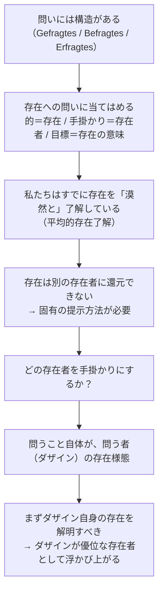

## 「§2」は何だと言っているのか

*ハイデガー『存在と時間』第2節*

---

### この節の結論を一言で

「存在とは何か」を問うためには、問いの*構造*を先に解きほぐしておかなければならない。そして、その解きほぐしを進めてゆくと、**問う者である私たち自身（ダザイン）が、この問いにとって特別な役割を担う存在者だ**、という事態がおのずと浮かび上がってくる――これが§2の骨子である。

---

### 「問い」には必ず三つの部品がある

ハイデガーはまず、*どんな問いにも共通する構造*を取り出すことから始める。

> あらゆる問うことは一つの探し求めることである。あらゆる探し求めることは、探し求められるものからあらかじめ与えられた方向をもつ。

つまり、問いはデタラメな方向へは向かえない。問う前から、ぼんやりとでも「こちらの方向」という見当がついているから、初めて問いが成り立つ。

その上でハイデガーは、問いを構成する三つの部品を区別する。

| 用語（原語） | 日本語の意味 | 存在への問いに当てはめると |
|---|---|---|
| 問われているもの（Gefragtes） | 問いが向かう的 | 「存在」そのもの |
| 問い掛けられるもの（Befragtes） | 答えを引き出すために直接触れるもの | 存在者（目の前にある物や人） |
| 問い究められるもの（Erfragtes） | 問いが最終的に到達したいもの | 存在の「意味」 |

この三区分は、「存在への問い」が何を的にして、どこから手掛かりを得て、何を目指しているのかを明確にするための骨格となる。

---

### すでに「存在了解」はある――だがそれは霧の中にある

次にハイデガーは重要な逆説を突きつける。

> われわれは「存在」が何を言わんとしているのかを知らない。しかしすでにわれわれが「『存在』とは何か」と問うとき、われわれは「ある（ist）」の或る了解のうちに身を保っているのであって、しかも「ある」が何を意味するのかを概念的に固定することはできない。

私たちは毎日「机が**ある**」「彼は**いる**」「それは**存在する**」と言い続けている。「ある」という言葉を使いこなしている以上、何らかの了解は持っている。ところがいざ「では『ある』とは何か」と正面から問われると、言葉に詰まる。

この「使えるが説明できない」状態を、ハイデガーは**平均的で漠然とした存在了解**と呼ぶ。そしてこれを「単なる無知」として切り捨てるのではなく、「解明を必要とする積極的な現象」として受け取る。ここがハイデガーらしい発想の転換点だ。

---

### 「存在」は別の存在者で説明できない

次の一歩は、問われているもの（存在）の特殊性の確認だ。

> 存在者の存在は、それ自身が存在者で「ある」のではない。

これは何を言っているか。たとえば「りんごとは何か」と問われれば、「果物の一種で、バラ科で……」と他のものとの関係で説明できる。つまり**あるものを別のものへ還元**して説明できる。しかし「存在」については、それ自体が別の存在者ではない以上、同じ手が使えない。

> 存在者を存在者として、その由来において他の存在者へ還元することによって規定しないということ

これがハイデガーの指摘する「哲学の第一歩」だ。存在を物語のように語ること（ある神話的始まりからの由来として語ること）も、別の存在者から演繹することも禁じられる。だからこそ、存在は**それ固有の提示の仕方と概念性**を要求する、と言われる。

---

### どの存在者を手掛かりにするか――問う者自身の登場

存在を直接つかまえることはできないから、どこかの存在者の存在を手掛かりにして問いを進めるしかない。ではどの存在者から出発すべきか。

ハイデガーはここで、問いそのものの構造に目を戻す。

> 何ものかへ眼差しを向けること、何ものかを理解し概念的に把握すること、選ぶこと、何ものかへ接近することは、問うという働きを構成する諸態度であり、それ自体ある特定の存在者──すなわち問う者である我々自身がそのつど存在するところの存在者──の存在様態である。

「問う」という行為は、空中で起きるのではない。それは**問う者（私たち）**という存在者の存在様態として起きている。ということは、存在への問いを正しく立てようとする以上、まず**問う者自身の存在**を解明しておかなければならない。

この「問う者」を、ハイデガーは**ダザイン**（Dasein、「現-存在」とも訳される）と呼ぶ。ここでは「問うことができる、自分の存在が問題になりうる存在者」という程度に理解しておけばよい。

---

### 「循環論法ではないか」という反論への答え

ここで当然の疑問が生じる。「存在者（ダザイン）の存在を先に解明しなければならない、しかし存在とは何かを問うのがそもそもの目的だ。これは循環していないか」という疑問だ。

ハイデガーはこれを正面から受け止め、しかし「循環ではない」と答える。

> 存在の「前提」は、存在へのあらかじめの眼差し向けの性格をもっており……この問いに答えることにおいて問題になるのは、導出による基礎づけではなく、提示による地盤の開示だからである。

ポイントは「証明の型」の違いだ。

| 型 | 内容 | 問題点 |
|---|---|---|
| **演繹的証明** | 前提→命題→結論を論理で繋ぐ | 前提が循環すれば全体が崩れる |
| **提示による開示** | すでに動いている了解を、明示的に見えるようにする | 「すでにある了解」を土台にするだけで、論理的循環ではない |

存在への問いが頼るのは後者だ。私たちはすでに存在を了解しながら生きている。その了解を出発点として、問いをより明示的な形に練り上げてゆく――これは「前提を答えにすり替える循環」ではなく、「地平を広げてゆく開示の運動」だ、とハイデガーは言う。

---

### §2の全体像を振り返る

この節でハイデガーが積み上げた論点を整理すると、次のようになる。

| 論点の段階 | 内容 |
|---|---|
| ① 問いの構造の分析 | 問いには「的・手掛かり・目標」の三部品がある |
| ② 存在了解の確認 | 私たちはすでに存在を漠然と了解している |
| ③ 存在の特殊性 | 存在は別の存在者に還元できない |
| ④ 出発点の選択 | 問う者自身（ダザイン）が優位な手掛かりとなる |
| ⑤ 循環論法への反論 | これは演繹の循環ではなく、開示の運動である |

そして節の末尾でハイデガーは、ダザインの「優位」がまだ*完全には証明されていない*と正直に認める。次節以降の仕事がそこに残されているわけだが、§2の時点でその輪郭が「告げ知らされた」のだ、と締めくくる。存在への問いを問いとして真剣に立てようとすれば、**問う者自身が問いの中心に引き込まれてくる**――その事態がこの節全体を通じて示されている。
