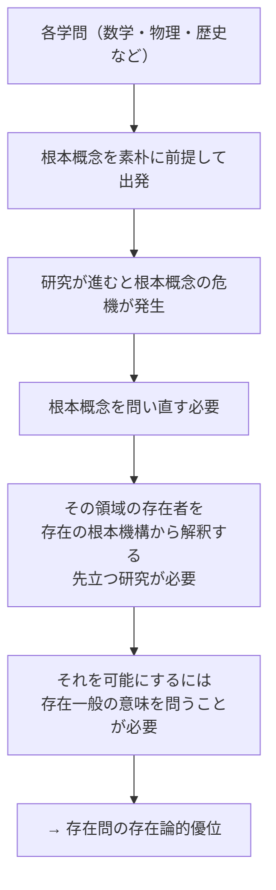

## 「§3」は何だと言っているのか

*ハイデガー『存在と時間』第3節*

---

### この節のいちばん言いたいこと

一言で言えば、**「存在への問い」は、あらゆる学問の土台を掘る問いだ**、ということです。

数学・物理学・歴史学……どんな学問も、「この分野で扱うものとは何か」という根本的な問いに正面から答えないまま出発しています。その土台を掘り下げようとすれば、最終的に「そもそも存在とは何か」という問いに行き着く。だから存在問は「浮ついた思弁」どころか、最も根っこにある、最も具体的な問いなのです――これがこの節の結論です。

---

### 問いの「役立ち」を先に確認する

節の冒頭でハイデガーは、まず読者が抱きそうな疑問を自分で立てています。

> それは単に、いやそもそも、最も普遍的な普遍性についての浮動的な思弁の仕事にすぎないのか――それとも、それは最も原理的にして同時に最も具体的な問いなのか。

「存在を問うなんて、役に立たない抽象的な話では？」という素朴な疑いに正面から向き合うわけです。この節全体は、その疑いを段階的に解消しようとします。

---

### 学問はどこから出発しているか

ハイデガーがまず見せるのは、すべての学問の構造です。歴史・自然・生命・言語……それぞれの分野は、扱う「事象の領域」をひとまず素朴に区切ることから始まります。その区切り方を支えている最初の規定を、ハイデガーは**根本概念**と呼びます。

根本概念とは、簡単に言えば「この学問は何を相手にしているか」についての、研究が始まる前の了解です。数学なら「数とは何か」、生物学なら「生命とは何か」、という最初の線引きがそれにあたります。

> ある学問の水準は、それがその根本概念の危機にどこまで耐えうるかによって決定される。

学問の本当の前進は、結果を積み上げることではなく、この根本概念を問い直すことで起きる――これがハイデガーの観察です。

---

### 各学問で起きていた「危機」の実例

ハイデガーはこの主張を抽象論で済ませず、当時（1920年代）の各学問の状況を具体的に並べています。

| 学問分野 | 起きていた「危機」の内容 |
|---|---|
| 数学 | 形式主義 vs 直観主義。「数学の対象とは何か」をめぐる基礎づけ論争 |
| 物理学 | 相対性理論。「自然それ自体の連関はどうあるか」を問い直す試み |
| 生物学 | 機械論・生気論を超えて「生けるものの存在様式」を再規定しようとする動き |
| 歴史学 | 伝承・叙述を突き抜けて「歴史的現実そのもの」へ迫ろうとする衝動 |
| 神学 | 既存の教義体系の概念が信仰の経験をかえって覆い隠しているという気づき |

どの分野でも起きていることは同じです。「自分たちがそもそも何を扱っているか」への問い返しが不可避になっている。ハイデガーはここに、単なる流行ではなく、学問の構造が必然的に生み出す動きを見ています。

---

### 「先立つ研究」が必要だという論理

根本概念の危機が各学問の内側から繰り返し起きるとすれば、そもそも最初からその土台を明示的に掘り下げておく研究があってよいはずです。ハイデガーはこれを**生産的な論理学**と呼びます。

「後追いの論理学」（既存の学問の方法論を事後的に整理する作業）ではなく、ある存在領域に最初から飛び込んで、その存在の仕組みを解明し、その成果を各学問に提供する――そういう先行的な研究です。

> かかる研究は実証的諸学に先行しなければならない。そしてそれを為しうるのである。プラトンとアリストテレスの仕事はそのことの証である。

たとえばカントの『純粋理性批判』の意義も、認識理論を整備したことではなく、「自然一般に属するもの」を摘出した、つまり自然という存在領域のアプリオリな構造を示したことにある、とハイデガーは言います。

---

### 存在論もまた、存在問なしには盲目になる

さらに一歩踏み込んで、ハイデガーは存在論（「存在者の存在を問う探究」全般）それ自体にも同じ問題があると指摘します。

> あらゆる存在論は……それに先立って存在の意味を十分に解明し、この解明を自らの根本課題として把握していないならば、根本において盲目のままにとどまる。

つまり、「存在者の存在を問う」各種の存在論は、各学問の根本概念を支えることができる。しかしその存在論自体が「存在とはそもそも何か」を問わずに動いているとしたら、その存在論もまた盲目なのです。

ここに三つの層が現れます。

| 層 | 内容 |
|---|---|
| 実証的諸学 | 個々の存在者を扱う（物理学・歴史学など） |
| 存在論 | 各領域の存在者の「存在」を問う（各学問の基礎づけ） |
| 存在への問い | 「存在」そのものの意味を問う（すべての存在論の基礎づけ） |

この三層構造の最下段にあるのが、ハイデガーが取り組もうとしている問いです。

---

### まとめ：存在問の「存在論的優位」とは何か

「存在への問い」が優位にあるというのは、権威や格式の話ではありません。構造上の話です。

- 実証的な学問は、根本概念を前提して動く。
- 根本概念は、その領域の存在者が「どうある」かについての了解を前提している。
- その了解を明示的に解明しなければ、どんな学問も自分の土台を見えていないまま動くことになる。
- そして存在論もまた、「存在そのものの意味」を問わなければ同じ盲目さに陥る。

だから、存在の意味への問いは、すべての学問的探究の中で**最も根源的な位置**にある。これが「存在論的優位」の意味です。

節の末尾でハイデガーは「しかし、こうした事象＝学問的な優位は唯一の優位ではない」と付け加えます。次節（§4）では、もう一種類の優位――存在論的優位とは別の優位――が論じられることが予告されています。
