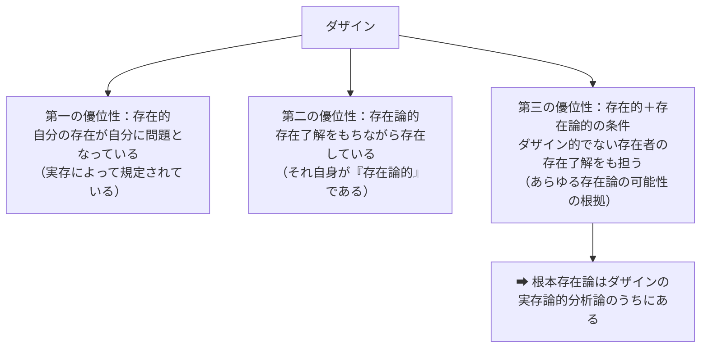
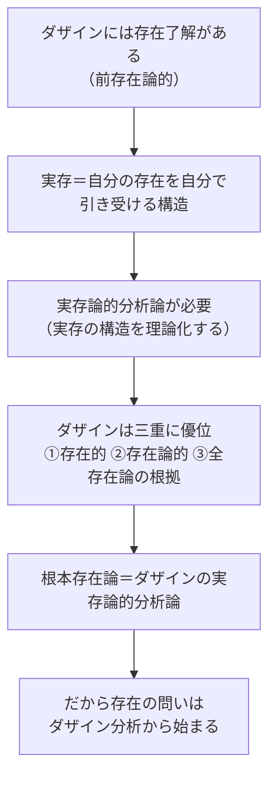

## 「§4」は何だと言っているのか

*ハイデガー『存在と時間』第4節*

---

### この節の結論を一言で言うと

「なぜ人間（ダザイン）を最初に問わなければならないのか」——その理由を三段階で積み上げ、最終的に「**ダザインこそがあらゆる存在論の根拠であり、だから存在の問いはダザイン分析から始めなければならない**」と宣言する節です。

節のタイトルは「存在問題の存在的優位」ですが、内容はむしろ「なぜダザインが特別なのか、その優位性を三つの角度から示す」という論証です。

---

### 登場する主な用語の整理

| 用語 | 一言で言うと |
|------|-------------|
| **ダザイン**（Dasein） | ここでは「人間」のこと。ただし、「存在を問う能力をもつ存在者」として特別視されている |
| **存在的**（ontisch） | 「実際に何かが在る・起きている」という事実のレベル |
| **存在論的**（ontologisch） | 「在るとはどういうことか」を問う理論のレベル |
| **実存**（Existenz） | ダザインだけに固有の在り方——自分の存在を自分のこととして引き受ける在り方 |
| **前存在論的**（vorontologisch） | 理論化はしていないが、何となく「在る」を分かっている状態 |
| **根本存在論**（Fundamentalontologie） | すべての存在論の土台となる問い。ダザインの分析がそれにあたる |

---

### 第一段階——ダザインはなぜ「特別な存在者」なのか

ハイデガーはまず、他の存在者（石や動物など）とダザインを比べます。

> この存在者にとって、その存在においてこの存在それ自身が問題となっている。

石ころは「自分が石だ」などとは気にしない。しかし人間は、生きることそのものを——うまく生きているか、どう生きるべきかを——常に問いながら存在しています。これが「自己の存在が自分にとって問題になっている」という意味です。

さらにダザインは、「在るとはどういうことか」をある程度すでに分かって（＝**了解して**）生きています。哲学書を読まなくても、私たちは日常的に「ある」と「ない」を区別し、「本物」と「偽物」を区別する——これが**前存在論的な存在了解**です。

ハイデガーはここでダザインの最初の特徴を打ち出します：

> ダザインの存在的卓越性は、それが存在論的であるという点にある。

つまり「事実として存在している（存在的）」と同時に「存在を了解しながら存在している（存在論的）」という、他の存在者にはない二重性がダザインにはある、ということです。

---

### 第二段階——「実存」と「実存性」の区別

ここで議論は一段掘り下がります。

ダザインは「自分の存在を自分のこととして引き受けながら生きる」——これを**実存**と呼びます。そして実存は、他人が代わりに引き受けることはできない。

> 実存の問いは、実存することそのものによってのみ清算されうる。

「どう生きるか」は、自分が実際に生きることでしか答えられない、ということです。

ここでハイデガーは二つのレベルを区別します：

| レベル | 名称 | 内容 |
|--------|------|------|
| 日常的・実践的 | **実存的**（existenziell） | 「私はどう生きるか」という個人の問い |
| 哲学的・理論的 | **実存論的**（existenzial） | 「実存とはそもそもどういう構造か」という分析 |

§4が扱うのは後者——「実存の構造そのものを解明する」という哲学的作業です。これを**実存論的分析論**と呼びます。

---

### 第三段階——ダザインの「三つの優位性」

この節のクライマックスです。ハイデガーはダザインが他のあらゆる存在者に対して**三重の意味で優位**にあると整理します。

> かくしてダザインは、他のあらゆる存在者に先立って、存在論的に第一義的に問われるべきものであることが明らかになった。

第三の優位性が決定的です。ダザインは「世界の内に存在する」ものとして、石や木や道具など**自分以外の存在者の「在り方」もすでに了解しながら**生きています。つまり物理学も生物学も歴史学も、すべての学問はダザインの存在了解の上に乗っかっている。だから**ダザインの存在を解明すること＝根本存在論**になる、というわけです。

---

### 「学問」への言及——節の冒頭の意図

節の冒頭でハイデガーは学問に触れています。

> 諸学はダザインの存在様式であり、その様式においてダザインは、みずからがある必要のない存在者にも関わる。

物理学は石を研究するが、石が物理学をするわけではない。研究するのはダザインです。学問という営みもまた「ダザインの在り方の一つ」にすぎない——これによってダザインが学問よりも根底にある問いであることが示されます。

---

### アリストテレスとトマスへの言及——歴史的系譜

節の後半では、この洞察が哲学の歴史のなかにも顔を出していたと指摘されます。

- **アリストテレス**：「魂はある意味で存在者である」——感覚と思惟によって魂はあらゆる存在者を開示する
- **トマス・アクィノス**：「あらゆる存在者と自然に合一するよう生まれついた存在者＝魂」——「真」という概念を導くためにこの存在者の特別な地位を使った

ハイデガーの評価は辛口です：彼らはダザインの優位性には気づいていたが、「なぜそうなのか」を**存在論的に解明しなかった**、と。本書が初めてその問いを正面から立てる、という自負がここにあります。

---

### この節の全体的な流れ（まとめ）

---

### 読後のポイント

§4は「なぜこの本はまず人間の分析をするのか」という問いへの答えです。哲学の本なのに人間論から始まるのは奇妙に見えますが、ハイデガーの論理は明快です——「存在の意味を問えるのはダザインだけであり、そのダザイン自身がすでに存在を了解しながら生きている。だからダザインを解明することが、存在の意味への問いの入口になる」。

§4を読み終えた時点で、『存在と時間』全体の設計図が初めて見えてきます。
