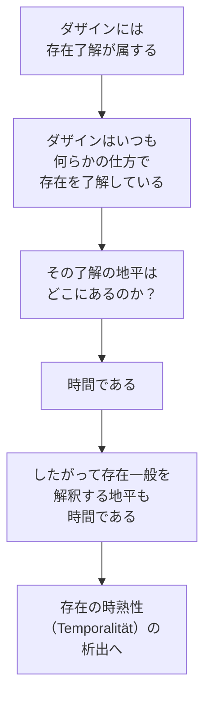

## 「§5」は何だと言っているのか

*ハイデガー『存在と時間』第5節*

---

### この節で言いたいこと――一言で

**ダザインを正しく分析することが、存在一般の意味を問う前提になる。そのためには、ダザインに「外から」概念を持ち込まず、ダザインが日常においてあるがままに自分を示す姿から出発しなければならない。そして、その分析を最後まで貫くと、「時間」こそがあらゆる存在了解の地平であることが見えてくる。**

---

### ダザインとは何か――念のための確認

「ダザイン（Dasein）」とはハイデガーが人間存在を指すために使う言葉で、「そこにある」という意味をもつドイツ語です。人間は単に「存在している物」ではなく、自分の存在について何らかの理解をもちながら生きている特別な存在者です。この節はその「ダザイン」を正しく分析するにはどうすればよいか、またなぜそれが必要なのかを論じています。

---

### 第一段階――ダザインは「最も近く、最も遠い」

ハイデガーはまず、一見不思議なことを言います。

> ダザインは存在的に近いだけでなく、あるいは最も近いものでさえあるのであって——それにもかかわらず、あるいはまさにそれゆえに、ダザインは存在論的には最も遠いものである。

「存在的に近い」とは、私たちが自分自身であるという意味での近さです。自分のことは毎日経験しているし、日々の実感もある。ところが「存在論的に遠い」とは、自分の存在の**構造**（なぜ、どのようにして存在しているのか）については、かえってよく見えていない、という逆説です。

なぜそうなるのか。ダザインはふだん、自分の存在を自分自身の内側から問い直すのではなく、自分が関わっている「世界のもの」の側から了解しようとする傾向があります。つまり「私はこういう仕事をしている人間だ」「こういう関係の中にいる」という形で自分を理解する。ハイデガーはこれを「世界了解のダザイン解釈への存在論的な逆照射」と呼びます。鏡が反射するように、世界からの像で自分を見ているわけです。

この傾向があるため、日常的な自己理解をそのまま分析の「導きの糸」にすることはできない、とハイデガーは主張します。

---

### 第二段階――では、どうやってダザインに近づくのか

ダザインが難しい相手だとわかったうえで、ハイデガーは接近の方針を示します。

- **外から「人間とはこういうものだ」という観念を持ち込んではならない。**（たとえば「人間は理性的動物だ」といった定義から出発してはいけない）
- **ダザインが「さしあたりたいていの場合」にいる姿、すなわち平均的な日常性から出発しなければならない。**

「平均的な日常性」とは、特別な状態（英雄的な決断の瞬間や極限的な状況）ではなく、ごく普通の、あたりまえの日常のことです。そこにこそ、ダザインの**本質的な構造**が貫き通っているとハイデガーは考えます。

同時に、ハイデガーは既存のダザイン解釈の成果――心理学・人間学・倫理学・文学・歴史叙述など――を否定しているわけではありません。ただし、こう問います。

> これらの解釈は、実存的（existenziell）に根源的であったとしても、同じく根源的に実存論的（existenzial）に遂行されたのかどうか。

「実存的」とは生きた経験のレベルでの深さ、「実存論的」とは存在の構造を概念的に掴んだかどうかです。優れた文学や伝記が人間を深く描いていても、それはまだ存在の構造を**哲学的に**解明したことにはならない、ということです。

---

### 第三段階――分析論の限界と目標

ハイデガーは正直に、この分析論が何をして何をしないのかを明示します。

| できること | できないこと |
|---|---|
| ダザインの存在の構造を取り出す（予備的分析） | ダザインの存在の意味まで完全に解釈すること |
| 存在解釈のための「地平」を開示する準備 | 人間学・倫理学を丸ごと基礎づけること |
| より高次の分析のための足場を作る | 存在論の完成版を与えること |

分析論は「不完全」でも「失敗」でもなく、意図的に「予備的」なものとして設計されています。目的は地平を開くことであり、目的地への到達そのものではない、とハイデガーは述べています。

---

### 第四段階――時間こそが、存在了解の地平である

節の後半で、ダザインの存在の意味として「**時間性（Zeitlichkeit）**」が提示されます。

ここで重要なのは「時間」の意味が拡張されることです。ふつう「時間的」といえば「時間の中にある（はかないもの）」を指し、「非時間的」な数学の真理や「超時間的」な永遠と対比されます。しかしハイデガーはそれでは不十分だと言います。

> 「無時間的」なものも「超時間的」なものも、その存在という観点においては「時間的」なのである。

つまり、存在するものはすべて——時間を超えた真理でさえも——「時間の地平から初めて理解できる」という意味で「時間的」だということです。

この区別を明確にするため、ハイデガーは「時間的（zeitlich）」という従来の語とは別に、**「時熟的（temporal）」** という言葉を導入します。存在の意味を時間から規定することを、「存在の時熟的規定性（temporale Bestimmtheit）」と呼ぶわけです。

---

### 「通俗的な時間了解」との対決

ハイデガーはさらに、アリストテレスからベルクソンに至る伝統的な時間論との対決を予告します。

伝統的に「時間」は存在者を分類する基準として「おのずと」使われてきました（「時間の中にある自然」対「時間を超えた数」など）。しかしなぜ時間がそのような基準になりうるのかは問われてこなかった。ハイデガーはこの問いを掘り起こし、時間の根源的な意義を明らかにしようとします。

また、ベルクソンが「哲学が扱う時間は実は空間にすぎない」と批判したことへの応答も示唆されます。ハイデガーは通俗的な時間概念にも固有の権利があると認めつつ、それを「時間性」から導出することで根拠づけ直そうとしています。

---

### まとめ――§5 の論の流れ

| 段階 | 問い | 答え |
|---|---|---|
| 1 | ダザインにどうやって近づくか | 日常性から出発し、外からの概念を持ち込まない |
| 2 | なぜ日常的な自己理解では足りないか | ダザインは世界の側から自分を了解する傾向があり、存在論的に「遠い」 |
| 3 | ダザインの分析論は何を目指すか | 存在了解の「地平」を開くこと（完全な人間論ではなく予備的分析） |
| 4 | その地平とは何か | 時間性——ダザインの存在の意味は時間性であり、存在了解の地平は時間である |
| 5 | 「時間的」の意味を広げると何が言えるか | 存在一般の意味は時間から概念的に把握されなければならない（時熟性の問題） |

> 答えはその最も固有の意味からして、開示された地平の内で探究的な問いかけを開始するという具体的な存在論的研究への指針を与える——そして与えるのはそれだけである。

これがこの節の結論の場所です。§5 は「答えを与える」節ではなく、「答えを探すための正しい場所と方向を示す」節です。
