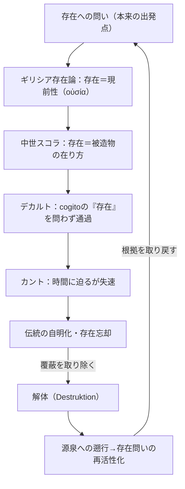

## 「§6」は何だと言っているのか

*ハイデガー『存在と時間』第6節*

---

### この節の結論を一言で

**哲学の伝統は「存在とは何か」という問いをむしろ埋葬してきた。だからこそ、その伝統を掘り返す「解体（Destruktion）」が必要だ。**

§6 は「存在への問い」を立て直すための準備作業として、「なぜ過去の哲学が邪魔になっているのか」「どうすれば邪魔を取り除けるか」を段階的に説明する節である。議論は三つの山を踏む。①ダザインはそもそも歴史的な存在者だ → ②伝統はその歴史性を覆い隠す → ③だから伝統を「解体」しなければならない。

---

### 第一の山：ダザインは歴史の中に「すでに投げ込まれている」

**ダザイン**（＝「ここに在る」こと、つまりわれわれ人間の存在のあり方）は、過去を背後に引きずる存在者ではない。ハイデガーはこう言う。

> ダザインはその存在の仕方において自らの過去を「存在する」のであり、その存在は、粗略に言えば、そのつど未来から「生起する」。

「過去を持っている」のではなく、「過去を生きている」。しかもそれは、その人が属する「世代」の伝承ごと引き受けている。言い換えれば、ダザインは生まれた瞬間から、すでに特定の言語・思想・常識の中に放り込まれている。これが**歴史性（Geschichtlichkeit）**という概念の核心だ。

歴史性は「歴史書に書かれた出来事」より先にある。世界史が可能になるのは、ダザイン自身が歴史的に「生起する」存在だからである。

---

### 第二の山：伝統は「源泉」への道を塞ぐ

歴史性は本来、「過去を積極的に掘り起こす力」になりうる。しかし実際には逆のことが起きる。

> 伝統はダザインから、固有の指導、問いと選択を奪い取る。

伝統が強力になると、それが「自明」になる。自明になった概念は、もうだれも根拠を問わない。ギリシア哲学が生み出した「存在」概念は、スコラ哲学・デカルト・カント・ヘーゲルと受け渡される中で、問い直されることなく「当然の枠組み」として定着してしまった。

| 段階 | 主な担い手 | 何が起きたか |
|------|-----------|-------------|
| 古代ギリシア | プラトン・アリストテレス | 存在を「現前性（今ある様子）」として捉えた |
| 中世スコラ | トマスら → スアレス | ギリシアの存在概念をキリスト教的創造論と結びつけ固定 |
| 近代初頭 | デカルト | 「我思う（cogito）」の「存在」を問わずに出発 |
| 近代批判哲学 | カント | 時間と存在の関係に迫りかけたが、デカルトの枠を引き継いで失速 |
| ドイツ観念論 | ヘーゲル | 上記の蓄積を論理学の素材として扱ったが、根本問いは棚上げ |

それぞれの段階で「存在とは何か」という根本問いが薄まり、最終的に**忘却**される。これがハイデガーの言う「存在忘却」である。

---

### 第三の山：「解体（Destruktion）」とは何か

ここで提案されるのが「解体」という作業だ。誤解を防ぐため、ハイデガーは丁寧に否定から始める。

> 解体はまた、存在論的伝統を振り払うという否定的意味をも持たない。

解体は「過去の哲学をゴミ箱に捨てる」ことではない。むしろ、伝統が積み重なった表面を掘り下げ、「どの段階で、なぜこの概念が固まったのか」を明らかにする作業である。掘ることで、本来の問いに答えた「源泉」まで届こうとする。

---

### カントはなぜ「惜しい」のか

§6 が最も具体的に論じる例がカントである。カントは存在と時間の結びつきに、他の誰よりも肉薄した。その証拠として、カント自身の言葉が引かれる。

> 「現象とその純粋な形式とに関する悟性のこの図式論は、人間の魂の深みに潜む隠れた術であって……われわれにはほとんど不可能であろう。」

カントは「何かが深く隠れている」と感じていた。しかし彼はそこで立ち止まった。理由は二つある。

1. **デカルトの枠組みを無批判に引き継いだ**——「考える主体（res cogitans）」の存在を問わないまま出発した。  
2. **時間を「通俗的な意味での時間」で捉えた**——時間を主観の内側に引き寄せながら、その時間理解自体は伝来の常識的な枠にとどまった。

その結果、「時間」と「我思う（Ich denke）」の間の決定的なつながりが、問題にすらなれなかった。

---

### 解体の的：古代存在論が「現在」に固執したこと

解体が最終的に向かう先は、古代ギリシアの存在理解そのものだ。

> 存在者はその存在において「現前性」として把握されている、すなわち、ある特定の時間様相、「現在」の観点から理解されているのである。

ギリシア語の「οὐσία（ウーシア）」は日本語で「本質・実体」と訳されるが、ハイデガーによればその原義は「現前していること（Anwesenheit）」、つまり「今ここに在る様子」である。存在をこのように捉えると、「今見えているもの」が存在のモデルになり、「過去」「未来」「時間性」は副次的なものに押しやられる。これがその後の西洋存在論の出発点の歪みだ、とハイデガーは見る。

---

### この節の位置づけと射程

§6 の内容を整理すると、こうなる。

| 問い | §6 の答え |
|------|----------|
| なぜ「存在への問い」は忘れられたのか | 伝統が概念を自明化し、源泉への道を塞いだから |
| 解体（Destruktion）とは何か | 伝統の積層を掘り下げ、問いが固まった地点を露わにする作業 |
| 解体の目標は否定か | 否。伝統の「積極的可能性」と「限界」を同時に画定すること |
| 解体が最初に向かう先は | カントの時間論 → デカルトの cogito → 古代ギリシアの存在論 |
| 最終的に何を得ようとするか | 「存在の意味」を時間性と結びつけて問い直す地盤 |

---

### まとめ

§6 は一言で言えば「哲学的な地質調査の宣言」である。「存在とは何か」という問いが埋もれてしまった理由は、知的怠慢ではなく、伝統という構造そのものにある。その構造を掘り返さない限り、問いは本当に立てられない。ハイデガーが「解体」と呼ぶ作業は、過去を壊すためではなく、**問いが生きていた源泉を取り戻すため**に、伝統の地層を下へ下へと遡る営みなのである。
