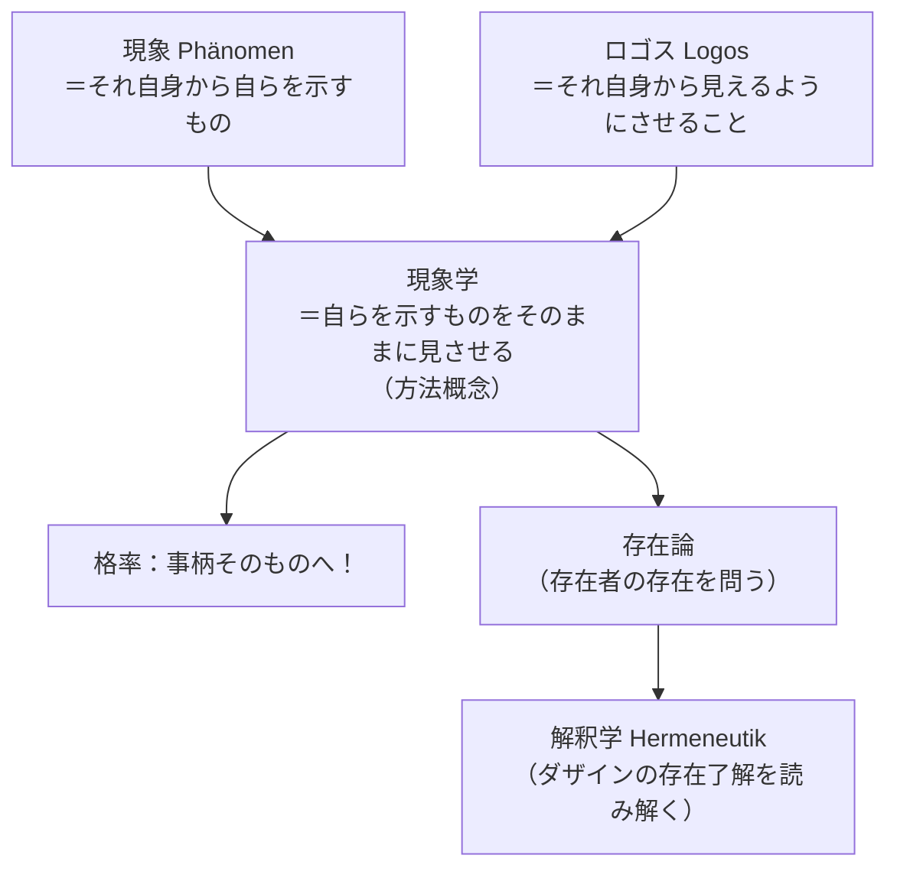

## 「§7」は何だと言っているのか

*ハイデガー『存在と時間』第7節*

---

### この節の結論を先に言う

**「存在論（存在そのものを問う学）」はどうやって進めるべきか？　答えは"現象学"という方法だ。**

ただしそれは、「現象学運動」のような看板を掲げることではない。「自らを示すものを、それが示すそのままに見せる」——この一点に徹する**態度**のことである。そしてその態度の先には、存在をめぐる問いが解釈学（ヘルメノイティク）として展開するという地平が開けてくる。

この節は三段階の議論（A. 現象とは何か → B. ロゴスとは何か → C. 二者を合わせると「現象学」とは何かが分かる）で構成されており、最後に現象学・存在論・解釈学が一つにつながることを示して締めくくられる。

---

### 第一段階：「現象（Phänomen）」の意味を掘り下げる

「現象学（Phänomenologie）」という言葉は **Phänomen**（現象）＋ **Logos**（ロゴス）からできている。だから、まず「現象」とは何かを確認しなければならない。

ギリシア語の **φαινόμενον**（ファイノメノン）は、動詞「自らを示す」から来ている。つまり現象の根本的な意味は、**「それ自身の側から自らを示すもの」**である。

> 「現象」という術語を φαινόμενον の積極的かつ根源的な意味に術語論的に割り当て、現象を、現象の欠如的変様としての仮象から区別する。

しかしここで注意が必要だ。日常語には「現象」に混同されやすい言葉がいくつかある。ハイデガーはそれらを丁寧に区別する。

| 用語 | ドイツ語 | 意味 |
|------|----------|------|
| 現象（根源的） | Phänomen | **それ自身から自らを示すもの**（光の中に置かれた存在者そのもの） |
| 仮象 | Schein | そうではないものとして示す（うわべだけの見え方） |
| 現れ | Erscheinung | 何か別のものを「告知」するしるし（例：病状は病気を告知する） |
| 単なる現れ | bloße Erscheinung | 隠れた本質の発散として出るもの（カント的な意味での現象） |

この表のポイント：**仮象も現れも、どちらも根っこでは Phänomen（本来の意味での現象）に依拠している**。見かけだけのものも、告知するものも、「自らを示す」という構造があるから初めて成立できる。逆に言えば、Phänomen を理解していなければ、これらの区別自体が崩れる。

> 現象（Phänomene）は決して現象（Erscheinungen）ではないが、いかなる現象（Erscheinung）も現象（Phänomene）に依拠している。

---

### 第二段階：「ロゴス（Logos）」の意味を取り戻す

次にロゴス。後世には「理性」「判断」「概念」「根拠」などと訳されてきたが、ハイデガーは根本的な意味を**「語り（Rede）」**に見る。

ただしこの「語り」は単なるおしゃべりではない。アリストテレスが **ἀποφαίνεσθαι**（アポファイネスタイ）という語で鋭く示したように、**語りとは「語られる事柄をそれ自身から見えるようにさせること」**である。

> ロゴスは何かを見させる——ἀπό……それ自身から、語りがそれについてなされているものそれ自身のほうから。

このことから、**真理と偽り**の理解も変わる。ギリシア語の **ἀλήθεια**（アレーテイア、真理）は文字通り「隠れ（λήθη）を取り去ること（ἀ-）」、すなわち**「覆いを取り除いて開示すること」**を意味する。真なる語りとは、存在者をその隠れから引き出して「非隠れたもの」として見させることだ。

逆に偽なる語りは、何かを何かの前に置くことで「覆い隠す」こと。したがって**真理は第一義的にはロゴス（命題・判断）に宿るのではなく**、存在者の開示という出来事そのものにある。

---

### 第三段階：二つを合わせると「現象学」の意味が決まる

「現象」＝それ自身から自らを示すもの  
「ロゴス」＝それ自身から見えるようにさせること

この二つをギリシア語で合体させると：

> **ἀποφαίνεσθαι τὰ φαινόμενα**（アポファイネスタイ・タ・ファイノメナ）  
> 「自らを示すものを、それが自らのほうから示すそのありかたのままに、それ自らのほうから見させること」

これが現象学の定義だ。そしてこれはまさに格率「**事柄そのものへ！**」の言い換えにほかならない。

重要な確認：現象学は「神学（神についての学）」のように**対象の内容を名指す言葉ではない**。生物学・社会学のような名称は「何を扱うか」を示すが、現象学は**「いかに扱うか（方法）」**を示す言葉だ。

---

### 隠蔽性という問題——なぜ現象学が必要か

現象学の方法が必要だということは、逆に言えば、**「自らを示すもの」がたいていの場合は隠れている**ということを意味する。

ハイデガーは「隠蔽性（Verdecktheit）」の三つのモードを区別する。

| 隠蔽のモード | 内容 |
|---|---|
| 未発見（noch nicht entdeckt） | そもそもまだ誰にも見いだされていない |
| 埋没（verschüttet） | かつて発見されたが、再び隠れてしまった |
| 偽装（Verstellung） | 一見見えているが、仮象として「見当違いのもの」として示されている（最も危険） |

最も危険なのが「偽装」だ。なぜなら、歴史的に伝承された哲学体系の中で「自明なもの」として流通している概念が、実は地盤を失って浮遊した誤った概念である可能性がある——しかも当人たちにはそう見えないからだ。

> 「偽装（Verstellung）」としてのこの隠蔽は最も頻繁にして最も危険なものである。なぜなら、ここでは欺瞞と誤導の可能性がとりわけ執拗だからである。

そして**最も顕著に隠れているのは、この或る存在者やあの或る存在者ではなく、存在者の存在そのものだ**。存在者（目の前のもの）については誰もが気づいているが、「その存在」は問われないまま覆われている。だからこそ現象学が要請される。

---

### 現象学・存在論・解釈学の三位一体

節の末尾でハイデガーはこの節全体の結論を三本の柱でまとめる。

**① 現象学は存在論の方法である**

> 現象学とは、存在論の主題となるべきものへの接近様式であり、かつそれの証示的な規定様式である。存在論は現象学としてのみ可能である。

存在者の存在（＝存在論の問い）は、「自らを示すものをそのまま見させる」という現象学的方法なしには問えない。

**② ダザインの現象学は解釈学である**

「ダザイン」（*Dasein*）とはここでは「人間的な在り方をしている存在者」——世界の中に投げ込まれ、自分の存在が問題になるような存在者のこと——を指す。ダザインの現象学においてロゴスは**ἑρμηνεύειν**（ヘルメーネウエイン、解釈する）の性格をもつ。なぜなら、ダザインにはすでに存在の了解が宿っているが、それを**明示的に読み解く**（解釈する）作業が必要だからだ。

**③ 解釈学はさらに三つの意味をもつ**

| 意味の層 | 内容 |
|---|---|
| 第一義：存在の意味の解明 | ダザイン自身に潜む存在了解を読み解く |
| 第二義：存在論的探究の地平を切り開く | ダザイン以外の存在者の存在論を可能にする条件を整える |
| 第三義：実存の実存性の分析論 | 実際に生きている人間の在り方の構造を掘り起こす（最も根本的） |

この三重の意味をもつ「解釈学」は、さらにダザインの歴史性を問うことで、歴史的人文諸科学の方法論（diltheyが言う意味での「解釈学」）の**存在論的根拠**を担うことにもなる。

---

### まとめ：この節で言われていることの骨格

> 存在論と現象学とは、哲学に属する他の諸学科と並ぶ二つの異なる学科ではない。この二つの名称は、対象と取り扱いの仕方とに即して哲学そのものを性格づけるものである。哲学とは普遍的な現象学的存在論であり、ダザインの解釈学を出発点とする。

§7の主張を一言で言うなら：**「存在の問いを問うには"現象学"という方法しかなく、その現象学はダザイン（人間的存在者）の解釈学として具体化される」**。

「現象」「ロゴス」という言葉のギリシア語の意味から手を入れ直すことで、ハイデガーは現象学を特定の哲学潮流の看板ではなく、**哲学そのものの方法的な自己了解**として位置づけているのである。
