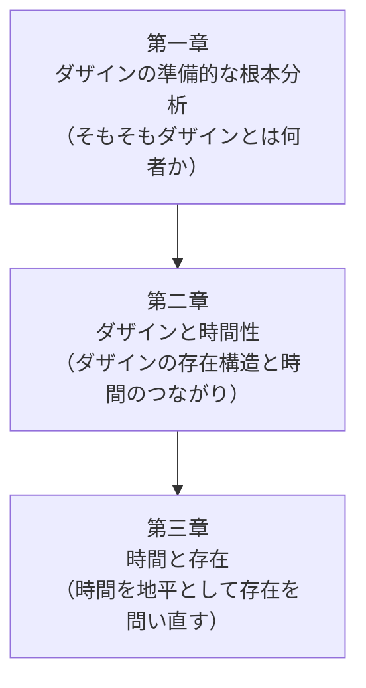

## 「§8」は何だと言っているのか

*ハイデガー『存在と時間』第8節*

---

### この節のひと言まとめ

§8 は、『存在と時間』という本がどんな地図で構成されているかを示す「目次の解説」にあたる節である。ただし単なる目次ではない。**なぜ二部構成になるのか**、**なぜその順番なのか**という理由が、前節までの議論（存在への問いとは何か）と結びついた形で説明されている。

---

### 「問い」が「二つの課題」を生む

§1〜§7 を通じてハイデガーは、「存在とはそもそも何か」という問いを立て直すことを宣言した。§8 ではその問いが、**二つの課題**に分岐すると述べる。

> 存在への問いの仕上げはかくして二つの課題に分岐する。それらに対応して、論文は二部に分けて構成される。

「二つの課題」とは、ざっくり言えば次のものだ。

| 部   | 課題の中身                             | キーワード         |
|------|----------------------------------------|--------------------|
| 第一部 | 私たち人間（ダザイン）の存在構造を解き明かし、「時間」こそが存在を理解するための地平だと示す | 時間性（Zeitlichkeit） |
| 第二部 | 西洋哲学史（カント・デカルト・アリストテレス）がこの問いをどう扱い、どこで行き詰まったかを掘り起こす | 現象学的破壊（Destruktion） |

ここで出てくる専門語を簡単に押さえておこう。

- **ダザイン**：「現存在」とも訳される。平たく言えば「いま・ここに存在している私たち人間」のこと。
- **時間性（Zeitlichkeit）**：ダザインが過去・現在・未来にわたって存在するあり方の構造。
- **時間性（Temporalität）**：存在一般を理解する地平として捉え直した「時間」の概念（第二部では第一部の成果を歴史哲学に応用するため、こちらの表記が使われる）。
- **現象学的破壊**：これまでの哲学の「常識」を壊すという意味ではなく、積み重なった解釈の層をはがして根っこの問いに戻ることを指す。

---

### なぜ「ダザイン」から始めるのか

節の冒頭では、一見矛盾するように見える点が片付けられる。

> 存在の意味への問いは、最も普遍的にして最も空虚な問いである。しかしそこにはまた同時に、その問い自身が、そのつどのダザインへと最も鋭く個別化されうる可能性が宿っている。

「存在とは何か」という問いは、すべてに当てはまる最も広い問いでありながら、問うのは必ず**この私**である。だから一番抽象的な問いへの答えを得るには、逆に、一番具体的な存在者であるダザインを手がかりにするしかない——これが第一部がダザイン分析から始まる理由だ。

さらにダザインはそれ自体が「歴史的」な存在者だ、とも言われる。生きた人間は過去から受け継ぎ、未来へ向かう存在であり、したがってダザインを本当に分析しようとすれば、哲学史の文脈も避けて通れない。これが第二部（歴史上の哲学者たちへの遡行）が必要になる理由として示されている。

---

### 第一部の内部構成

第一部はさらに**三つの章**に分かれる。その道筋をたどると、「小さい問いから大きい問いへ」と積み上がっていく設計になっていることがわかる。

この三段階は、**個別の人間分析**から出発して、最終的には**存在一般の意味**へ至るための足場を順番に積み上げるものだ。

第一章それ自体もさらに六つの章節に分かれると予告されており、その内訳も節の末尾に示されている。

| 章節   | 内容                                   |
|--------|----------------------------------------|
| 第一章 | ダザイン分析の課題の解明と先行整理     |
| 第二章 | 世界内存在という根本構造               |
| 第三章 | 世界性における世界                     |
| 第四章 | 共同存在・自己存在としての世界内存在   |
| 第五章 | 内存在そのもの                         |
| 第六章 | 配慮（Sorge）——ダザインの実存論的意味   |

**配慮（Sorge）**とは、ダザインが世界と関わるときの根本的な「気にかけ・関わり方」を指す概念で、第六章でその分析がひとまず完成する。

---

### 第二部の内部構成

第二部は哲学史への「掘り起こし」であり、こちらも三分割される。

| 章節   | 対象                         | 狙い                                     |
|--------|------------------------------|------------------------------------------|
| 第一章 | カントの図式論と時間論        | 時間性の問題への「前段階」として整理する |
| 第二章 | デカルトの「我あり」（cogito sum）と中世存在論 | 近代哲学の存在論的前提を問い直す |
| 第三章 | アリストテレスの時間論        | 古代存在論の根拠と限界を示す             |

時代を逆にたどる（カント→デカルト→アリストテレス）のは、より根の深い問題へと剥ぎ取っていくためである。

---

### まとめ：§8 が果たす役割

§8 は哲学書としては珍しく「この本はどう読めばよいか」を明示してくれる節である。ここで示された構成は、単なる章割りではなく、**存在への問いをどういう手順で答えに近づけるか**という戦略そのものだ。

> 存在概念の普遍性は、探究の「特殊性」——すなわち、ある特定の存在者、ダザインの特殊な解釈という経路を通じてそれへと前進すること——と矛盾しない。

一番抽象的な問いほど、一番具体的な出発点が必要になる。その逆説的な手続きを体系として示したのが、この節の核心である。
