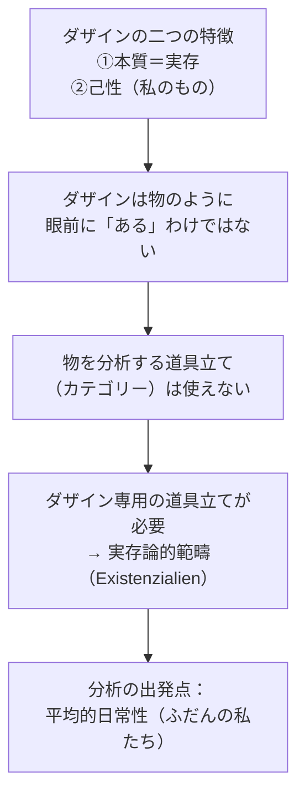

## 「§9」は何だと言っているのか

*ハイデガー『存在と時間』第9節*

---

### この節のひとことまとめ

「人間（ダザイン）」は、石や木とは根本的に異なる種類の存在者だ。だから人間を分析するには、石や木に使う道具立て（カテゴリー）ではなく、人間専用の道具立て（実存論的範疇）が必要になる――それがこの節の中心主張である。

ハイデガーはそこへ至るために、まず「ダザインとは何か」を二つの特徴から素描し、そこから分析の方法論上の帰結を引き出す、という順序で議論を進める。

---

### ダザインとは何者か――二つの根本的な特徴

**ダザイン（Dasein）** とは、ハイデガーが「人間という存在者」を指すために使う術語である。ただし「人間」と言わないのには理由がある。「人間」という言葉は、すでに心理学や生物学の定義を引きずっているからだ。

ハイデガーはダザインの特徴を、次の二点で整理する。

#### 特徴①――「存在すること」そのものが本質である

> この存在者の「本質（Wesen）」はその「存在すべきこと（Zu-sein）」に存する。

つまり「ダザインとは何か（what）」を問うことはできない、という話だ。机や家なら「四本脚があって天板がある物」のように *何であるか* を説明できる。しかしダザインは、*ある仕方で存在していること* それ自体が本質であって、固定した属性リストに還元できない。

そこでハイデガーは伝統的な用語にも手を入れる。ラテン語の *existentia*（伝統哲学では「目の前に実際にある」という意味）は、ここでは使えない。ダザインに固有の意味として「**実存（Existenz）**」という語を新たに定義し、「目前的存在（Vorhandenheit）」（石や道具のように眼前にただあること）とは峻別する。

#### 特徴②――その存在は「そのつど私のもの」である

> この存在者がその存在においてそのつど問題にしている存在は、そのつど私のものである。

石は「どの石も同じ石」として代入可能だが、ダザインは代入不可能だ。「私が在る」「汝が在る」という人称は飾りではなく、存在の構造そのものに属している。これをハイデガーは **己性（Jemeinigkeit）／各自性** と呼ぶ。

この己性から直接出てくるのが **本来性（Eigentlichkeit）** と **非本来性（Uneigentlichkeit）** の区別である。ダザインは自分自身の可能性を「本当に引き受ける」こともできるし、「見失ったままでいる」こともできる。ただし非本来性は「劣った状態」ではない。

> 非本来性はむしろ、ダザインをその最も充実した具体性において――その多忙さ、昂奮、関心のありよう、享楽の能力において――規定しうるのである。

---

### 二つの特徴がもたらす方法論的問題

この二つの特徴があるからこそ、ダザインの分析は「物体の記述」とは根本的に異なる問いの立て方を要求する。

---

### 「カテゴリー」と「実存論的範疇」の違い

ハイデガーはここで存在性格の二種類を対比させる。

| | 対象 | 問いの形 | 名称 |
|---|---|---|---|
| 物・道具・自然物など | モノ（何か） | 「それは何か（what）？」 | **カテゴリー** |
| ダザイン（人間） | 誰か（who） | 「それは誰か（who）？」 | **実存論的範疇** |

「カテゴリー」という言葉はギリシャ語の *カテゴレイスタイ*（公衆の前で誰かに向かって何かをずばりと言う）に由来する。古代哲学はこれを、眼前にある存在者の存在をあらかじめ言い表す操作として使ってきた。しかしそれは「物」を見る目線で作られた概念装置だった。

ダザインは「物」ではなく「誰か」であるから、同じ装置は使えない。こうして実存論的範疇という新しい概念群の必要性が正当化される。

---

### 分析はどこから始めるか――「平均的日常性」

二つの特徴と方法論の整備を経て、ハイデガーは分析の出発点を示す。

> ダザインは分析の出発においてまさに、或る特定の実存することの差異においてではなく、その無差別的な「さしあたりほとんどの場合」において開示されるべきなのである。

つまり、英雄的な決断をした瞬間の人間や、深く内省した哲学者の人間ではなく、「ふだん何となく生きている私たち」――これを **平均的日常性（Durchschnittlichkeit）** と呼ぶ――が分析の土台になる。

これには逆説がある。

> 存在的にもっとも身近にあり知られているものは、存在論的にはもっとも遠く、未知であり、その存在論的意義においてたえず看過されているものである。

「自分自身に最も近いもの」であるにもかかわらず、哲学がそれをきちんと見てきたことはない。ハイデガーはここでアウグスティヌスの言葉を引く。「私は自分にとって困難と過大な汗の土地となってしまった」。自分自身を理解することの難しさは、存在論的な問題でもある、というわけだ。

---

### 「平均的日常性」は軽視されてはならない

最後にハイデガーは一点を念押しする。

> 存在的（ontisch）に平均性という仕方において存在しているものは、存在論的（ontologisch）には十分に際立った構造のうちに把握されうる。

**存在的** とは「実際にどうあるか」という事実の話、**存在論的** とは「その存在の構造はどうなっているか」という分析の話だ。日常的にぼんやりしているからといって、その構造がぼんやりしているわけではない。むしろ日常性のなかにこそ、実存の構造（実存論性）がアプリオリに（経験に先立って）潜んでいる。

---

### この節全体の論点の流れ

| ステップ | 内容 |
|---|---|
| ① | ダザインは「本質＝実存」であり、物のように属性を列挙できない |
| ② | ダザインは「己性（私のもの）」を持ち、代入不可能な存在者だ |
| ③ | この二点から、物体分析に使うカテゴリーはダザインに使えないことが帰結する |
| ④ | ダザイン専用の分析装置として「実存論的範疇」が必要になる |
| ⑤ | 分析の出発点は「平均的日常性」であり、それは構造として捉えるに値する |
| ⑥ | この分析は心理学・人間学・生物学に先行する哲学的課題である |

---

### この節のポジション

§9 は、これから始まるダザインの分析論全体の「使用説明書」にあたる節だ。「何を分析するのか」「なぜ従来の道具では駄目なのか」「どこから始めるのか」の三点を確定することで、以降の議論の地盤を整える。読者はここで「分析の対象（ダザイン）」「分析の道具立て（実存論的範疇）」「分析の出発点（平均的日常性）」という三つの柱を頭に入れておくと、続く節が格段に読みやすくなる。
