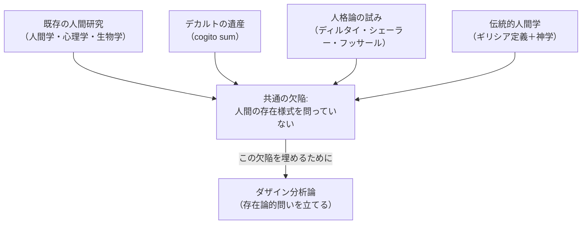

## 「§10」は何だと言っているのか

*ハイデガー『存在と時間』第10節*

---

### この節の結論を一言で

第10節の主張はこうだ。**人間を扱う学問（人間学・心理学・生物学）は、「人間とはそもそも何者か」という最も根本的な問い——存在論的な問い——を立てていない。だからダザイン分析論は、それらとは別の問いを立てている**。この宣言が全体を貫いている。

「ダザイン（Dasein）」とはハイデガーが「私たち人間のように存在する存在者」を指すために使う言葉だ。私たちは机や石とは違う仕方で存在している。その「存在の仕方そのもの」を問うのがダザイン分析論である。

---

### 議論の見取り図



---

### ステップ①　なぜ「禁止的な性格規定」から始めるのか

節の冒頭でハイデガーは、自分がやろうとしていることの「輪郭」をすでに示したうえで、今度は「何をやってはならないか」を述べると予告する。

> 「示されるべきことは、ダザインを目指した従来の問い立てと探究とが、その事柄上の実りを損なうことなく、固有の哲学的問題を見誤っているということ」

つまりこの節は、既存の人間研究を全否定しているのではなく、**哲学的問いの次元で見誤りがある**と指摘している。研究の「成果」を否定しているのではなく、「問いの立て方」の話だ、と最初から釘が刺されている。

---

### ステップ②　デカルトが残した宿題

ハイデガーは近代哲学の出発点としてデカルトの「コギト・スム（cogito sum）」を持ち出す。これは「われ思う、ゆえにわれあり」という有名な命題だ。

| デカルトが調べたこと | デカルトが調べなかったこと |
|---|---|
| **cogito**（私が考えるという働き） | **sum**（私が「ある」とはどういうことか） |

デカルトは「考える私」の働きを詳しく分析した。しかし「その私が存在するとはそもそもどういう存在様式なのか」という問いは、まったく手つかずのまま残した。ハイデガーのダザイン分析論は、この**sum の存在様式を問う**作業だと位置づけられる。

ただし、ここでハイデガーはすぐ自己訂正する。「主観」「自我」という枠組みそのものを安易に引き継いではいけない、とも言う。「主観」という概念には、その言葉を使った途端に「物のように存在するもの（スブイェクトゥム）」というイメージが忍び込んでしまうからだ。

---

### ステップ③　「生の哲学」「人格論」は何を見逃したか

ハイデガーはここで三つの流れを検討する。

#### 生の哲学（ディルタイほか）

ヴィルヘルム・ディルタイは「生（Leben）」を要素に分解せず、全体として理解しようとした。その方向性自体はハイデガーも評価する。

> 「正しく理解されるならば、その傾向のうちには、ダザインの存在の理解へ向かう傾向が暗黙のうちに潜んでいる」

しかし決定的な欠陥がある。

> 「『生』それ自体が一つの存在様式として存在論的に問題となっていない」

「生」という言葉を使い続けながら、その「生」が**どういう存在の仕方をしているのか**を問わない。言葉が先走って、問いが立てられていないのだ。

#### 人格論（フッサール・シェーラー）

シェーラーは「人格（Person）」を物や実体として捉えることを拒否し、次のように言う。

> 「人格はむしろ、体験することの直接的に共に体験された統一であり、直接的に体験されたものの背後にある単なる思惟上の物ではない」

また作用（Akt）——たとえば「愛する」「知覚する」という心の働き——についても、「作用は決して対象ではありえない」と述べる。これはハイデガーの方向と近い。

**しかし問題が残る**。「人格はどのような存在様式で存在しているのか」という問いが、依然として立てられていない。「物ではない」と言うことと、「では何として存在しているのか」を積極的に答えることは別の話だ。

| 思想家 | 評価できる点 | 欠けている点 |
|---|---|---|
| ディルタイ | 「生」を全体として把握しようとした | 「生」の存在様式を問わなかった |
| シェーラー | 人格を物・実体・対象と区別した | 人格の存在様式を積極的に規定しなかった |
| フッサール | 人格主義的態度を詳細に分析した | 「人格であること」への問いを立てなかった |

---

### ステップ④　伝統的人間学の二つの起源

人間学・心理学・生物学が問いを立てられずにいる背景として、ハイデガーは西洋の人間観の二つの源流を指摘する。

**① ギリシア的定義**
人間＝「ζῷον λόγον ἔχον（ロゴスを持つ生き物）」＝animal rationale（理性的動物）。この定義では「生き物（ζῷον）」の存在様式が、石や道具と同じく「目の前にそこにある（眼前存在）」という意味で理解されてしまっている。

**② 神学的手引き**
人間は「神の像（imago Dei）に従って作られた」という聖書の言葉。ここから人間は「有限な存在者（ens finitum）」として理解されるが、その存在様式はギリシア存在論の道具で解釈されてきた。

> 「存在者『人間』の本質規定においては、その存在への問いが忘却されたままにとどまり、この存在がむしろ他の被造物の眼前存在という意味において『自明のもの』として把握されていることを示している」

つまり、「人間が存在するとはどういうことか」を問う前に、石や椅子と同じく「まあそこにいるもの」として処理されてきた、というのがハイデガーの批判の核心だ。

---

### ステップ⑤　生物学への位置づけ

では生物学はどうか。「人間学と心理学を生物学に組み込めばいい」という発想もある。ハイデガーはこれを退ける。

> 「生は固有の存在様式であるが、しかし本質的にダザインにおいてのみ接近可能である」

生物学が扱う「生（Leben）」は、ダザインでも純粋な物（眼前存在）でもない、固有の存在様式だ。しかし「生」にアクセスするためには、まずダザインの存在論が先に確立されていなければならない。生物学はダザイン分析論の**上に**根拠づけられるのであって、その逆ではない。

---

### まとめ：この節で言われていること

```
人間学・心理学・生物学　→　成果はある
　　　　　　　　　　　　　　しかし……
　　　　　　　　　　↓
　　「人間の存在様式そのもの」を問う次元に達していない
　　（ギリシア定義も神学も生の哲学も人格論も同じ欠陥を共有）

　　　　　　　　　　↓

　　存在論的な根本問いは、経験的研究から事後的に取り出せない
　　——それはすでに「そこに」なければならない

　　　　　　　　　　↓

　　だからダザイン分析論は、それらとは別の問いを立てる必要がある
```

ハイデガーが最後に念を押すのは、この批判は既存学問の研究成果への否定ではない、という点だ。

> 「これらの存在論的な根本基礎は、経験的な素材から事後的に仮説的に推論されることは決してできない。……経験的な素材がただ収集されるだけである場合にも、常にすでに『そこに』ある」

どんな経験的研究も、問いを立てる前に何らかの「存在の前提」を持ち込んでいる。ダザイン分析論はその前提を**明示的な問い**として取り出す作業なのだ、というのが第10節の最終的なメッセージである。
