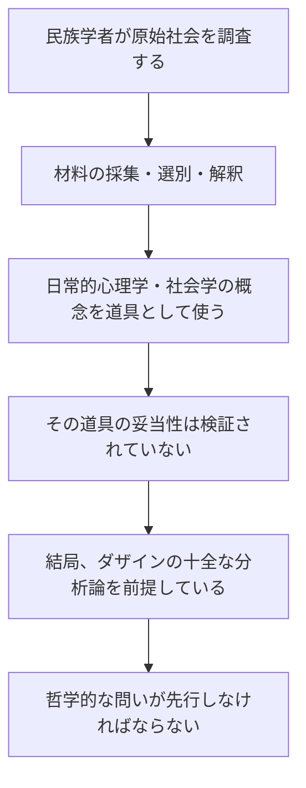
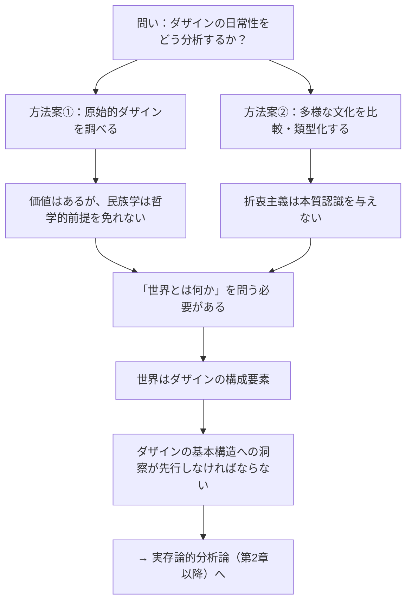

## 「§11」は何だと言っているのか

*ハイデガー『存在と時間』第11節*

---

### この節の結論を先に言う

§11のメッセージは、一言でまとめるとこうなる。

> ダザインの基本構造を明らかにしようとするとき、「原始的な人間を調べれば近道になる」という期待も、「世界中の文化を広く比較すれば答えが出る」という期待も、どちらも見当外れである。なぜなら、どちらのアプローチも、問題の核心――「世界とは何か」「ダザインとは何か」――をあらかじめ正しく問えていないからだ。

「ダザイン（Dasein）」とは、ハイデガーが「人間の存在のあり方」を指すために使う言葉である。日本語では「現存在」とも訳される。ここでは「私たちが日々生きているこの存在」くらいに理解しておけばよい。

---

### 議論の出発点：「原始的な人間を調べれば手がかりになるか？」

ハイデガーはまず、一つの素朴な期待を検討する。「日常性」（私たちが毎日なんとなく生きているあり方）を分析するとき、「まだ文明化されていない原始的な人間の方が、純粋な人間の姿を見せてくれるのではないか」という発想だ。

ハイデガーはここで二つのことを言う。

**第一：日常性と原始性は別物だ。**

> 日常性はむしろダザインの一つの存在様式であり、ダザインが高度に発展し分化した文化のなかで動いているときでさえ、まさにそのときにこそ、そうなのである。

「日常性」は「原始的であること」と同じではない。高度な文明社会にいる私たちにも日常性はあるし、原始的な社会の人々にもそれ固有の日常性と、非日常がある。原始性は日常性の「純粋版」ではない。

**第二：それでも、原始的ダザインには一定の方法論的価値がある。**

ハイデガーは原始社会の研究を完全に退けるわけではない。原始的なダザインは、高度な「自己解釈」（自分たちの生を概念で覆い固める作業）にまだ染まっていない分、現象がよりむき出しで見えやすい、とも述べている。

> 「原始的諸現象」がしばしば、当該ダザインの既に相当程度まで進展した自己解釈によって覆い隠されたり複雑化されたりする度合いが低いからである。

ただしこれは「積極的に有益でありうる」という留保つきの評価であって、「原始社会を調べればすべて分かる」という主張ではない。

---

### 問題の核心：民族学もまた「問い」を前提している

原始的ダザインの研究を担うのは民族学（文化人類学）だが、ハイデガーはここに根本的な問題を見る。

> 民族学者が携えてくる日常的心理学、あるいはそれどころか学的心理学や社会学が、探究されるべき諸現象への適切な接近可能性・解釈・伝達に対して学的保証を与えるものかどうか、それは確かめられていない。

つまり、民族学者が現地に行って材料を集めるとき、すでに「人間とはこういうものだ」という先入観を持ち込んでいる。その先入観が正しいかどうかが、そもそも問われていないのだ。

この連鎖が示すのは、実証科学（民族学・心理学など）は、哲学が先に答えるべき問い――「ダザインとは何か」――をあらかじめ前提として持ち込まずには動けない、ということだ。

---

### 「自然的世界概念」という難問

節の後半でハイデガーは、問題をより根本的な水準で定式化する。それが「自然的世界概念（natürlicher Weltbegriff）」の練り上げという課題だ。

「自然的世界概念」とは、哲学的な技術概念を使う前の、誰にでも共通する「世界についての素朴な理解」をきちんと概念として取り出そうという試みである。これは「久しく哲学を悩ませてきたにもかかわらず、充足においては絶えず失敗してきた」課題だとハイデガーは言う。

ここで彼が問題にするのは、次のような誘惑だ。

> あらゆるものを比較し類型化する折衷主義は、それ自体からして真の本質認識を与えるものではない。

世界中の文化や宗教や世界観を広く集めて比較・分類すれば、「普遍的な世界概念」が浮かび上がってくる――これは一見もっともらしいが、ハイデガーはこれを「外見に過ぎない」と退ける。

なぜか。整理するとこうなる。

| 期待されること | ハイデガーの反論 |
|---|---|
| 多くの文化を比較すれば共通点が見えてくる | 比較・分類の「秩序の原理」自体がすでに何らかの世界理解を前提している |
| 類型化すれば本質が分かる | 一覧表を作ることは、そこに並ぶものを「理解した」ことにはならない |
| データが多いほど真実に近づく | 豊富すぎる知識は、本来の問いを見誤らせる誘惑になる |

ハイデガーの言う通り、「世界を秩序づけるためには、世界一般の明示的な理念が必要」なのだ。そしてその「世界」がそもそもダザインの構成要素であるならば、世界を理解するにはダザインの基本構造への洞察が先に必要になる。

---

### 節全体の構造を俯瞰する

---

### まとめ：§11が言いたいこと

§11は、第1章の終わりとして「準備的な仕事はここまで」という区切りを示す節だ。やっていることは、「楽な近道はない」という消極的な確認である。

- 「原始社会を見れば純粋な人間が分かる」→ **甘い。原始性と日常性は別だし、民族学自体が哲学的前提を持ち込んでいる。**
- 「世界中の文化を比較すれば世界概念が作れる」→ **甘い。比較の秩序原理にすでに世界理解が前提されている。**

結局、どちらの道も、出発点として「ダザインとは何か」「世界とは何か」という問いへの哲学的な答えを必要としている。だからこそ、ハイデガーは第2章で「世界内存在」というダザインの根本構造の分析へと踏み込んでいく。この節は、その必要性を否定的に（つまり「他の道では駄目だ」という形で）示す、踏み台の役割を担っている。

---
