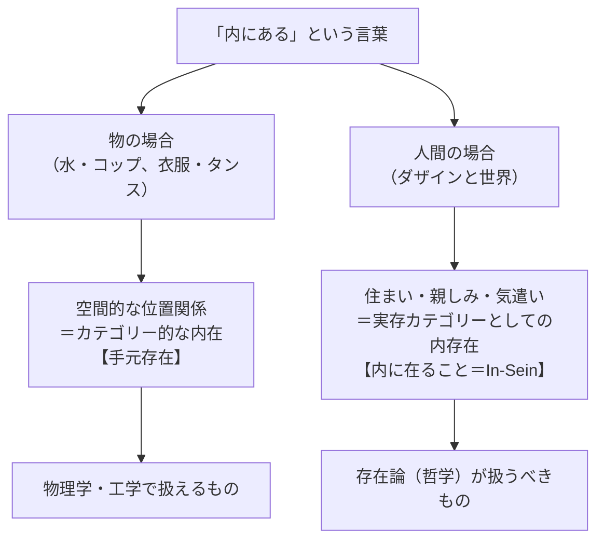
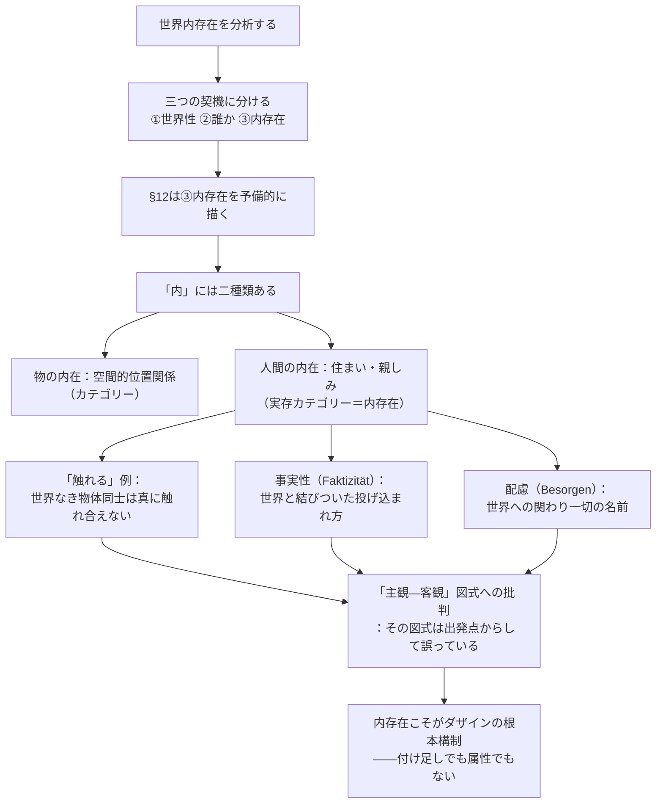

## 「§12」は何だと言っているのか

*ハイデガー『存在と時間』第12節*

---

### この節で言いたいこと（結論を先に）

ひと言で言えば——

> 「人間（ダザイン）が世界の中にいる」というのは、コップの中に水が入っているような**物理的な包含関係ではない**。それは**「世界に住み、世界に親しんでいる」という、人間に固有の存在のあり方**だ。そしてその存在のあり方こそが「内存在（In-Sein）」と呼ばれるものであり、これを正確に理解しないかぎり、人間とは何かは永遠に見誤られ続ける。

これが§12の核心です。以下では、その主張へとハイデガーがどう積み上げていくかを順に追います。

---

### 第一段階：「世界内存在」という構造は三つの問いを含む

§12は、すでに§9で予告された「世界内存在（In-der-Welt-sein）」という概念を本格的に分解しようとするところから始まります。

> 「世界内存在」という複合的な表現は……それによって統一的な現象が意味されていることをすでに示している。

ただし「一つの現象」とはいえ、分析の入口は三つあります。

| 着眼点 | 問い | 扱われる章 |
|--------|------|-----------|
| ①「世界の内に」 | 「世界」とはどんな構造か？ | 第3章（世界性） |
| ②「その中にいる者」 | 日常の「誰」が世界にいるのか？ | 第4章（誰か） |
| ③「内にいるということ」 | 「内に在る」とはどういう存在のあり方か？ | 第5章（内存在） |

§12はこのうち**③「内存在（In-Sein）そのもの」の予備的な輪郭描き**に集中します。

---

### 第二段階：「内にある」という言葉の二種類の意味

ここがこの節の最重要の区別です。

「AはBの中にある」という文は、二つのまったく異なる意味で使われます。

**意味①：物理的な包含（カテゴリー的な「内」）**

水がコップの中に入っている。衣服がタンスの中にある。ベンチが講義室の中にある……。これらはすべて、空間の中で場所を占めている「物」が、別の「物」の場所の中に収まっている、という関係です。ハイデガーはこれを「手元存在者（Vorhandensein）同士の空間的内在」と呼びます。

**意味②：人間的な「住まい」（実存カテゴリーとしての「内」）**

これに対して、人間（ダザイン）が「世界の中にいる」という場合の「内」は根本的に違います。

> 「in」は「innan-」に由来し、「住む（wohnen）」、「habitare」、「身を置く（sich aufhalten）」を意味する。

「わたしはある（ich bin）」という動詞そのものが、語源的に「……のそばに住む」「……に親しく在る」を意味する——ハイデガーはここでドイツ語の語源をたぐり寄せながら、「存在する＝世界に住みついている」ということを示そうとします。

---

### 第三段階：「触れる」という例で差異を際立たせる

ハイデガーはここで一つの鋭い思考実験を行います。

> 「椅子が壁に『触れている』」というように表現しがちである。しかし厳密に言えば、「触れること」について語ることは決してできない。

なぜか？

椅子と壁がどれだけ近くにあっても、椅子は壁を「壁として」認識していません。壁が椅子に「対して」何かとして現れるためには、そもそも**世界が開かれている存在者**でなければならない。

つまり「触れる」という関係が成立するためには、あらかじめ**世界内存在として存在していること**が必要です。「世界を持たない（weltlos）」純粋な物体同士は、どれだけ物理的に近くても、真の意味で「触れ合う」ことができない——これがハイデガーの主張です。

---

### 第四段階：「事実性（Faktizität）」という概念の導入

ダザインが世界の中にいるというのは、岩石が地面の上にある、という意味での「事実（Tatsache）」ではありません。

> ダザインという事実の事実性（Tatsächlichkeit）……を、われわれはそのダザインの**事実性（Faktizität）**と呼ぶ。

「事実性（Faktizität）」とは、人間がすでに何らかの世界の中に投げ込まれており、その世界の内部で出会う存在者と深く結びつきながら自己を理解している、という在り方です。これは「ただそこにある物体」としての事実とは根本的に異なります。

| 用語 | 意味 | 対象 |
|------|------|------|
| 事実（Tatsache） | 単に起きていること・確認できること | 岩石の出現など |
| 事実性（Faktizität） | 世界と結びつきながら存在していること | ダザインのみに当てはまる |

---

### 第五段階：「配慮（Besorgen）」——世界への関わりの名前

§12後半では、ダザインが世界の中でどんな仕方で生きているかが列挙されます。

> 何かと関わること、何かを制作すること、何かを耕し世話すること、何かを使用すること……

これらすべてをまとめる言葉が「配慮（Besorgen）」です。

ただし注意が必要です。日常語の「配慮」（心配する、気にかける）ではなく、ここでは**世界の中で何かと関わる、あらゆる働きかけの総称**としての術語です。怠けること、し損なうことさえ、この「配慮の欠如した形」として理解されます。

> 「配慮（Besorgen）」という表現は……可能的な世界内存在の存在の呼称として、存在論的な術語（実存カテゴリー）として用いられる。

「ダザインはまず世界と出会ってから、それに対して配慮するようになる」のではなく、**「世界にいる」ということ自体がすでに「配慮している」ことだ**、というのがハイデガーの言いたいことです。

---

### 第六段階：なぜ否定的な言い方が多いのか

この節を読んでいると、「～ではない」という否定的な記述が非常に多いことに気づきます。ハイデガー自身もこれを認めた上で、こう言います。

> この否定的な特性描写の支配は、偶然ではない。それはむしろ現象そのものの固有性を告知しており……真正な、現象自体に即した意味において積極的なのである。

つまり、「内存在は物理的な内在ではない」「ダザインは物体ではない」「世界内存在は付け足しの属性ではない」といった否定は、単なる言い訳ではなく、**長年の哲学的誤解（主観—客観図式など）を剥がす作業**そのものが積極的な意味をもつ、という立場です。

---

### 第七段階：「主観—客観」図式の批判

節の最後で、ハイデガーは伝統的な哲学の枠組みへの批判を展開します。

> 「主観」が「客観」へと関係し、またその逆が成り立つということほど自明なことがあろうか。この「主観—客観関係」は前提とされなければならない。しかしこれは……その存在論的必然性が……暗闇のなかに置き去りにされる場合には……きわめて由々しき前提であり続けるのである。

「まず内側に閉じた主観（心・意識）があり、そこから外側の客観（世界・物）へと認識が向かう」という図式は、哲学の中では当然視されてきた。しかしハイデガーの見方では、この図式は**出発点からして間違っている**。

なぜなら、「主観」と「客観」に分かれる以前に、人間はすでに**世界に住みついている**存在だからです。「世界内存在」が先であり、主観—客観の分離はその後に生まれる派生的な見方にすぎない——これが§12の最終的な批判のポイントです。

---

### §12の流れ：まとめ

---

### 読後のまとめ

§12の核心は、「人間が世界の中にいる」とはどういうことかを**根本から問い直す**ことにあります。

私たちは普段、「まず自分がいて、次に世界がある」あるいは「まず意識（主観）があり、そこから世界（客観）を認識する」と考えがちです。しかしハイデガーによれば、それは順序が逆です。人間は**最初から世界に住みついており、世界に親しみ、世界と関わりながら存在している**——この「世界に住まうこと（内存在）」が人間の存在の根っこであり、認識や主観—客観の区別はその後から生まれる話にすぎない。

§12はその主張の出発点として、「内に在る」という言葉の二つの意味を峻別し、哲学的な誤解を払い落とすことに全力を注いだ節なのです。
