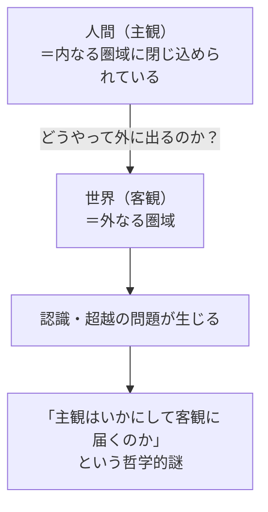
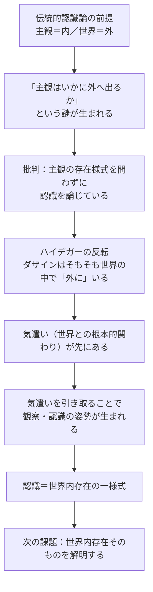

## 「§13」は何だと言っているのか

*ハイデガー『存在と時間』第13節*

---

### この節の結論を一言で

「認識（知ること）は、孤立した主観が外の世界へ橋を渡す行為ではない。人間（ダザイン）はそもそも最初から世界の中に出ていて、認識はその"世界の中にいること"の一つの様式にすぎない」——これがこの節のすべてです。

---

### 出発点：なぜ「認識」が問題になるのか

ハイデガーはまず、伝統的な哲学が「認識」をどう捉えてきたかを確認します。

> 認識を「主観と客観との関係」として定立する見方であり、この見方はそれが含む「真理」と同じだけの空虚をも内に宿している。

長い哲学の歴史の中で、「認識とは内側にいる主観が外側の客観を知ること」というイメージが当然のように使われてきました。ここから「主観はどうやって外へ出るのか？」という謎が生まれ、哲学者たちはずっとその謎と格闘してきた、とハイデガーは言います。

---

### 問題の構造：「内と外」という罠

伝統的な見方を整理するとこうなります。

このモデルでは、人間はまず「箱の中」にいて、そこから世界という「別の箱」へどう到達するかが問われます。ハイデガーが批判するのは、この前提そのものです。

> 幾多の変奏をともなうこの問いの定立においては、一貫して欠落しているのが、認識する主観の存在様式についての問いである。

つまり、「どう出るか」を問う前に、「そもそも人間はどういう仕方で存在しているのか」を問わなければならない、と言っているのです。

---

### ハイデガーの反転：最初から「外」にいる

ここがこの節の核心です。

> ……へと向かいつつ把握することにおいて、ダザインはまず自らが閉じ込められている「内なる圏域」から外へと踏み出すのではなく、むしろその根本的な存在様式からして、つねにすでにそのつど既に開示された世界において出会う存在者のもとで「外に」いる。

ダザイン（人間的な存在者）は、最初から世界の中に「外に」います。「内から外へ出る」という問い自体が、間違った前提の上に立っているのです。

この「外にいる」という感覚を日常の例で置き換えると——コーヒーカップを手に取るとき、私たちは「内なる意識が外の物体に働きかけた」とは感じません。最初からカップとともにある。ハイデガーはこれを**気遣い（Besorgen）**と呼び、それが認識より根本的な存在のあり方だと言います。

---

### 認識が成り立つ順序

では「認識」はどこから来るのか。ハイデガーはこう描きます。

| 段階 | 何が起きているか |
|------|-----------------|
| ① 気遣いの中にいる | 道具を使い、世界と関わりながら生きている（最も根本的な状態） |
| ② 気遣いを引き取る | 道具の使用・製作などをいったん止める |
| ③ 単に眺める | 存在者をただの「外見（εἶδος）」として見る姿勢が生まれる |
| ④ 注視・照準 | ある存在者に向けて方向を定め、観察する |
| ⑤ 把握・規定 | 観察したことを「何かを何かとして」言語化し、命題にする |
| ⑥ 保持・学問 | 言表されたものとして蓄積され、科学・学問になる |

認識はこの②〜⑥のプロセスですが、その基盤には①の「気遣いの中にいること」——世界の中にすでに出ている状態——があります。

---

### 「知ること」も「忘れること」も外にいること

ハイデガーはさらに踏み込みます。

> 存在者の存在連関についての「単なる」知において……私は根源的な把握の場合と同様に、世界の中で存在者のもとに外にいるのであり、それ以下ではない。

頭の中で「ただ考えている」だけのときも、何かを忘れているときも、誤解しているときも——すべて「世界の中に存在している様式の変奏」です。意識が「内」に引き込もられるような瞬間であっても、それは根本的な「外にいること（内-存在）」の変形に他なりません。

---

### この節の結論

> 認識とは世界内存在に基礎づけられたダザインの一様式である。それゆえ世界内存在は根本体制として、先行的な解釈を必要とする。

認識は主観と世界を結ぶ橋ではなく、**世界の中にいるダザインが、その「いること」のある特定の姿勢をとっているときに起こること**です。だから「認識問題（主観はどう外へ出るのか）」はそもそも誤った問いの立て方であり、正しく問い直すなら「世界の中にいること（世界内存在）とは何か」を先に解明しなければならない——そのためにこれ以降、「世界の世界性」の分析へと歩みが進みます。

---

### まとめ：§13の論証の流れ

