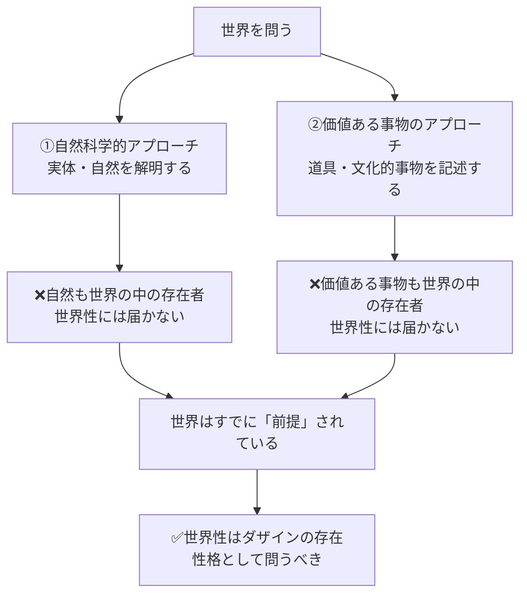

## 「§14」は何だと言っているのか

*ハイデガー『存在と時間』第14節*

---

### この節の結論を一言で

「世界」を正しく問うためには、世界の「中に」ある物（存在者）を列挙・記述するのではなく、**ダザイン（人間的存在）の存在様式そのものとして「世界性」を問わなければならない**——それがこの節の核心である。

> 「世界」は存在論的には、本質的にダザインではない存在者の規定ではなく、ダザイン自身の性格である。

つまり「世界」は外にあるモノの集まりではなく、私たちの「いる」あり方に属している、ということだ。

---

### なぜ「当たり前の記述」では足りないのか

節の冒頭でハイデガーは、一見ごく普通に思える問いの立て方を槍玉に挙げる。

「世界を記述する」と聞けば、誰でもこう考えるだろう——家、木、人間、山、星。それらを並べて説明すれば「世界の記述」になる、と。

しかしハイデガーはこれをはっきり退ける。

> 「記述は存在者に貼り付いたままである。それは存在的（ontisch）なのだ。しかし求められているのは存在なのである。」

ここで二つの言葉を押さえておきたい。

| 用語 | 意味 | 例 |
|------|------|----|
| **存在的（ontisch）** | 「何があるか」という事実レベルの話 | 「この部屋には机がある」 |
| **存在論的（ontologisch）** | 「それはどのような仕方で存在しているか」という構造レベルの話 | 「その机はどういう意味で"ある"のか」 |

物を列挙することは存在的（事実の確認）にとどまる。哲学が問うべきは、その「ある」という事態の構造——**存在論的な問い**——だとハイデガーは言う。

---

### 二つの「よくある失敗」

では「物の羅列」を超えて、もう少し賢く問えばいいのか。ハイデガーは二つのアプローチを検討し、いずれも「世界」には届かないと論じる。

**失敗①：自然科学的アプローチ**
　自然的事物の根本的な存在性格（実体性）を問い、数学的自然科学で自然を解明しようとする。これは確かに存在論的に見える。しかし、

> 「自然はそれ自体、世界のうちで出会われ……発見されうる一つの存在者なのである。」

自然は世界の「中身」の一つにすぎない。自然の存在論は、世界という「枠組み」そのものには到達しない。

**失敗②：「価値ある事物」アプローチ**
　道具や文化的意味をもつ事物こそが「私たちの生きている世界」を示しているのではないか。これはより日常に近いが、

> 「それらの事物もまた、世界の『うちなる』存在者にほかならない。」

価値ある事物も、やはり世界の「内側に」ある存在者である。二つのアプローチはいずれも、「世界をすでに前提にしたうえで」その中身を語っているだけだ、とハイデガーは指摘する。

---

### 「世界性」とは何か——ダザインの問題へ

ここでハイデガーは問いを転換する。「世界」はモノの属性ではなく、**ダザインの存在様式の問題**だ、と。

「ダザイン」とは、哲学的に厳密に言い直した「人間的存在」のことで、ハイデガーが使う固有の術語である。日常語で言えば「ここに投げ込まれ、常にすでに世界の中にいる私たち」のことだ。

> 「世界性はそれ自身一つの実存論項（Existenzial）である。」

**実存論項**とは、ダザインの存在を成り立たせている構造的な特徴のことだ。「世界性」はダザインが「世界の中にいる」というあり方の構造を指す概念であって、外にある何かではない。

---

### 「世界」という語の四つの意味

節の中盤でハイデガーは、「世界」という言葉が実はいくつもの意味で使われていることを整理する。混乱を防ぐための地図として読んでほしい。

| 番号 | 種別 | 意味 | 具体例 |
|------|------|------|--------|
| **①** | 存在的 | 世界内部に現前しうる存在者の全体 | 「自然界のすべてのもの」 |
| **②** | 存在論的 | ①の存在者の存在、または存在者の領域 | 「数学者の世界」（数学的対象の領域） |
| **③** | 存在的（ダザイン寄り） | ダザインが実際に「生きているその中」 | 「公共の世界」「家庭的な環境世界」 |
| **④** | 存在論的・実存論的 | 世界性一般の概念（アプリオリな構造） | 「世界性」そのもの |

ハイデガーは以後、**③の意味で「世界」という言葉を術語として使う**と宣言する。それ以外の意味で使うときは引用符（「」）をつけて区別するという。

---

### 伝統的存在論が見逃してきたこと

節の終盤、ハイデガーは哲学史への批判を簡潔に述べる。

これまでの存在論——とりわけデカルト——は、「世界」を空間的に広がる物体（**延長的物体＝res extensa**）として理解しようとした。しかしこれは、世界性の現象を「飛び越えて」しまっている。

> 「自然は……可能的な内世界的存在者の存在の限界事例である。」
> 「自然のカテゴリー的総括としての『自然』は、世界性を理解可能にすることが決してできない。」

自然科学的・数学的な「世界」理解は、ダザインの日常的・実存的な世界との関わりを無視した抽象だ——ハイデガーはそう主張する。

---

### では、どこから始めるか——節の締め括り

こうした反省を踏まえて、ハイデガーは分析の出発点を提示する。

> 「世界内存在……は、ダザインの最も身近な存在様式である**平均的日常性**という地平のなかで、分析論の主題となるべきである。」

難しい自然科学や形而上学からではなく、**私たちが毎日ごく普通に生きている日常**——その中で世界はどのように現れているか——から問いを立てるべきだ、ということだ。

その「最も身近な世界」として登場するのが、**周囲世界（Umwelt）**——私たちをとりまく、使ったり気にかけたりする物事の圏域——である。

節はここで三段階の分析計画を示して締め括られる。

| 段階 | 内容 |
|------|------|
| **A** | 周囲世界性と世界性一般の分析（次節以降の中心） |
| **B** | その分析とデカルトの「世界」存在論との対照 |
| **C** | 周囲世界の「周囲」とダザインの空間性 |

---

### まとめ：§14 が言いたいこと

「世界とは何か」を問うとき、人は反射的に「世界の中にあるもの（モノ、自然、文化的事物）」を語り始める。しかしそれはすでに世界を前提にした語りであり、世界そのものを問えていない。「世界性」はダザインの存在の構造に属するものとして問われなければならず、その手がかりは日常的な「周囲世界」の分析から得られる——これが§14 の骨格である。
