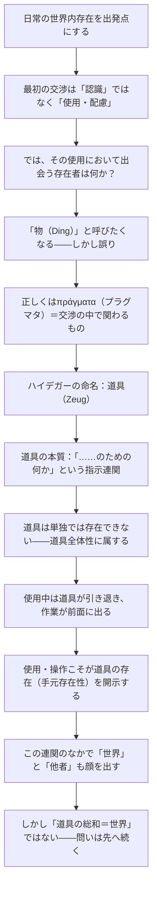

## 「§15」は何だと言っているのか

*ハイデガー『存在と時間』第15節*

---

### この節の結論を一言で言うと

私たちが日常の世界で最初に出会う存在者は「ただそこにある物（もの）」ではなく、**使うために手元にある道具**であり、その道具は単独では成り立たず、つねに**指示の連関（道具の全体的なネットワーク）の中に埋め込まれている**。この存在のあり方を、ハイデガーは **「手元存在性（Zuhandenheit）」** と呼ぶ。そして節の末尾では、「これだけでは、まだ『世界』そのものを説明したことにはならない」と問いを次に向けて開いたまま終わる。

---

### 論証の道筋をつかむ

---

### ① 出発点：日常の「使う」という関わり

ハイデガーはまず、世界の中の存在者と私たちがどう出会うかを問う。

> 最も近い交渉の様式は……手を動かし使用する配慮であり、この配慮はその固有の「認識」をもっている。

「最初に何かを知覚・観察してから使う」のではない、というのがポイントである。私たちは扉の取っ手を「取っ手とはいかなる物体か」と考えながら回すのではなく、すでに「開けるもの」として扱っている。世界との一番近い関わり方は、**観察より前の使用**なのだ。

---

### ② 「物（Ding）」と呼ぶことの何が問題か

では、その使用において出会うものを何と呼べばよいか。

> 人はこう答える。「物（Dinge）だ」と。しかしこの自明に見える答えによって、求められている前現象的な地盤はおそらくすでに踏み外されている。

「物」と呼んだ瞬間、私たちは存在者を「そこにある物体」として捉えてしまう。すると哲学の問いは「実体は何か」「延長はあるか」といった方向に向かう。しかしそれは、**使用の中で出会われる存在者のありさまをすでに隠蔽している**、とハイデガーは言う。

「価値を帯びた物」と言い直しても同じことだ。「価値の帯び方」という謎が別に生まれるだけで、問題は解決しない。

---

### ③ 「道具（Zeug）」という命名

ギリシア語の πράγματα（プラグマタ）——「交渉・実践（πρᾶξις）の中で人が関わるもの」——に近い概念として、ハイデガーは **道具（Zeug）** という語を選ぶ。筆記用具、縫い物道具、乗り物、測定用具……これらがその例である。

ポイントは道具の本質的な定義にある。

> 道具は本質的に「……のための何か」である。

ハンマーは「釘を打つため」にある。釘は「板を固定するため」にある。板は「小屋を建てるため」にある。こうして道具は必ず**別の何かへの指示（verweisung）**を内包しており、それが連鎖する。

---

### ④ 道具は単独では「ある」ことができない

> 道具は厳密に言えば決して「ある」ということがない。道具の存在には、つねにすでに一つの道具全体が属している。

一本のペンだけが存在するのではない。インク・紙・机・ランプ・部屋……が連動してはじめてペンはペンとして機能する。私たちが部屋に入ったとき「最初に出会うもの」は個々の道具ではなく、**部屋全体（住居用具として）**である。個々の道具は、その全体性の中から姿を現す。

| 問い | 答え |
|---|---|
| 最初に出会うものは何か | 個々の物ではなく「道具全体性」 |
| 道具の本質は何か | 「……のための何か」という指示連関 |
| その連関の構造は | 役立ち性・寄与性・使用可能性・手近さ |
| 道具が単独で成立しない理由 | 別の道具への指示なしには意味を持てないから |

---

### ⑤ 使うとき道具は「退く」――手元存在性

使用のリアルな場面をハイデガーは細かく観察する。

> ハンマーという事物をただ見つめるだけであることが少なければ少ないほど、手でつかみとるようにして使われれば使われるほど、それとの関係はいよいよ根源的となり、それがある当のもの、すなわち道具として、いよいよ覆いなく出会われる。

うまく釘を打っているとき、私はハンマーを意識していない。ハンマーは「道具として退いている」。意識は釘や板、完成する棚に向いている。この**使用の只中で道具がいわば透明になる**状態こそが、道具を道具として最もよく開示している。

この存在のあり方を **手元存在性（Zuhandenheit）** と呼ぶ。対して、ハンマーを机の上に置いてじっと眺めるときの存在のあり方は **眼前存在性（Vorhandenheit）** ——ただそこにある物として現れる——と呼ばれる（本節では後者への批判として対比される）。

---

### ⑥ 道具の連関が「世界」と「他者」を開く

道具の指示連関をたどると、使用者の身体・自然・他者・社会的な公共空間にまで広がっていく。

靴は皮革から作られ、皮革は動物から、動物は自然から。道路や橋や時計は「荒天・暗闇・太陽の位置」を考慮に入れており、配慮の中で自然が「道具的に」開示される。

> 森は林業用地であり、山は採石場であり、河川は水力であり、風は帆の中の風である。

また、制作された作品は「誰かのため」に作られる。その使用者が生きる世界もまた、道具連関の中に顔を出す。道具を使うとき、私たちはすでに**他者の存在をも「前提」にしている**のである。

---

### ⑦ しかし――問いはここで終わらない

節の末尾は答えではなく、問いで締めくくられる。

> この存在者を組み合わせたところで、その総和として「世界」のようなものが生じるわけではない。そもそもこの存在者の存在から、世界現象の呈示へといたる道が存在するのだろうか。

道具の存在様式（手元存在性）を明らかにしても、「世界とは何か」はまだ答えられていない。道具の総和が世界なのではないからだ。第15節は「道具の分析」を完了させると同時に、**世界の問いという次の難問を開いて終わる**。

---

### まとめ：§15 の論点地図

| 段階 | 主張 |
|---|---|
| 出発点 | 日常の関わりは「使用」であり、「観察」ではない |
| 誤った命名 | 「物（Ding）」と呼ぶと存在論的に道を踏み外す |
| 正しい命名 | 「道具（Zeug）」＝「……のための何か」 |
| 道具の構造 | 指示連関の全体性のなかにのみ存在できる |
| 使用と開示 | 使うときこそ道具が最もよく開示される（手元存在性） |
| 連関の広がり | 自然・他者・公共世界まで開示される |
| 残された問い | 道具の総和≠世界。「世界」の問いは次節以降へ |
