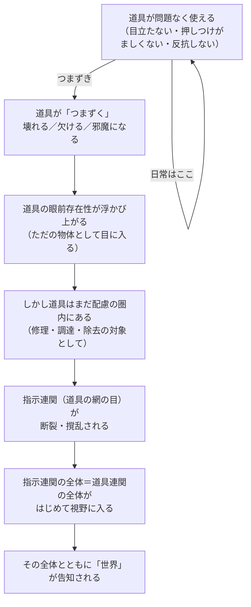

## 「§16」は何だと言っているのか

*ハイデガー『存在と時間』第16節*

---

### この節の結論から先に言ってしまう

ハイデガーがこの節で言いたいことは、一言でまとめるとこうだ。

> 世界は、道具がうまく使えなくなったときに、はじめてほんの一瞬だけ「輝き現れる」。

私たちは普段、道具（ハンマー、パソコン、椅子……）を意識せずに使っている。うまく使えているあいだは、道具の存在も、道具が埋め込まれている「世界」も、目に入らない。ところが、道具が壊れたり、なかったり、邪魔になったりすると、その背景にあった「世界」が一瞬顔をのぞかせる。

この節は、その「顔をのぞかせる瞬間」を三つのパターンに分けて丁寧に記述し、世界という現象を「視野に捉える入口」を示す節である。

---

### まず用語を整理する

この節には独特の語が頻出するので、最初にまとめておく。

| ハイデガーの語 | 平たい意味 |
|---|---|
| **ダザイン** | 人間（「ここに存在するもの」）。世界のただ中に投げ込まれた存在者 |
| **手許存在（Zuhandenheit）** | 道具として「すぐ使える状態にある存在の仕方」 |
| **眼前存在（Vorhandenheit）** | ただ「そこに転がっている物体」としての存在の仕方 |
| **周視（Umsicht）** | 道具を使いながら周囲に向けている、目立たない実践的な「見回し」 |
| **配慮（Besorgen）** | 日常の生活的なかかわり合い全般。道具を使って何かをすること |
| **指示連関** | 「このハンマーは釘のため、釘は板のため、板は家のため……」という目的の網の目 |
| **世界内部的存在者** | 世界のなかで出会われる個々の存在者（道具や物） |

---

### 問いの立て方：世界はどうやって「ある」のか

節の冒頭でハイデガーは問う。

> 世界それ自体は世界内部的な存在者ではない。しかしながら世界は、この存在者をかくも深く規定しているため、世界が「ある」かぎりにおいてのみ、存在者は出会われうる。

「世界」は机や椅子のように目の前に置いてある「もの」ではない。それなのに世界は確かに「ある」。では、世界はどういう仕方で「ある」のか。

ハイデガーの見立ては次のとおりだ。ダザイン（人間）は、存在論の理論を学ばなくても、日々の生活のなかでぼんやりと「世界のようなもの」を了解している。そしてその了解が、特定の日常的場面で一瞬あらわになることがある。その場面を捕まえれば、「世界」という現象を哲学的に解明する糸口になる——というのがこの節全体の戦略である。

---

### 三つのパターン：道具がうまくいかなくなる瞬間

日常の配慮（道具を使ったかかわり）が「つまずく」パターンを、ハイデガーは三つに区別する。

#### パターン①　目立ち（Auffälligkeit）――道具が壊れる

ハンマーの柄が折れた。そのとき何が起きるか。

壊れる前のハンマーは、意識の外にあった。釘を打つという行為に「没入」しているあいだ、ハンマーそのものは視野に入らない。ところが壊れた瞬間、ハンマーが「目につく（fällt auf）」。それはもはや「すぐ使える道具」ではなく、「ただそこに横たわる物体（眼前存在者）」として姿を現す。

> 使用不能性の開示において、道具立ては目につく。

ただし、壊れたハンマーはまだ完全に「ただの物体」になったわけではない。修理しようという配慮の対象として、なお道具の圏内に引き止められている。

#### パターン②　押しつけがましさ（Aufdringlichkeit）――道具が欠けている

もっと極端な場合——必要な道具がそもそも存在しない（あるいは在庫切れ）のとき。

欠けているものは「見えない」はずなのに、その欠如によって残りの道具たちが急に「押しつけがましく」なる。欠けている部品なしでは動かせない機械がただそこに鎮座し、自分の前に立ちふさがる。配慮が欠如しているものを発見することで、「手許にある」ものが逆説的にその不動性・眼前性をあらわにする。

#### パターン③　反抗性（Aufsässigkeit）――道具が邪魔になる

壊れてもなく、欠けてもいないが、「邪魔になる」もの。配慮が向かっている仕事の「邪魔になる」ものが割り込んでくることで、本来配慮されるべきものへの道が塞がれる。その反抗的な存在が、いまだ手をつけていない未処理のものとして浮かび上がる。

---

### 三つのパターンの共通構造

三つのパターンに共通するのは、「手許存在（すぐ使える道具の在り方）が揺らぐと、眼前存在（ただそこにある物体）が顔を出す」という構造だ。そしてその眼前存在性が顔を出す瞬間に、道具をつなぐ**指示連関の全体**——「このために、あれのために、それのために……」という目的の網の目——が一気に視野に入る。

> 用具連関は……顧慮においてつねに予め見通されている全体として、照らし出される。しかしこの全体とともに、世界が告知してくる。

---

### 逆説：うまくいっているときこそ世界は「隠れている」

ここにハイデガーの重要な洞察がある。

道具がスムーズに使えているとき、私たちは道具を意識しない。それはつまり、道具をつなぐ指示連関も意識しない。指示連関が意識されないとき、世界もまた「告知してこない」。そしてまさにその状態が、道具が「自体的に（An-sich）」——つまり、気づかれることなくひっそりと「それ自体として」——存在しているということの意味なのだ。

> 世界が告知してこないことが、手許存在者がその目立たなさから抜け出てこないための可能性の条件である。

この「目立たなさ・押しつけがましくなさ・反抗のなさ」という否定的な言い方こそが、じつは道具の「普通の在り方」を積極的に表現している——これはハイデガー独特の言い回しで、「うまくいっているときの透明さ」を指している。

---

### 節の到達点と残された問い

| 問い | この節での答え |
|---|---|
| 世界はどうやって「ある」のか | 日常の配慮のつまずきのなかで一瞬「告知（輝き現れ）」する |
| 世界が告知されるのはいつか | 道具が目立ち・押しつけがましく・反抗するとき |
| 世界は道具の集まりか | ちがう。道具の集まりではなく、道具を可能にしている全体的な地平 |
| 「世界」そのものの構造は何か | この節では解明していない。次節以降の課題として残る |

節の末尾でハイデガー自身がこう述べる。

> これらの問いは世界性の現象と問題の析出を目指しているが、それに答えるためには……より具体的な分析が要求される。

つまりこの§16は、「世界という現象を捉える入口に立った」というところで終わる。世界の構造そのものの解明は、続く節へと引き渡されている。

---

### まとめ

この節をひと言で言うなら、「**壊れた道具が哲学を呼び込む**」だ。

ハンマーが折れ、部品が欠け、邪魔なものが立ちふさがる——そのつまずきの瞬間にだけ、私たちはふだん「透明」だった世界の輪郭をかすかに感じ取る。ハイデガーはその感触を哲学の言葉で捕まえようとした。この節はその試みの最初の一歩である。
