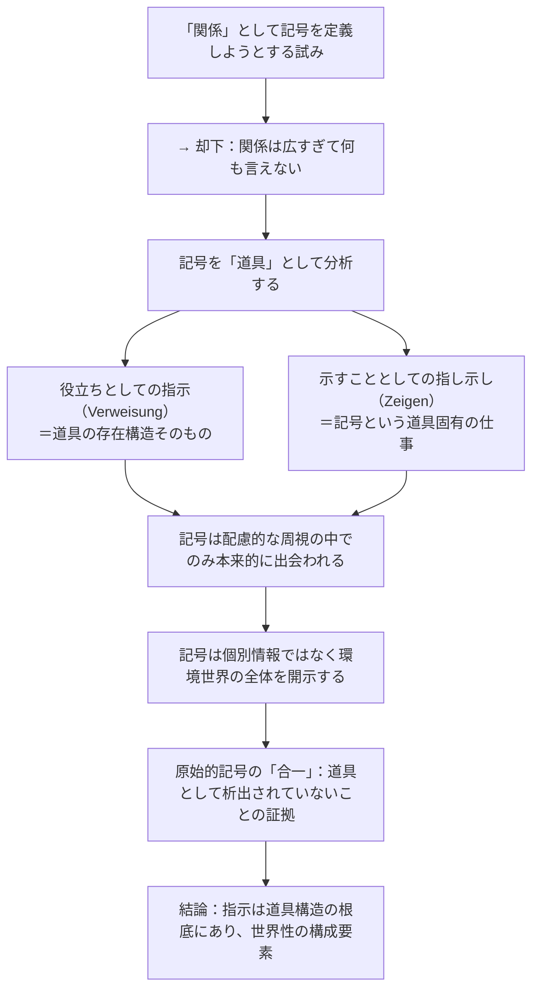

## 「§17」は何だと言っているのか

*ハイデガー『存在と時間』第17節*

---

### この節の結論を一言で

§17の問いは「**記号（Zeichen）とは何か、そしてそれは指示（Verweisung）とどう違うのか**」である。ハイデガーが最終的に言いたいのは、記号は単なる「モノとモノの関係」ではなく、**私たちが世界の中でどう向き合っているか（配慮的な交わり）を通じてはじめて成り立つ**、ということだ。さらに記号の分析を通じて、「指示」という現象がいかに世界そのものの成り立ちに深く根ざしているかを示すための地盤を掘り下げている。

---

### 出発点：なぜ「記号」を分析するのか

前節（§16まで）では、道具（ハンマーや机など、私たちが日常的に使うもの）が「指示の網の目」の中で存在することを示した。ところが「指示（Verweisung）」自体はまだぼんやりしたままだった。

> 指示という現象が姿を現した。もっともそれはきわめて輪郭的な形においてであり……まだ指し示されたにすぎないその現象を、その存在論的な由来という観点から解明する必要性を強調したのであった。

そこでハイデガーは**記号（Zeichen）**という特別な道具に注目する。記号は「指示すること」が仕事の道具だから、「指示」という現象をいちばん鮮明に見せてくれる素材になる、というわけだ。

---

### ステップ１：「関係」という形式化では何も言えない

「記号とは何か」を考えるとき、まず思いつくのは「AがBを指し示す関係だ」という整理だろう。しかしハイデガーはこれを退ける。

> 指示、記号、あるいはそもそも意味という現象の探究にとって、それを関係として特性規定することによっては何も得られない。

「関係」はあまりにも広い。すべての指示は関係だが、すべての関係が指示なわけではない。すべての記号による「指し示し」は指示の一種だが、すべての指示が記号の指し示しなわけでもない。これを整理すると次のようになる。

| 概念 | 含まれる方向 |
|---|---|
| 関係（Beziehung） | 最も広い形式的な概念 |
| 指示（Verweisung） | 関係の一種。道具の存在構造に属する |
| 指し示し（Zeigen） | 指示の一種。記号という道具の「仕事」 |

つまり「関係」は上位概念ではなく、むしろ「指示」の方に存在論的な根を持つ可能性がある、とハイデガーは言う。

---

### ステップ２：矢印の例で「指し示し」と「指示」を区別する

ハイデガーは自動車に付いた方向指示器（回転式の赤い矢印）を例にとる。

- この矢印は**道具**である：交通という道具連関の中に位置づけられている
- この矢印の「仕事」は**示すこと（Zeigen）**：進む方向を教える
- 矢印を使うのは運転者だけではなく、**歩行者や他の運転者も**：彼らは矢印に応じて「避ける」「立ち止まる」という行動をとる

ここで重要な区別が立つ。

> 「示すこと」としての「指示すること」は、道具としての記号の存在論的構造ではない。

つまり——

| 用語 | 意味 | 道具論上の位置 |
|---|---|---|
| 指示（Verweisung）としての「…への役立ち」 | 道具が何かのためにある、という存在構造そのもの | **存在論的・カテゴリー的な規定**（道具はすべてこれを持つ） |
| 指し示し（Zeigen）としての「示すこと」 | 記号という特定の道具が「示す」という仕事をもつ | 「役立ち」の何のために、の**存在的な具体化** |

槌も「釘を打つための役立ち」という指示をもつが、槌は記号ではない。記号だけが「示すこと」を仕事とする。しかし「示すこと」は「役立ちとしての指示」に支えられてはじめて成り立つ。

---

### ステップ３：記号はどのように「世界」を開くか

矢印を「凝視して観察する」のは、記号との**本来的な関わり方ではない**。

> 徴標は配慮的な交わりの周視（Umsicht）に向けられており、その指示に従う周視が……その都度の環境世界の周辺的なものを明示的な「見渡し」へともたらすのである。

「周視（Umsicht）」とは、日常の配慮の中で状況全体を読む、いわば「使いながら見回す目」のことだ。矢印を見た歩行者は矢印そのものを観察しているのではなく、**自分が今いる交通空間全体の中で身をどう置くかを把握している**。記号は個別の情報を伝えるだけでなく、**環境世界の全体を配慮的な視点に向けて開示する**働きをする。

同じことが「ハンカチの結び目」の例でも示される。結び目は「今日やるべき何か」を示す。しかし設定者本人がその意味を忘れると、新たな記号が必要になる。それでも結び目は記号性を失うのではなく、むしろ「意味が読めない手許なもの」として不安をかきたてる——これもまた、記号が世界内の配慮的な関係の中で機能していることを示している。

---

### ステップ４：「原始的な」記号使用が教えてくれること

フェティシュや呪術を例に、ハイデガーはさらに考察を深める。「原始人」（ハイデガーの時代の民族学的な言い方）は記号とそれが指し示すものを「合一」させるとされる。これをハイデガーはこう解釈する。

> この「合一」とは、あらかじめ孤立させられていたものの同一化ではなく、記号が指示されたものから未だ自由になっていないことである。

つまり、記号と指示対象が「くっついて見える」のは記号が物として客体化された上で融合したのではなく、**そもそも記号がまだ独立した「道具」として析出されていない**からだ。これは逆から言うと、私たちが日常使う記号は、配慮的な交わりの中で「指示するもの」と「指示されるもの」がある程度区別されて機能している、ということを意味する。

---

### 論証の流れを整理する

---

### 節の末尾でまとめられる「三重の関係」

ハイデガーは記号と指示の関係を最終的に三点にまとめる。

| 番号 | 内容 | 平たく言うと |
|---|---|---|
| ① | 記号の「示すこと」は、役立ちとしての指示（Um-zu）に基づく | 記号も「何かのためにある」という道具構造の上に乗っている |
| ② | 記号の指し示しは、道具連関・指示連関の一部として手許にある | 記号は孤立せず、他の道具たちのネットワークの中にいる |
| ③ | 記号はその手許にあることによって、環境世界を配視に対して明示的に開く | 記号を使うことで、私たちは世界全体の輪郭をつかみ直す |

---

### この節が全体の中で果たす役割

§17は「記号論」を展開しているのではない。記号を素材にしながら、**指示という現象が道具存在の根底にあること**、そして**その指示の全体性が「世界性」を構成する**という、次の大きな議論への橋渡しをしている。最後の問い——「指示連関はいかなる意味で手許存在性を構成し、いかなる意味で世界性一般の構成契機であるか」——は、まさにそれに続く節で引き受けられる問いである。
