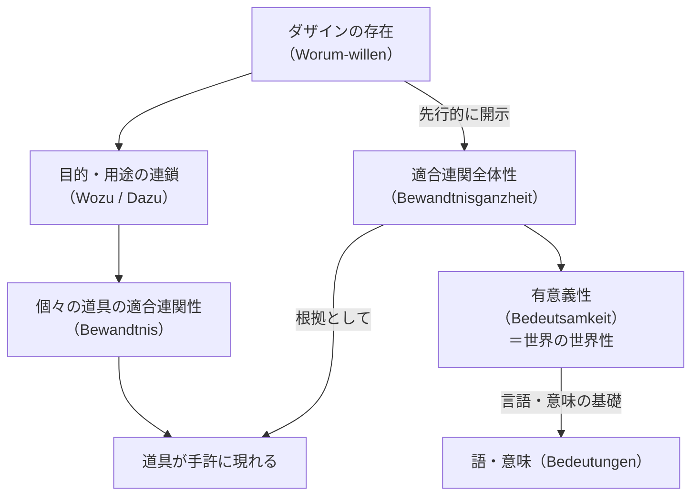

## 「§18」は何だと言っているのか

*ハイデガー『存在と時間』第18節*

---

### この節が言いたいこと――一行で言えば

道具が道具として私たちの前に現れるためには、世界そのものが「意味のつながり」として**あらかじめ開かれていなければならない**。その「意味のつながり全体」こそが**有意義性（Bedeutsamkeit）**であり、これが世界の世界性を構成する――それがこの節の結論である。

---

### 前提の確認――「適合連関性」とは何か

第17節までの議論で、道具（手許存在者）は単独では存在しないことが示されていた。ハンマーは「打つこと」のために、打つことは「固定すること」のために、固定することは「雨風をしのぐこと」のために……というように、道具はつねに**他の何かへの指示（Verweisung）**の網の目の中にある。

この節ではまず、その指示の構造に名前が与えられる。

> 存在者はある何かに際して何かに係わり（Bewenden）をもつ。手許存在者の存在性格は、適合連関性（Bewandtnis）である。

「適合連関性」とは「何かに際して、何かに係わりをもつ」という存在のあり方のことだ。たとえばハンマーは「打つことに際して、固定することに係わりをもつ」。これは単なるハンマーの「性質」ではない――ハンマーが**存在するそのあり方**そのものである、とハイデガーは言う。

---

### 「道具の連鎖」はどこで終わるのか

適合連関性の連鎖（何のために→何のために→……）は永遠に続くのか？　そうではない。ハイデガーはここで連鎖の**終端**を探す。

> この根源的な何のためにはDazu（……のための手段）ではなく……根源的な「何のために」とは、或ることのために（Worum-willen）である。しかし「……のために（Um-willen）」は、つねにダザインの存在に関わる。

| 連鎖の段階 | 例 | 性格 |
|---|---|---|
| 道具→道具 | ハンマー→打つこと→固定すること | 手段の連鎖（Dazu） |
| 道具→目的 | 固定すること→雨風をしのぐ家 | 奉仕性（Wozu） |
| 目的→究極の根拠 | 家→**ダザインの住まいのために** | 「或ることのために（Worum-willen）」 |

「**ダザイン**」とは私たち人間の存在のことだ（「そこにある」という意味のドイツ語）。道具の連鎖は最終的に、道具ではなく**人間の存在そのもの**へと帰着する。そしてこの最終根拠だけは、それ自身もまた別の何かの「手段」ではない。

---

### 「あるがままにしておくこと」――存在論的な読み

ここでハイデガーは重要な区別を設ける。「なりゆきにまかせること（Bewendenlassen）」には二つの意味がある。

- **存在的な意味**：実際の営みの中で、道具をそのままの用途に使わせておくこと（ハンマーをハンマーとして使う）
- **存在論的な意味**：道具が道具として**出会われる可能性そのもの**を先行的に開いておくこと

後者のほうが根本的だ。私たちが何かを道具として認識する**よりも前に**、世界はすでにその道具が「手許にある」ものとして現れる場を開いている。これが「**ア・プリオリな完了形**」という表現の意味だ――世界の開示は、つねにすでに完了している、ということ。

---

### 「有意義性」――世界の構造の名前

連鎖全体を支えている「あらかじめの開示」とは何か。ハイデガーはここで核心的な概念を導入する。

> 何々のためにということ（Worumwillen）は何々するためにということ（Um-zu）を意味し、これは何々のためにということ（Dazu）を、これはなりゆきに委ねること（Bewendenlassen）の何においてということ（Wobei）を、これは連関（Bewandtnis）の何をもってということ（Womit）を意味する。

「意味する（bedeuten）」という動詞が連鎖を結ぶ。「あること」が「別のこと」を意味し、その意味がさらに別のことを意味する――この**「意味すること」の連関全体**が**有意義性（Bedeutsamkeit）**だ。

> この意味することの連関全体を、われわれは有意義性と呼ぶ。それこそが、世界の――ダザインがそれとして常にすでにあるところのものの――構造をなしている。

つまり：

| 概念 | 意味 |
|---|---|
| 適合連関性（Bewandtnis） | 個々の道具の「～のために～に係わる」という存在のあり方 |
| 適合連関全体性（Bewandtnisganzheit） | 道具どうしの連鎖全体 |
| 有意義性（Bedeutsamkeit） | その連鎖全体が「意味しあう」構造――世界の世界性そのもの |

有意義性はさらに、**言語の可能性の根拠**でもあるとハイデガーは付け加える。「意味（Bedeutungen）」という語の意味は、すでに世界が有意義性として開示されているからこそ成立する。

---

### 「関係の体系」への批判的応答

ここでハイデガーは自分の議論への想定反論に答える。

「指示の連関の連関」と言うなら、それは単なる関係の体系（数学的・論理的な）に過ぎないのではないか？　世界が関係の体系なら、物のリアルな存在が消えてしまわないか？

ハイデガーの答えは明快だ。三つの存在様式を峻別せよ、と。

| 存在様式 | 具体的なもの | 性格 |
|---|---|---|
| **手許存在性（Zuhandenheit）** | 使われている道具 | カテゴリー（ダザイン以外） |
| **眼前存在性（Vorhandenheit）** | 観察・計測される事物 | カテゴリー（ダザイン以外） |
| **世界性（Weltlichkeit）** | 世界の世界性 | 実存論的規定（ダザインの在り方） |

世界性は「思惟が作った関係体系」ではない。それは

> 配慮的な顧慮（besorgende Umsicht）がそれとして常にすでに滞在している諸連関

つまり、理論的に構成されたものではなく、私たちが日々の営みの中で**すでにその中にいる**連関である。むしろ、世界性という基盤があってはじめて、道具がその「実体的なそれ自体」として発見可能となり、ひいては自然科学的な「眼前存在者」として把握されることも可能になる。

---

### この節の到達点と次への橋渡し

この節の議論をまとめると次のようになる。

1. 道具の連鎖（適合連関性）は、最終的に**ダザイン自身の存在**へと帰着する。
2. ダザインはその存在了解において、世界を**有意義性の連関として**あらかじめ開示している。
3. この有意義性こそが**世界の世界性**であり、すべての道具・事物が出会われるための**条件**である。
4. この構造は「思惟の産物」ではなく、**実存論的な事実**――ダザインがいつもすでにそこにいる在り方――だ。

節の末尾では、世界性の議論をいっそう際立たせるために、**デカルトの世界解釈との対照**（§19〜21）が予告される。デカルトは世界を「延長（extensio）」として捉えたが、それはまさに「眼前存在性」の立場から世界を見ることであり、ハイデガーが示した「手許存在性」と「世界性」の次元を根本的に見落としている――という批判的検討へと議論は進む。
