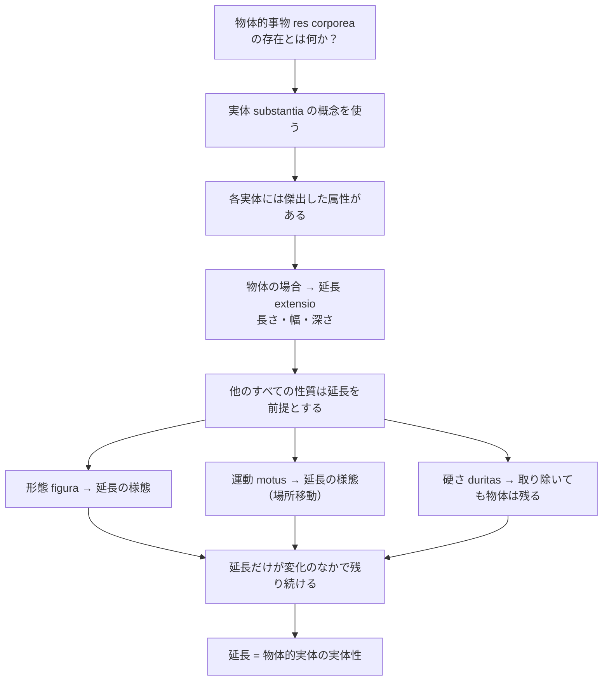

## 「§19」は何だと言っているのか

*ハイデガー『存在と時間』第19節*

---

### この節の結論を先に言ってしまう

デカルトは「世界」、つまり物体的な事物の世界を **res extensa（延長をもつもの）** として定義した。「延長」とは長さ・幅・深さという空間的な広がりのことだ。ハイデガーがこの節でやっているのは、デカルトの議論の段取りを丁寧に追いながら、「デカルトは物体的な存在者の存在を、どういう考え方で捉えたのか」を明確にすることである。

結論を一行でまとめると——

> **物体的事物の「本当に存在するもの」は延長（extensio）であり、形・運動・硬さ・重さ・色などはすべてその「様態（modus）」にすぎない。**

この結論に至るデカルトの論証を、ハイデガーは以下の順序で整理している。

---

### ステップ①　なぜ「実体（substantia）」から話が始まるのか

デカルトは「考える私（ego cogito）」と「物体的なもの（res corporea）」を区別した。これがのちの「精神と自然」という二項対立の出発点になる。

では、物体的なものの「存在」とは何か。ハイデガーは、デカルトが使う鍵概念を確認する。

> それ自体において存在する何かの存在を表わすタイトルは、**substantia（実体）**である。

「実体（Substanz）」という言葉は二重の意味を持つ。①存在者そのもの（一つの実体）、②その存在者の「あること」の構造（実体性）。この二義性はすでに古代ギリシャ語の **ousia（ウーシア）** にも宿っていた、とハイデガーは指摘する。重要なのは、物体的事物の **実体性**、つまり「それが物体的事物として成り立っているのはなぜか」を問うことだ。

---

### ステップ②　「傑出した属性」で実体の本質を読む

デカルトによれば、実体はその「属性（Attribut）」を通じてはじめて私たちに近づける。そして各実体には、他のすべての属性の「土台」となる **傑出した固有性（praecipua proprietas）** が一つある。

物体的実体の場合、その固有性とは何か。デカルトは答える。

> **Nempe extensio in longum, latum et profundum, substantiae corporeae naturam constituit.**
> すなわち、長さ・幅・深さにおける延長が、物体的実体の本性を成り立たせている。

なぜ延長がその地位を持つのか。理由は明快だ——

> **Nam omne aliud quod corpori tribui potest, extensionem praesupponit.**
> 物体に帰せられうる他のすべての性質は、延長を前提としている。

延長は「先に存在している」のだ。他の規定はすべて延長があってはじめて意味をもつ。

---

### ステップ③　形・運動・硬さはどう扱われるか

デカルトの論証の核心は、物体の諸性質を「延長の様態（modus）にすぎない」と示すことにある。

**形態（figura）の場合**
一つの物体は、全体の延長量を保ちながら、長さ・幅・深さへの配分を変えることができる（粘土を細長くしたり平たくしたりするイメージ）。つまり形は変わるが延長は変わらない。形は延長の一様態だ。

**運動（motus）の場合**
運動が物体の存在的な属性として語られうるのは、「局所的な場所移動」として、すなわち延長の変化として捉えられるときだけだ。運動を引き起こす「力」については問わない、とデカルトは言う。力は物体の存在規定には入らない。

**硬さ（duritas）の場合**
これが最も丁寧に論じられる部分だ。デカルトの議論を要約すると——

> 硬さとは、手が触れようとしたとき、物体の各部分が手の動きに「抵抗する」ことである。もし物体が手の接近と同じ速度で退いていくとすれば、接触は生じず、硬さは経験されない。しかしそのように退く物体が「物体であること」を失うとは、けっして言えない。

つまり、硬さがなくても物体は物体のままでいられる。硬さは物体の存在を構成しない。重さ（pondus）・色（color）も同様だ。

| 性質 | デカルトの扱い |
|---|---|
| 延長（extensio） | 物体的実体の**本質**。すべての規定の土台 |
| 形態（figura） | 延長の**様態**。延長の配分の変化にすぎない |
| 運動（motus） | 延長の**様態**。場所移動として延長から把握される |
| 硬さ（duritas） | 取り除けても物体は残る。延長の様態 |
| 重さ・色など | 同上。物体の存在を構成しない |

---

### ステップ④　「残り続けるもの」こそが実体性だ

ここで議論が締め括られる。物体的事物の本来の存在を成り立たせるのは延長であり、延長とは——

- あらゆる仕方で**分割可能**であり（divisibile）
- **形態をとりうる**（figurabile）
- **運動しうる**（mobile）

そしてこれらすべての変化のなかにあっても**自己を保ち続けるもの**（remanet）である。

この「変化のなかで残り続ける恒常性」こそが、物体的実体の **実体性** を性格づける。

---

### この節全体の意味：ハイデガーはなぜデカルトを追うのか

この節はデカルトの議論の **内部に入って整理する** ことに徹している。ハイデガーの批判はまだ明示されない。しかし節末の結論——「恒常的に持続するものが本来の存在だ」——は、ハイデガーが次節以降で問い直す標的になる。

デカルトにとって「世界」の存在とは「数学的に測定可能な延長」だった。では、私たちが日常的に関わっている「使える道具」や「出会う場所」としての世界は、この規定のなかに収まるのか——その問いがここから始まる。
