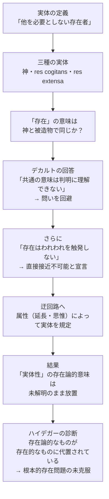

## 「§20」は何だと言っているのか

*ハイデガー『存在と時間』第20節*

---

### この節の結論を一言で

デカルトは「世界＝延長するもの（*res extensa*）」という規定の土台として「実体性」という概念を使った。しかしその「実体性」が何を意味するか——つまり「存在とは何か」——を、彼は問わなかった。問えなかったのではなく、**問いを回避した**。そしてその回避の結果、「実体」という言葉が存在論的な意味と存在的な意味とでいりまじって使われるという混乱が生じた。この混乱の背後には、「存在そのものの問い」が未解決のまま放置されているという根本的な問題がある——それがこの節の主張である。

---

### 論証の段取りを見る前に：用語の確認

| 用語 | 本節での意味 |
|------|------------|
| **存在者** | 現に「ある」もの。神・物・人間など具体的に指せるもの |
| **存在** | その「ある」ということ自体。「〜がある」の「ある」の意味 |
| **実体（substantia）** | 「存在するために他の何ものも必要としない」存在者 |
| **実体性（Substanzialität）** | 実体を実体たらしめている存在の構造・意味 |
| **属性（Attribut）** | 実体を特徴づける性質（延長・思惟など） |
| **存在的** | 存在者の側の話（「何があるか」「どんな性質か」） |
| **存在論的** | 存在の意味の話（「あるとはどういうことか」） |

---

### ステップ１：デカルトの「実体」概念の骨格

デカルトは実体をこう定義した。

> 実体のもとで我々は、存在するために他のいかなる存在者をも必要としないようなかたちで存在する存在者以外の何ものも理解することができない。

「他に依存しない」＝**無必要性**、これが実体の核心だ。

この基準を完全に満たすのは神だけである。神は何にも依存せず存在する完全な実体（*ens perfectissimum*）だ。一方、人間や世界（物体）は神に創られ・維持されているから、厳密には「依存している」。それでも「被造の実体」として、限定的な意味で実体と呼ばれる。こうして三種の実体が並ぶ。

| 種類 | 名称 | 特徴 |
|------|------|------|
| 無限実体 | 神 | 何にも依存しない。真の実体 |
| 有限実体① | *res cogitans*（思惟するもの） | 神に依存するが、被造物の中では独立 |
| 有限実体② | *res extensa*（延長するもの） | 同上。「世界＝物体」はここに属する |

「世界」の存在論的な規定はこの枠組みに乗っている。だがハイデガーはここで立ち止まり、問い返す——**「実体性」の意味、つまり「存在するとはどういうことか」は、本当に解明されているのか？**

---

### ステップ２：「存在の意味」という問題の回避

神と被造物はともに「存在する」と言われる。しかし両者の間には「無限の差異」がある。では「存在する（ist）」の意味は同じなのか？

- **一義的**（同じ意味）に使うなら、被造物を非被造物と同列に扱うか、神を被造物に引き下げるかしかない——どちらも不合理だ。
- **単なる同名**（たまたま同じ言葉）なら、「存在」という語に何の統一的な意味もないことになる。

スコラ哲学はこの難問に「**類比（analogia）**」という考え方で応えようとした。「存在」は一義的でも単なる同名でもなく、一定の対応関係のもとで意味が「ずれながらも通じる」という立場だ。アリストテレスに源を持つこの議論は、中世哲学が真剣に格闘した問題だった。

ところがデカルトはどうしたか。

> *Nulla eius \[substantiae\] nominis significatio potest distincte intelligi, quae Deo et creaturis sit communis.*
>（神と被造物とに共通するような「実体」という名称の意味は、判明には理解できない。）

つまり「共通の意味は分からない」と言って、**問いそのものを脇に置いた**。ハイデガーの評価は辛辣だ——デカルトはスコラ哲学の達成にすら及ばず、「存在の意味の未解明」という問題を「自明」として素通りした、と。

---

### ステップ３：「存在は触発しない」という逃げ道

さらにデカルトは別の理由を加える。

> 「存在」そのものは、われわれを「触発（affiziert）」しない、それゆえ存在は聴き取られえない。

「触発する」とは、感覚や経験として直接ぶつかってくることだ。たしかに「机がある」という経験はできても、「あること」そのものは感覚できない。デカルトはここから「存在は実体への直接の接近路にはなれない」と結論づける。これはカントの「存在は実在的な述語ではない」という有名な命題と同じ方向の主張だ——とハイデガーは指摘する。

その結果、デカルトは迂回路を取る。存在そのものに接近できないなら、**属性（属性＝存在的な性質）によって実体を間接的に示すしかない**。物体的実体（*res corporea*）を示す第一の属性は「延長（extensio）」だ。こうして「世界は延長するものである」という命題が成立する。

しかし問題が残る。「延長する」というのは**存在的な規定**（どんな性質をもつか）であり、**存在論的な規定**（あるとはどういうことか）ではない。延長を迂回路として使うことで、「実体性の存在の意味」という問いは棚上げされたまま先へ進まれてしまっている。

---

### 論証の流れ

---

### ステップ４：「*substantia*」の両義性という症状

この迂回の帰結として、`substantia`（実体）という言葉は二重の意味で使われることになる。

| 使われ方 | 意味の層 | 例 |
|----------|----------|----|
| **存在論的な意味** | 実体性そのもの、「あること」の構造 | 「実体とは何か」を問うとき |
| **存在的な意味** | 実体という存在者そのもの | 「延長するものが実体だ」と言うとき |
| **混濁した使い方** | 両者がいりまじったまま | テキストの大半 |

「些細に見える意味の差異」とハイデガーは言うが、これは些細ではない。この混乱の奥には「存在そのものを問う」という哲学の根本問題が未解決で眠っている。

---

### まとめ：この節が言いたいこと

ハイデガーはここで「デカルト批判」をしているが、その狙いはデカルト個人への攻撃ではない。「**世界とは何か**」を問うとき、私たちはいつのまにか「実体性」という概念に頼っている。しかしその「実体性」の意味——つまり「**あるとはどういうことか**」——は、デカルトにおいて（そして中世・古代の存在論においても）問われていない。

「存在は自明だ」という思い込みが、問いを封じてきた。その封印を解いて「存在の意味」を根本から問い直すこと——それが『存在と時間』全体の企てであり、この節はその伏線として、デカルトの「世界」規定がいかに深い問題を素通りしているかを示している。
