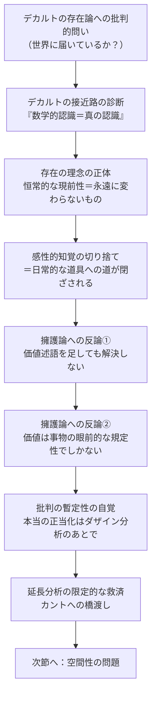

## 「§21」は何だと言っているのか

*ハイデガー『存在と時間』第21節*

---

### この節の結論を一言で

デカルトの「世界」の存在論は、**世界そのもの**にも、**日常的に使うものの存在**にも、どちらにも届いていない。その失敗は単なる見落としではなく、「本当に存在するものとは永遠に変わらないものだ」という古代以来の存在理解を無批判に引き継いだことから来ている。そしてこの批判を哲学的に確定するためには、まずダザイン（＝私たちのような、世界の中に投げ込まれた形で存在している人間的存在）の分析を先に行わなければならない。

---

### §21の構成を俯瞰する

この節は「批判→弁護への反論→次の段階への橋渡し」という三つの動きで進む。

---

### ①「どこへ接近しているか」の問い——診断の出発点

ハイデガーはまず、デカルトへの批判の切り口を鋭く一本に絞る。

> デカルトがその存在を延長性として世界の存在と同一視している存在者への、適切な接近様式としていかなるダザインの存在様式が固定されているか。

つまり「どんな認識の仕方をすれば、その存在者に本当に触れられるのか」という問いだ。

デカルトの答えは明快だ——**数学的・知性的認識だけが真の認識である**。なぜか。数学は対象をいつでも確実に把捉できる。では、数学によって把捉されるものとはどんなものか。それは「変わらずそこにあり続けるもの」だ。

ここでハイデガーが暴き出すのが、デカルトの隠れた前提である。

> 真に存在するのは、永遠に留まり続けるものである。

これは「存在＝恒常的な現前性（ständige Vorhandenheit）」という古代以来の存在の理解の転写だ。デカルトは世界を観察して「延長こそが世界の本質だ」と発見したのではない。最初から「永遠に変わらないものが本当の存在だ」という理念を持っていて、その理念を世界に**書き定めた**のである。

| デカルトが言っていること | ハイデガーの読み |
|---|---|
| 数学的認識が最も確実 | 「不変のもの」だけを認識できる手段 |
| 延長こそが物体の本質 | 不変性＝延長という前提からの演繹 |
| 感性は存在を示さない | 変わるものを扱う感性は存在論的に無効とされた |

---

### ②感性的知覚の切り捨て——「堅さ」の例で見る

デカルトは感性的知覚（目や手で感じること）を存在認識の手段として退ける。ラテン語引用が示すように、感官は「外の物が人間の身体にとって有益か有害かを報告するだけ」であって、存在者の存在を教えてはくれない、というのがデカルトの立場だ。

ハイデガーはこの切り捨てを、「堅さ」の解釈を通じて批判する。デカルトは「堅さ」を「場所を譲らないこと」＝運動の関係として読み替える。しかしそれは、**堅さを直接経験した内容を別のもの（延長する二つの物体の運動関係）に置き換えている**だけだ。

ハイデガーのポイントはここにある。

> ダザインの存在様式を持つ存在者が、あるいは少なくとも生命あるものが存在しないならば、堅さと抵抗はそもそも示されることがない。

つまり、**「堅さ」は誰かが触れるという経験の中でしか現れない**。それを「二物体の位置関係」に還元することは、経験の現場を消し去ってしまうことだ。デカルトは、感性的な受け取り（Vernehmen）の存在様式を、自分が知っている唯一の存在様式——延長する物体の現前的な関係——に置き換えてしまっている。

---

### ③擁護論への反論——「価値述語を足せばいい」ではないのか

ここでハイデガーは仮想の反論を呼び込む。

> デカルトは、物質的自然の存在論的性格づけの基礎を据えたのではないか。この根本層の上に、他の諸層が積み重ねられる……

この擁護論のロジックはこうだ。デカルトがしたのは「一番底の層」（物質的自然）の分析だ。その上に「有用・有害」「美しい・醜い」といった価値の述語を加えてゆけば、日常的に使うものの存在まで到達できる。

しかしハイデガーはこれを根本から否定する。

> 価値述語の付加は、財（Güter）の存在について新たな解明を少しも与えることができず、かえってこれらの存在様式を純粋な眼前存在性として再び前提するだけである。

問題はこうだ。「物」があって、それに「役立つ」という性質を貼り付けても、「物」という存在の理解は何も変わらない。「役立つ」も結局、眼前に現れている物の一規定性として扱われてしまう。**「道具として手許にある存在（Zuhandenheit）」は、物の存在論の上に価値を足算しても出てこない**。出発点が間違っているから、どこまで積み重ねても正しい地点には届かないのだ。

> この再構成は設計図なしに建設を行うことになりはしないか。

---

### ④この批判の暫定性——正当化はあとで

ハイデガーは自分の批判が「まだ完全に正当化されていない」と正直に認める。

> いま遂行したデカルト的な、そして原則的には今日もなお通用している世界存在論への批判を、その哲学的正当性に据えることができる。

この「据えること」は未来形だ。それができるのは、ダザインの存在構造が解明され、存在一般を理解できる地平が整ったとき——つまり『存在と時間』全体の分析が進んだ後である。いまはその予備的論証に留まる、とハイデガーは明示している。

また、デカルトの延長分析には限定的な評価も与えられる。

> 延長の分析は……ある限度内においては独立している。

カントが空間をアプリオリ（経験に先立つ条件）として論じたのは、デカルトが延長を根本規定として取り出したことと線でつながっている。ただし、それだけでは**空間の中に現れる道具の空間性**も、**ダザイン自身の空間性**も存在論的に把握できない。デカルトには「救える部分」もあるが、それで十分とは言えない。

---

### 節の末尾に示される四つの問い

第一部第三篇（本書のより後の部分）で答えられるべき課題として、ハイデガーは四つの問いを掲げる。

| 問い | 内容 |
|---|---|
| ① なぜ飛び越えたか | なぜ哲学の出発点で世界の現象が見逃されたのか（パルメニデスまで遡る） |
| ② 何が代わりに立ったか | 世界内部的存在者が存在論の主題に据えられた理由 |
| ③ なぜ「自然」か | 最初に見出される存在者がなぜ自然物なのか |
| ④ なぜ価値か | 補完手段として価値現象が選ばれた理由 |

これらへの答えが揃ったとき、「世界の問題圏」の積極的な理解が得られ、デカルト批判の正当根拠が証示される。

---

### この節から次節へ——空間性という橋

節の最後でハイデガーは論の方向を転じる。デカルト批判で一区切りつけながら、「それでも延長は空間性と関係する」という点を足がかりに、次の主題を宣言する。

> 環境世界の周辺性（Umhaftes）とダザインの空間性

ダザインには確かに空間性が備わっている。しかしそれは「物体が空間の中に入っている」という意味での空間性（内側性）ではない。この空間性をどう記述するかが、第22〜24節の課題となる。

---

### まとめ——§21が言いたいこと

デカルトは「永遠に変わらないものこそが本当に存在する」という古代以来の存在理解を出発点に置き、数学的認識を唯一正当な認識として固定し、感性的経験を切り捨てた。その結果、日常的に使うもの（道具）の存在も、世界そのものの現象も、視野の外に出てしまった。「価値を足せば補完できる」という擁護も、同じ独断論の地盤に立つかぎり解決にならない。ただしこの批判の哲学的な正当化は、ダザインの存在構造の分析が完成したのちに行わなければならない——それが§21全体の主張である。
