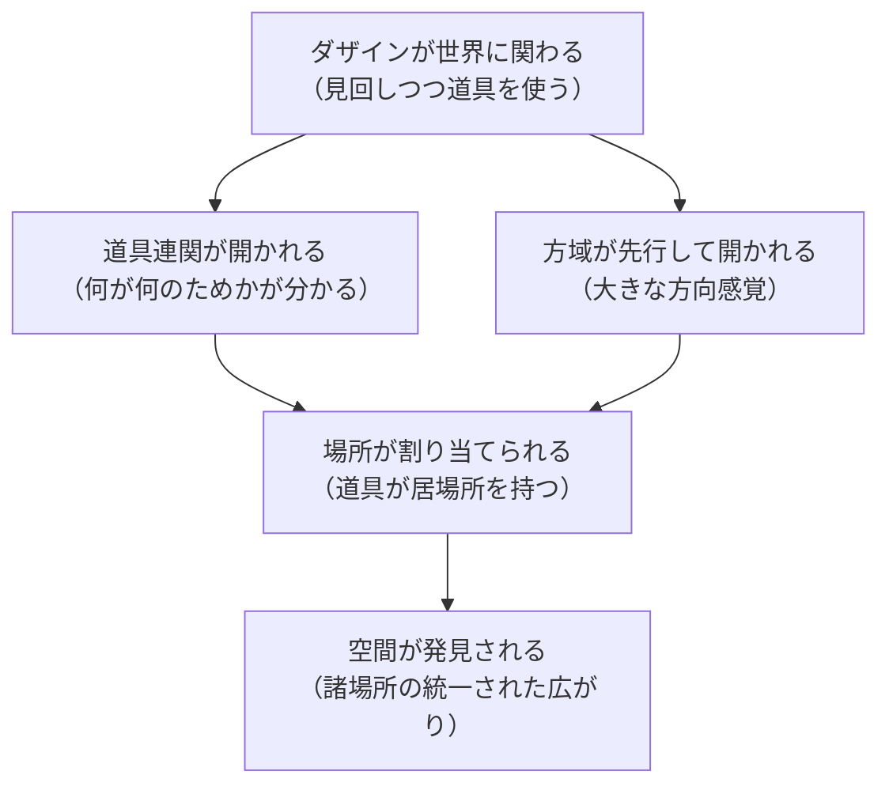

## 「§22」は何だと言っているのか

*ハイデガー『存在と時間』第22節*

---

### この節の結論を先に言う

道具（手許にあるもの）の「場所」は、測定された空間座標ではなく、**使う文脈の中で意味を持つ「居場所」**だ。そして空間そのものは、こうした道具の居場所の連なりとして、私たちの関わりの中に先に開けている。空間が先にあって道具が置かれるのではなく、道具との関わりが空間を開くのだ、とハイデガーは言いたい。

---

### 出発点：「手許にある」とは「近くにある」ということ

ハイデガーがここで最初に確認するのは、日常語のわずかな手がかりだ。

> 「さしあたり手許にあるもの」は、単に他のものに先んじてまず出会われる存在者を意味するだけでなく、同時に「近く」にある存在者をも意味している。

「手許（てもと）」という言葉そのものに「近さ」が含まれている、と彼は読む。ここで言う「近さ」は、定規で測った距離とは違う。

> この近さは、距離の測定によって確定されるものではない。

たとえば作業台の上のハンマーは、部屋の隅にある椅子より「遠い」かもしれない。しかし今まさに釘を打とうとしている人間にとって、ハンマーは「近い」。近さとは、**いま何をしているかという文脈が作り出す関係**だ。

---

### 「場所（Platz）」と「位置（Stelle）」は違う

ここがこの節の核心のひとつだ。ハイデガーは「場所」と「位置」を明確に区別する。

| 概念 | 内容 | 例 |
|------|------|----|
| **位置（Stelle）** | 幾何学的な座標。どの物体でも置ける中立の点 | 「この部屋の北東の角」 |
| **場所（Platz）** | 道具としての文脈の中で割り当てられた「ここ」 | 「ハンマーのかかっているあの釘」 |

> 道具はその場所を持つ、あるいはそれが「転がっている」――これは任意の空間的位置における純粋な現前とは根本的に区別されなければならない。

「転がっている」という表現が示唆的だ。本来あるべき場所から外れた道具は、使う文脈を失って「ただそこにある物」へと落ちる。場所は道具の意味と一体だ。

---

### 「方域（Gegend）」：場所を成り立たせる広がり

個々の場所は、バラバラに存在するのではない。それらは**方域（Gegend）**と呼ばれる「大きな行き先の方向感覚」の中に位置づけられている。

> 可能的な道具的所属のこの「どこへ」を、われわれは方域と呼ぶ。

方域は「北・南・東・西」のような地理的方角よりずっと生活に密着した概念だ。

> 「上（Oben）」とは「天井のところ」であり、「下（Unten）」とは「床のところ」であり、「後ろ（Hinten）」とは「扉のところ」である。

台所・寝室・作業場、あるいは「日のあたる方向」「風雨を受ける方向」――こうした生活的な方向感覚が方域であり、個々の道具の場所はその方域の中に収まる。方域は観測装置で確認するものではなく、**見回し（Umsicht）**、つまり実際に何かをする中で周囲に気を配る注意の中で開かれる。

---

### 太陽の例：常住的に手許にあるものが方域を示す

この節でハイデガーが持ち出す印象的な例が太陽だ。

> 太陽は――その光と熱が日常的な使用に供されているかぎり――、それが与えるものの変化する使用可能性から、見回し的に開示された卓越した場所を持つ。すなわち、日の出、正午、日没、真夜中がそれである。

「日の出」「正午」「日没」は天文学的な測定値ではなく、農作業・礼拝・休息など**人間の活動に結びついた「時間の場所」**だ。太陽はその動きによって方域の「指標（Anzeigen）」として機能する。教会が日の出・日没の方角に合わせて建てられるのも、その場所が「生と死の方域」として意味を帯びているからだとハイデガーは言う。

---

### 方域はふだん目に見えない

重要なポイントが次の文にある。

> 界域自体が目に見えてくるのは、手許的存在者を配慮的に見まわして発見する際に目立つという仕方においてのみであり、しかもそれは配慮の欠如的な諸様式においてである。何かがその場所に見当たらないという事態において、その場所の界域がしばしばはじめて明示的なものとして近づきうるものとなる。

「ハサミがいつもの引き出しにない」――そのときはじめて「ハサミは引き出しにあるべきだ」という方域が意識に上る。うまく機能しているときは、方域は空気のように気づかれない。これは前の節で「壊れた道具が初めて道具の構造を示す」と言われたことと同じ論理だ。

---

### 結論：空間は道具の連なりが開くもの

節の末尾でハイデガーはこの議論をひとつにまとめる。

> 「環境世界（Umwelt）」は、あらかじめ与えられた空間の中に自らを設置するのではなく、その固有の世界性が、見まわしによって指示された諸場所のそれぞれの全体の、適所性に即した連関を分節化するのである。

つまり、**空が先にあって星が入るのではなく、星々の関係が夜空を作る**、そのような構造だ。先にある空虚な三次元空間に道具が置かれるのではなく、道具を使う関わりの中で空間が発見される。

そしてこの発見が可能なのは、ダザイン（私たちのこと。「世界の中に存在すること」が本質である人間）自身がそもそも「空間的」な存在だからだ、という一文が節を締める。

> 手許的存在者をその環境世界的空間において出会わしめることが存在的に可能であるのは、ただ、ダザイン自身がその世界内存在に即して「空間的」であるがゆえにほかならない。

ダザインの空間性が何かはこの節では未解決のまま残される。それは次節以降の課題だ。

---

### この節で押さえておくべき三つの対比

| 通常の空間理解 | ハイデガーの主張 |
|----------------|------------------|
| 空間は先にある容れ物 | 空間は道具の関わりが開くもの |
| 位置は測定で決まる座標 | 場所は使う文脈の中で決まる居場所 |
| 方角は地理的な客観値 | 方域は生活的な「行き先の感覚」 |

この節は、常識的な「空間＝入れ物」という見方をひっくり返し、人間の**関わりが空間を生む**という主張を、道具・場所・方域という三段階の積み重ねで示している。
