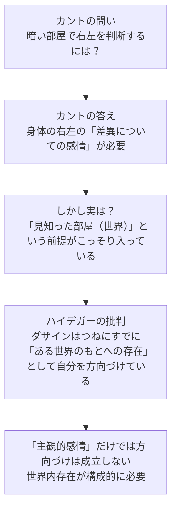
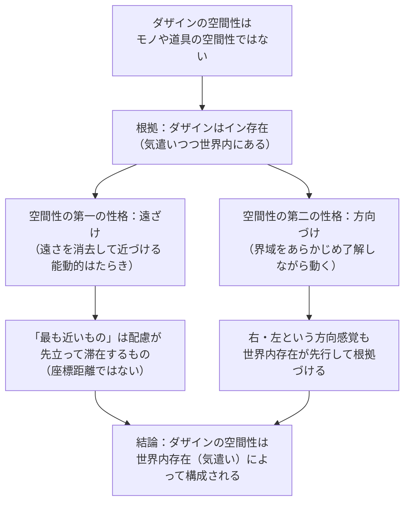

## 「§23」は何だと言っているのか

*ハイデガー『存在と時間』第23節*

---

### この節の結論を一言で

ダザイン（人間的な存在のあり方）の「空間にいる」という事実は、物が座標上の一点を占めることとはまったく別物だ。ダザインは**遠ざけ（Ent-fernung）**と**方向づけ（Ausrichtung）**という二つのはたらきによって空間的であり、それは常に「気遣いながら世界と関わる」という生き方と切り離せない。

---

### 前提の整理――「空間にいる」には二つの意味がある

ハイデガーはまず、ダザインの空間性を二種類の存在者と対比させることで出発する。

| 存在者の種類 | 空間へのかかわり方 | ハイデガーの用語 |
|---|---|---|
| 石や机など（モノ） | ある座標点に「ある」 | 現前存在（Vorhandensein） |
| 道具・用具 | 使われる場所に「ある」 | 手許存在（Zuhandensein） |
| **ダザイン（人間）** | 気遣いつつ世界と交わる中に「ある」 | **イン存在（In-sein）** |

ダザインは「世界という劇場のどこかの席に座っている観客」ではなく、舞台の中で役を演じながら移動している存在だ。そのため空間性もまた、座席番号（座標・距離）では語れない。

---

### 第一のはたらき――「遠ざけ」とは何か

#### 「遠ざけ」は「距離を縮める」こと

日本語では紛らわしいが、ハイデガーが「Ent-fernung（遠ざけ／遠さの消去）」と書くとき、それは「遠くへ追いやる」ではなく、**「遠さを消し去って近づける」**という能動的な行為を指す。

> ダザインは本質的に遠ざかる（ent-fernend）存在であり、それはそのある存在者として、それぞれの存在者を近くに出会わせる。

物理的な「距離」は二点間の客観的な数値だ。しかし「遠ざけ」はダザインの存在様式、つまり生き方の構造そのものである。だから「二つの点が互いに遠ざけ合うことはない」――点はただそこにあるだけで、何かを近づけようとしないからだ。

#### 日常的な距離感覚はすでに「遠ざけ」である

ハイデガーが挙げる例がわかりやすい。

> そこまでは散歩の距離だ、ひとっ跳びだ、「パイプ一服分」だ。

「三十分の道」とは、三十分間という純粋な時間量ではなく、**自分がこれから気遣いつつ歩いていく道のり**として了解されている。「客観的に」短い道が果てしなく遠く感じられることがある。それは知覚の誤りではなく、むしろその重い足取りの道こそが「今ここにある世界」を本来的に開示している、とハイデガーは言う。

#### 「最も近いもの」は距離が最小のものではない

これが節の中でも特に鮮やかな逆説だ。

> 眼鏡をかけている人にとって、距離的にはそれほど近く「鼻の上に乗っている」その眼鏡は、向かいの壁に掛かっている絵よりも環境世界的にははるかに遠くにある。

眼鏡は使われているとき意識から消えている（道具の「目立たなさ」）。絵は「見る」という気遣いの先に現れる。だから環境世界的な「近さ」を決めるのは座標距離ではなく、**見回し的な配慮（umsichtiges Besorgen）**――つまりその都度何かに気を遣いながら世界を見廻すはたらき――である。

---

### 第二のはたらき――「方向づけ」とは何か

遠ざけは必ず方向を持つ。近づけるといっても、どちらへ向かって近づけるのか。

> いかなる接近も、あらかじめすでに一つの界域（Gegend）への方向を取り込んでいて、その界域の方からこそ脱‐距離されたものが近づいてくる。

「界域（Gegend）」とは、漠然と「あのあたり」と了解されている方向圏のことだ。道具に「徴示（Zeigen）」＝指示・サインが必要なのも、この方向づけを明示的に保つためだとハイデガーは言う。

右と左という固定した方向感覚もここから説明される。手袋は右手用・左手用に分かれるが、ハンマーには右用・左用がない――手袋は「身体に沿って方向づけられている用具」であり、ハンマーは手とともに動く工具だからだ。

---

### カントへの批判――方向づけに「世界」は必要か

ハイデガーはカントの論文「思惟における方向づけとは何を意味するか」（1786年）を俎上に載せる。

カントは「右左の感情はア・プリオリな主観的原理だ」と言う。ハイデガーはそれを否定しないが、そのア・プリオリはさらに深い根拠、すなわち**世界内存在というア・プリオリ**のうちに根ざしている、と指摘する。世界を持たない主観が感情だけで方向を決めることはできない。

---

### 論証の流れを整理すると

---

### まとめ

| 問い | この節の答え |
|---|---|
| ダザインの「空間にいる」とはどういうことか | 気遣いつつ世界と交わる「イン存在」のあり方そのものである |
| 「遠い・近い」はどこで決まるか | 客観的距離ではなく、配慮がそのつど先立って滞在するところが「最も近い」 |
| 右・左という方向感覚はどこから来るか | 身体的感情だけからではなく、世界内存在という構造から来る |
| この節の最終目的は何か | 世界の空間性・空間の存在論的問題を問うための前提を用意すること |

ハイデガーがここで強調したいのは、空間とは「人間を外側から包む入れ物」ではなく、**ダザインが気遣いながら生きることによって初めて開かれてくるもの**だ、ということである。距離を物差しで測る前に、私たちはすでにある特定の方向へ向かい、ある対象を近くに引き寄せながら世界を生きている。その事実こそが、ダザインの空間性の本質をなしている。
