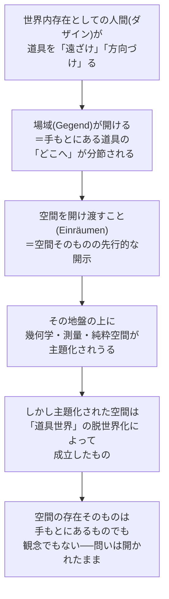

## 「§24」は何だと言っているのか

*ハイデガー『存在と時間』第24節*

---

### この節の結論を一言で

**空間は人間（ダザイン）の外にある「入れ物」でも、頭の中にある「観念」でもない。空間は、人間が世界の内に生きている（＝世界内存在である）という事実そのものによって、はじめて開かれるものだ。**

§24はそれまでの空間論（§22・§23）の締めくくりであり、「世界・道具・空間」の三者関係を総括しながら、最後に「では空間の存在とは何か」という根本問題を正面から提起して終わる。

---

### そもそもの出発点：空間はどこから来るのか

ハイデガーが前の節までで示してきたのは、人間がモノに「遠ざけ（Ent-fernung）」と「方向づけ」という仕方で関わることで、空間が開けてくる、という考えだった。§24はその結論を受けて、次の問いを立てる。

> 「ダザインがあり離れと方向づけとの様式において空間的であるからこそ、環境的に手もとにある存在者がその空間性において出会われうるのである。」

つまり**道具が「そこにある」ように感じられるのは、人間がまず空間的に存在しているから**だ、という順番になっている。数学的・幾何学的な「3次元の箱」が先にあって、そこへ人間が放り込まれるのではない。

---

### 論証の三段階

#### 第一段階：「場域（Gegend）」が空間の先行形態である

私たちが道具を使うとき、「ハンマーは工具箱の方角だ」「光は窓の方から来る」といった、ざっくりとした「方角＋帰属先」の感覚がまず働いている。ハイデガーはこれを「場域（Gegend）」と呼ぶ。

> 「この帰属性は、世界に対して構成的な意義性から規定され、可能な「どこへ」のなかに「此処へ」と「彼処へ」とを分節する。」

これは均質な座標空間ではない。「ここ（手元）」と「あそこ（向こう）」が、使う文脈ごとに意味をもって区別されている、生きられた方向感覚だ。

#### 第二段階：「空間を開け渡すこと（Einräumen）」が世界内存在の構造に属する

ハイデガーは「空間を与えること」という表現を使う。人間が世界の中で配慮しながら動き回れるのは、**空間をあらかじめ「開け渡している」（Einräumen）** という実存の働きがあるからだ。これは意識的な操作ではなく、世界内存在そのものに組み込まれた構造である。

> 「実存カテゴリーとして理解された空間の開け渡しが、世界内存在に属しているからにほかならない。」

「実存カテゴリー（Existenzial）」とは、ダザインだけがもつ存在の仕組みのことだ（石や机とは違う種類の規定）。

#### 第三段階：純粋な幾何学的空間は「二次的」な発見物である

測量や建築のために私たちは道具世界を「眺める」姿勢に切り替える。すると「場域」という方向感覚は薄れ、代わりに中立的な座標として空間が現れる。さらに純粋な観視へと進めば、幾何学・位相解析・計量数学が展開される。

しかしこれは**道具世界の「脱世界化」（環境の意味的文脈を剥ぎ取ること）によって成立した二次的な空間**だ、とハイデガーは言う。

> 「均質な自然空間が現れてくるのは、ただ一つの発見様式の道を通じてのことであり、その発見様式は、手元にあるものの世界性を特定の仕方で脱世界化するという性格をもつ。」

---

### 核心命題：空間は「主観の中」にも「世界の容器」にもない

ここで節の最も有名な主張が登場する。

> 「空間は主観の内にあるのでもなく、また世界が空間の内にあるのでもない。空間はむしろ世界の「内に」ある——ダザインに対して構成的な世界内存在が空間を開示したかぎりにおいて。」

| よくある空間観 | ハイデガーの批判 |
|---|---|
| ニュートン的：空間は宇宙の絶対的容器 | 「世界が空間の中にある」という誤り |
| カント的：空間は主観の感性形式（アプリオリ） | 「無世界的な主観が空間を外に投射する」という誤解 |
| ハイデガー：空間は世界内存在が開示する | 「アプリオリ」とは出会いの先行性であり、主観の産物ではない |

カントが言う「アプリオリ（経験に先立つ）」をハイデガーは否定しない。しかし意味を変える。アプリオリとは「無世界的な主観が先天的にもっている形式」ではなく、**「道具や場所と出会うより先に、場域（空間の方向感覚）がすでに開かれている」という先行性**のことだ、と読み替える。

---

### 残された問い：「空間の存在」とは何か

節の末尾でハイデガーは、空間の存在様式はまだ決定されていないと明言する。

> 「空間は、それ自身空間的に手元にあるものあるいは眼前にあるものの存在様式をもつ必要はない。空間の存在はダザインの存在様式をももたない。」

| 候補 | 排除される理由 |
|---|---|
| 道具（手もとにあるもの）と同じ存在 | 空間は「使う」ものではない |
| 物体（眼前にあるもの）と同じ存在 | 空間は res extensa（延長する物質）に還元できない |
| 主観（ダザイン）と同じ存在 | 空間はダザインの「経験」そのものではない |

だからと言って「空間は主観的だ」とも「空間は客観的物質だ」とも言えない。この袋小路の根本原因は、**「存在一般の可能性についての根本的な透明性の欠如」** にある、とハイデガーは診断する。空間論の困惑は空間についての知識不足ではなく、**存在論そのものの未熟さ**から来ているのだ。

---

### 最終的なまとめ：§24の構造

§24は「前の節の結論整理 → 空間の位置づけの転換 → 空間論の困惑の診断」という三層構造をもち、最後に次のことを宣言して終わる。

> 「空間は、世界へと遡ることによってはじめて把握されうる。……空間性はそもそも世界の根拠の上においてのみ発見可能なのであって、その際、空間は……世界をもとより共に構成しているのである。」

**空間を理解したければ、まず「人間が世界の中に存在している」という事実に立ち戻れ**——これが§24の最終的なメッセージである。空間は人間の外にある器でも、人間の内にある観念でもなく、人間が世界の中に生きているというその事実の中に、すでに共に開かれているものなのだ。
