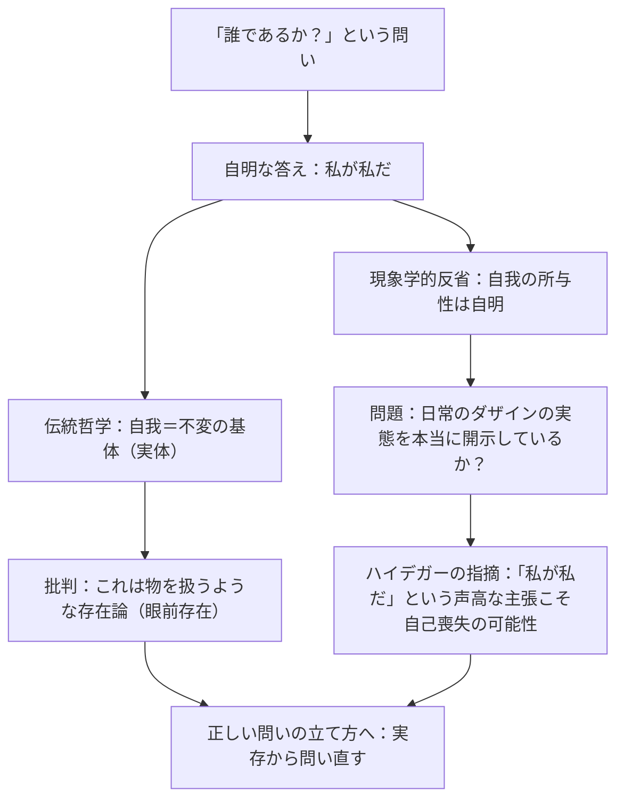

## 「§25」は何だと言っているのか

*ハイデガー『存在と時間』第25節*

---

### まず結論から：「私が私だ」という自明な答えを疑え

この節の問いは一言でまとめると、**「ダザインはいったい『誰』なのか」** という問いです。

「ダザイン」とは、ハイデガーが「人間の存在のあり方そのもの」を指すために使う言葉です。私たちが日常でやりとりしている「私」ではなく、その「私」がそもそもどんな存在の仕方をしているのか、を問う概念だと思ってください。

この問いに対して、誰もが真っ先に思いつく答えがあります。

> ダザインはそのつど私自身がある存在者であり、存在はそのつど私のものである。

「私が誰かって？　それはもちろん私でしょう」。これは確かに存在的には（日常的な事実として）そのとおりです。しかしハイデガーはここで立ち止まり、「その答えは存在論的には（存在の構造としては）まだ何も語っていない」と言います。そしてさらに踏み込んで、「日常生活において誰であるかは、実はそのつど私自身ではないかもしれない」とすら示唆します。

この節の核心は、**「自明に思える『私』という答えを問い直し、正しい問いの立て方へ向け直す」** ことにあります。

---

### 伝統的な答え方の問題点

では、これまで哲学はこの問いにどう答えてきたのでしょうか。

伝統的な哲学は「自我（私）」を、変わりゆく体験や振る舞いの背後に不変の基盤として存在するもの、いわば「基体（Subjectum）」として考えてきました。ギリシャ以来の「実体」という考え方です。

ハイデガーはこれを次のように批判します。

> 霊魂実体を斥けようとも、意識の物件性を斥けようとも、人格の対象性を斥けようとも、存在論的には、……眼前存在の意味を保持するような何かを措定することに変わりはない。

「眼前存在（Vorhandenheit）」とは、机や石ころのように「そこにただ置かれている」存在の仕方のことです。どんなに洗練させても、伝統哲学は結局「自我」を「そこにある物のように扱っている」とハイデガーは言うのです。しかし人間の存在はそのような物と同じ仕方では存在していない——これがハイデガーの根本的な批判です。

---

### 「自我の自明な所与性」という罠

「でも、自分が今ここにいるということほど確かなことはないのでは？」という反論は当然です。デカルト以来、「私が考えている」という自己意識の自明性は哲学の出発点とされてきました。

ハイデガーはこの点を正面から取り上げます。

> この洞察はそれどころか、「意識の形式的現象学」として根本的な枠組みを与える意義をもつ自立的な現象学的問題圏への通路をも開くのである。

つまり、「自我の自明な所与性」を出発点にすること自体には意義がある、とハイデガーは認めています。しかし問題は、それが **「日常的なダザインの実態を本当に開示しているか」** という点です。

ハイデガーはここで大胆な問いを投げかけます。

> おそらくダザインは、みずからを最初に言い表す際、つねに「それは私である」と語り、結局は、このような存在者で「ない」ときにこそ、最も声高にそう語るのではないだろうか？

逆説的に聞こえますが、これはこういうことです。「私が私だ」と一番強く主張するとき、その人はむしろ自分自身から最も遠ざかっているかもしれない——「自己喪失」の状態にこそ「私は私だ」という主張が声高になるかもしれない、ということです。

---

### 「世界なき私」も「他者なき私」もない

さらにハイデガーは、これまでの議論（世界内存在の分析）から得られた知見を援用します。

> 世界内存在の解明は……世界なき単なる主観などというものが存在しないことを示した。そして結局、それと同様に、他者なき孤立した自我もまた、まず初めに与えられているわけではない。

「世界内存在」とは、人間はまず「世界の中に投げ込まれた存在」であり、世界と切り離された純粋な自我として最初から存在しているわけではない、というハイデガーの基本命題です。

つまり、「自我を最初に確保してから世界や他者を導き出す」というデカルト以来の問い方は、そもそも間違った出発点から始まっていた、ということになります。他者はすでに「世界内存在」の中に組み込まれており、切り離して考えることができません。

---

### では、どこから問い直すのか

問い方の誤りを示した後、ハイデガーは正しい手引きを提示します。

| 誤った出発点 | 正しい出発点 |
|---|---|
| 自我の形式的・反省的な所与性 | ダザインの「本質は実存に基づく」という構造 |
| 自我を不変の実体として想定する | 自己をダザインの「存在様式」として問う |
| 内省によって自我を確保する | 日常的な存在のあり方を現象学的に提示する |
| 世界・他者を切り離して自我を考える | 世界内存在・共存在の中で誰であるかを問う |

> 誰はそれゆえ、ダザインのある特定の存在様式を現象学的に提示することによってのみ答えられうる。

「自己」は、物のように「そこにある核心」ではなく、ダザインのある特定の**存在のし方（様式）**として理解されなければならない。ハイデガーはこれを「実存論的・存在論的な問い立て」と呼びます。

---

### 最後の一撃：人間の「実体」は実存である

節の締めくくりとして、ハイデガーは次のように断言します。

> しかし人間の「実体」は、魂と身体との総合としての精神ではなく、実存なのである。

「実存」とは、固定された性質を持つ「物」としてではなく、つねにみずからの存在をかけて生きている、そのあり方そのものです。「私とは誰か」は、物のように静的に確定できるものではなく、どう生きるか、どう存在するかという動的な問いとして問われなければならない、というわけです。

---

### まとめ：この節の仕事

この節はそれ自体で最終的な「誰」の答えを出しません。しかし、それこそがこの節の仕事です。

1. **自明な答え（「私が私だ」）を存在論的に問い直す必要を示す**
2. **伝統哲学が陥ってきた「物的な自我」という誤りを暴く**
3. **「自我の反省的所与性」という出発点の罠を明らかにする**
4. **「実存から問い直す」という正しい問いの地盤を確保する**

この節は、次の節から始まる「日常的な誰」の分析（世人・ひと＝das Man の分析）への準備として機能しています。まずは問い方を正さなければ、正しい答えには辿り着けない——それがこの節の主張です。
