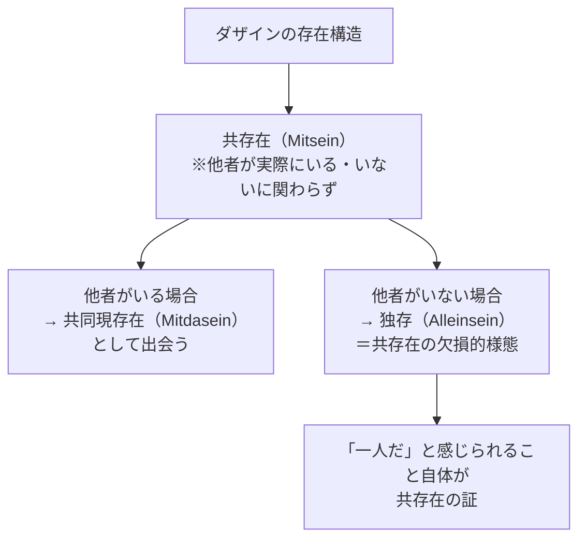
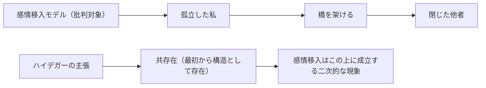
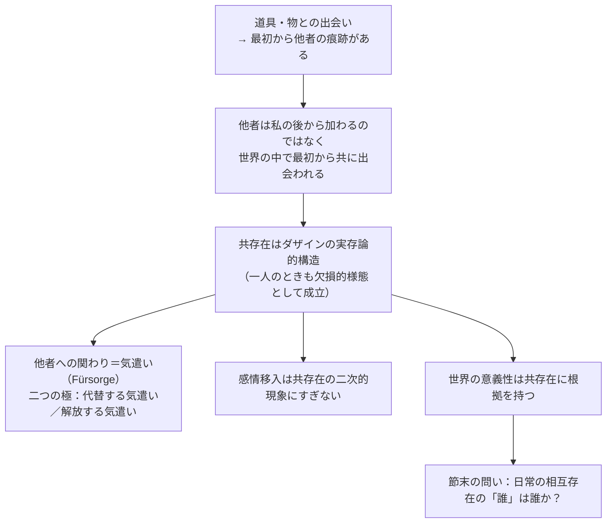

## 「§26」は何だと言っているのか

*ハイデガー『存在と時間』第26節*

---

### この節の結論を一言で言うと

「私」は最初から他者と一緒に世界の中にいる。他者との「共にあること」はあとから付け加わるのではなく、ダザインの存在そのものの構造だ——これがこの節の核心である。

> ダザインの世界はしたがって共同世界（Mitwelt）である。内存在（In-Sein）は他者たちとの共存在（Mitsein）である。

ここで使う主な術語を先に整理しておく。

| 術語 | 一言説明 |
|---|---|
| **ダザイン** | 「そこにいる」という意味。人間の存在のあり方を指すハイデガーの言葉 |
| **共存在（Mitsein）** | 他者たちと「ともにある」というダザイン自身の存在様式 |
| **共同現存在（Mitdasein）** | 他者のダザインが私の世界の中で世界内的に出会われる仕方 |
| **配慮（Besorgen）** | 道具や物を使いこなすことへの関わり |
| **気遣い（Fürsorge）** | 他者のダザインへの関わり・世話 |

---

### 出発点：「誰であるか」という問いと世界の記述

この節はそもそも「日常のダザインとは誰なのか」を問うところから始まる。

ハイデガーは前の節ですでに「世界」の分析をした。そこで気づいたことがある。道具（ハンマー、針、板）は、それ単独では存在していない。それらは必ず誰かのために、誰かによって作られたものとして出会われる。

> 製作中の道具とともに、その「作品」が向けられている他者たちが「共に出会われる」ということであった。

野原は「誰かの土地」として、本は「誰かに贈られたもの」として、ボートは「知人のもの」として現れる。物は最初から他者の痕跡を帯びて現れているのだ。つまり他者は「物を見てからあとで想像される存在」ではなく、物と一緒に最初から世界に登場している。

---

### 「私を除いた残り」ではない他者

ここで誤解を防ぐ重要な一歩がある。「他者」という言葉は「私という主体がいて、そこから除かれた残りの人々」を意味しない、とハイデガーは言う。

> 「他者たち」とは、私を除いたその余の者すべてを意味するのではない。他者たちはむしろ、人が自分自身をほとんど区別しない者たちであり、人もそのなかにいる者たちである。

つまり私自身も「その他者たちの中の一人」として日常を生きている。「孤立した私」が先にあって、そこから他者へ橋を架けるのではない。最初から「ともにいる」のが出発点なのだ。

この「ともに（Mit）」と「も（Auch）」はカテゴリー（物の分類）ではなく、**実存論的**（生き方の構造）なものとして理解されなければならない、とハイデガーは強調する。

---

### 「共存在」はオプションではなく構造だ

ここが節の理論的な核心である。

ハイデガーは次の命題を立てる。

> 「ダザインは本質的に共存在である」

これは「実際にいつも誰かそばにいる」という事実の話ではない。たとえ今この瞬間一人きりでも、ダザインの存在の構造として「共存在」が刻み込まれているということだ。

> 共存在は、たとえ他者が事実的に現前しておらず知覚されてもいない場合でさえ、ダザインを実存論的に規定する。

一人でいること（独存）は「共存在の欠損的様態」にすぎない。鍵を失くしたとき「欠如」と分かるのは鍵の存在を前提しているからだ。同じように、「一人だ」と感じられるのは「ともにあること」が構造として先にあるからこそだ。

---

### 気遣い（Fürsorge）：他者への関わり方の二極

他者との関わりは「配慮（Besorgen）」——道具への関与——とは区別された「気遣い（Fürsorge）」によって成り立つ。気遣いには積極的な二つの極がある。

| 様式 | 内容 | 結果 |
|---|---|---|
| **飛び込んで代替する気遣い** | 他者の代わりに引き受けてやる | 他者は依存的・被支配的になる |
| **先駆して解放する気遣い** | 他者自身の力で生きられるよう促す | 他者が自らの存在可能に向けて自由になる |

日常のほとんどは、この二極の間の様々な混合形態——無関心・すれ違い・互いへの遠慮——の中にある。

> 気遣いの欠如と無関心の様態こそが、日常的かつ平均的な相互存在（Miteinandersein）を特徴づけるものである。

---

### 「感情移入」では足りない理由

当時の哲学では「他者を理解するのは感情移入によって可能だ」という考えがあった。自分の内面を他者に投影することで他者を分かる、という発想だ。

ハイデガーはこれを根から批判する。

> 「感情移入」が共存在を初めて構成するのではなく、感情移入はむしろ共存在を基盤としてはじめて可能になる。

感情移入は「孤立した私」から「閉じた他者」へ橋を架ける作業として想定されている。だが、もしダザインが最初から共存在であるなら、橋を架ける必要などない。感情移入が必要に感じられるのは、むしろ日常の共存在が「欠如した様態」——無関心・すれ違い——の中にあるからだ、とハイデガーは言う。

---

### 世界性・意義性・共存在のつながり

この節の終盤でハイデガーはより深い接続をする。第18節で「世界性＝意義性の指示連関の全体」と定義された。

その「意義性」の連関は、ダザインが他者たちのために（umwillen）存在するという構造の中に固定されている。言い換えると、「他者たちのために」という共存在の構造があるから、世界はそもそも意味をもって立ち現れる。

> ダザインの存在了解（Seinsverständnis）の中には、――その存在が共存在であるがゆえに――すでに他者たちの了解が含まれている。

他者を理解するのは認識や知識の問題ではなく、存在のレベルで最初から他者と了解し合っている、ということだ。物を介した共同の配慮——同じものを使い、同じことに従事すること——の中で、すでに他者との了解が動いている。

---

### この節の論証の流れをまとめる

---

### まとめ：この節が言いたいこと

この節でハイデガーが積み上げるのは一つの転換だ。

従来の哲学は「まず孤立した私（主観）があり、そこから他者を推論・感情移入する」という図式を当然のものとしてきた。ハイデガーはそれを逆転させる。**「ともにあること」が先にあり、「一人でいること」はその欠損形態だ**。他者を理解するのは橋を架ける知的作業ではなく、存在の構造としてすでに与えられている。

そして節の末尾に新たな問いが浮かぶ。日常の相互存在——無関心・すれ違い・他者に紛れ込んだ日々——の中で、「自己自身のダザイン」を引き受けているのはいったい「誰」なのか。この問いは次節（§27「ひと（das Man）」）へと続いていく。
