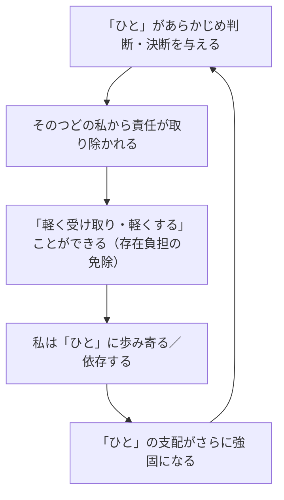

## 「§27」は何だと言っているのか

*ハイデガー『存在と時間』第27節*

---

### この節の結論を一言で

この節が言いたいことは、ひとつの鋭い問いへの答えである。

> 日常的なダザインの「誰」という問いが答えられた。

「私」とは誰か。日常的な私は、じつは「私」ではない。それは **「ひと（das Man）」** である。「ひと」とは特定の誰でもない、しかし至るところに存在する匿名の支配者であり、私たちはそこから自分を「与えられて」いる——これが§27の核心的主張である。

---

### 前提を確認する――「距離性」とは何か

まず節の出発点を押さえよう。ハイデガーがここで言う「ダザイン（Dasein）」とは、ざっくり言えば「私たち人間が世界のなかに投げ込まれて存在していること」を指す概念語である。

私たちは他者と一緒に生きている（共存在）。そしてその共存在のなかで、私たちは絶えず他者と自分を比べている。

> 他者たちとの距離への配慮が絶えず潜んでいる。……相互存在はこの距離への配慮によって不安にさらされている。

追いつこうとする、抜きん出ようとする、押さえつけようとする——方向はさまざまだが、つねに「他者との距離を気にしている」。ハイデガーはこれを **「距離性（Abständigkeit）」** と呼ぶ。

この距離性は、普段は目に見えないぶん、かえって深く根を張っている。そしてここから「ひと」の問題が生まれてくる。

---

### 「ひと」の正体

距離性の中で、私たちは知らず知らずのうちに「他者たちの支配」のもとに置かれている。だがその「他者たち」とは誰なのか。

> この他者たちは、そのつどこれと特定された他者ではない。どんな他者もそれらの者たちの代わりになりうる。

「誰」とは、この人でもなく、あの人でもなく、自分自身でもなく、全員の合計でもない。

> この「誰」は中性的なもの、「ひと（das Man）」である。

日本語の「ひとはそう言う」「ひとの目が気になる」という使い方に近い。英語で言えば "one does" や "they say" の「they」に当たる。名指しできない、だが確かに存在する、匿名の「ひと一般」である。

---

### 「ひと」の三つの性格

「ひと」の支配は、三つの性格によって成り立っている。

| 性格 | 意味 | 具体例（節より） |
|------|------|-----------------|
| **距離性**（Abständigkeit） | 常に他者との差を気にし、平均に近づこうとする | 周囲から浮かないよう振る舞う |
| **平均性**（Durchschnittlichkeit） | 「普通はこうだ」という基準が一切を仕切る | 礼節・許容範囲・成功の定義を規定する |
| **均質化**（Einebnung） | 卓越・個性・秘密を平均の水準に引き戻す | 「あの新しい考えは昔から言われていた」と言いならす |

> あらゆる卓越は、音もなく押さえ込まれる。あらゆる根源的なものは、一夜のうちに、とうの昔から知られていたものとして均されてしまう。

この三つが合わさって「**公共性**」が作られる。公共性は事物を深く知っているから正しいのではなく、「事柄に立ち入らない」からこそあらゆる差異に鈍感でいられる。そしてその鈍感さがかえって、すべてを「当然のこと」として流通させてしまう。

---

### 「ひと」はなぜこれほど強力なのか

「ひと」の強さの秘密は、責任の所在を消してしまうことにある。

> 〈ひと〉がそれであった「のだ」、しかしそれでも「誰も」それではなかった、と言うことができる。

「みんながそう言っていた」「ひとがそうするから」——責任は「ひと」に帰されるが、その「ひと」は誰でもないので、誰も責任を取らなくてよい。

さらに決定的なのは、「ひと」は私たちを「楽にしてくれる」という点である。判断しなくてよい、決断しなくてよい、責任を取らなくてよい。私たちの中にある「楽になりたい」という傾向が、「ひと」の支配を自ら招き入れている。だから「ひと」は強い。

---

### 日常の「私」とは何者か

これを受けてハイデガーは、日常的な「私」の姿を次のように描く。

> 各人が他の者であり、誰も彼自身ではない。

日常的な私の「誰であるか」を答えているのは **「世人自己（Man-selbst）」** である。「世人（das Man）」とは「ひと」が組織する平均的な誰でもない者のことで、私はそこへ散乱している。

> さしあたり「私」が固有の自己という意味において「存在する」のではなく、他者たちが世人の様式において存在する。この世人から、かつこの世人として、私は「自己」をさしあたり「与えられる」。

私は自分で自分を作っているつもりでいるが、実際には「ひと」が描いた枠の中で、「ひと」が用意した「私」を演じている。

---

### 誤解を防ぐ――「ひと」はゼロではない

ハイデガーはここで注意を促す。「ひと」は「本来的には何でもない偽物」だから捨ててしまえばよい、という話ではない。

> この存在様式においてこそダザインは最も実在的なものである。

「ひと」はダザインの積極的な構造に属する **「実存カテゴリー（Existenzial）」**——つまり人間の存在の根本的な構成要素——である。また「ひと」は、眼の前に置かれた石のように手でつかめるものではないが、だからといって「存在しない」わけではない。

同様に「本来的な自己」とは、「ひと」から切り離された例外的な孤独な主体のことではなく、**「ひと」のあり方を変様させたもの**として理解しなければならない。

---

### まとめ――§27が問い、答えたこと

| 問い | 答え |
|------|------|
| 日常的な「私」とは誰か？ | 「世人自己」＝「ひと」が用意した誰でもない私 |
| 「ひと」とは何か？ | 距離性・平均性・均質化によって成り立つ匿名の支配 |
| なぜ「ひと」から逃れられないのか？ | 責任と負担を免除してくれるから、私が自ら歩み寄るから |
| 「ひと」は偽物だから無価値か？ | いいえ。ダザインの根本構造の一部であり、本来的自己もここから出発する |

この節は「世界内存在」の日常的な姿を解剖し、私たちが「私」と呼んでいるものの正体を暴く。そしてそれは次章以降で問われる「本来的な自己」とは何か、という問いへの助走になっている。
