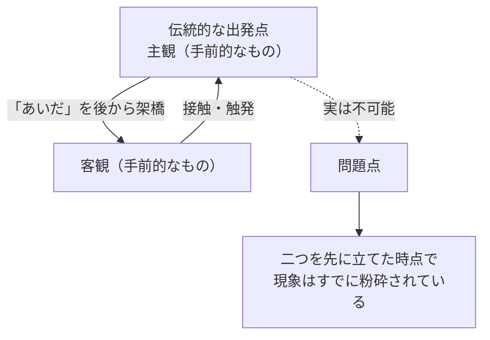
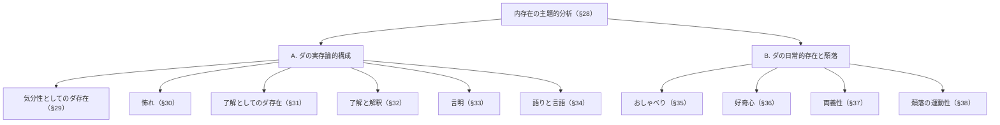

## 「§28」は何だと言っているのか

*ハイデガー『存在と時間』第28節*

---

### この節の結論を一言で

§28 は「内存在の分析をこれから本格的に始める」という**導入・見取り図**の節である。ここでハイデガーが言いたいことは、一つの問いに集約できる。

> 「ダザインはその開示性である」

私たち人間（ダザイン）は、自分の「ダ（Da＝ここ・そこ）」を存在することによって、世界をひらいている存在者だ——この命題の内実を証示するために、分析の道筋と章立てを示すのが§28の仕事である。

---

### 前提を確認する：ここまで何が分かったか

ハイデガーはこれまでの章で「世界内存在」という構造を二つの方向から照らしてきた。

| 既済の分析 | 問いの形 | 到達点 |
|---|---|---|
| 世界 | 「どこ」にあるのか | 道具連関の全体としての世界 |
| 共存在・自己 | 「誰」がいるのか | 世人（ひと一般）としての日常的自己 |

しかし「世界の**中に**いること（内存在）」そのものはまだ正面から分析されていない。§28はその空白を埋める章の冒頭に位置する。

---

### 最初の問い：内存在とは「あいだ」か

ハイデガーはここで一つの素朴な解釈を取り上げ、退ける。

> 「この解釈が『この「あいだ」の存在こそがダザインである』と言うならば、現象的事態にはいくらか近づくことになろう。とはいえ、「あいだ」への定位は依然として誤導的なままである」

「主観（人間）」と「客観（世界）」という二つの手前的なもの（目の前にただある物）を先に立て、その**接点を埋める何かとして内存在を捉える**——これが伝統的な「認識問題」の立て方だ。しかしハイデガーに言わせれば、この立て方はすでに現象を「粉砕」してしまっている。割れた皿のかけらをいくら集めても元の皿には戻らない、というわけだ。

破片から出発するのではなく、**分裂する前の統一した現象**を最初から守ること——これが§28の方法的な宣言である。

---

### 核心：「ダ」とは何か

「ダザイン（Dasein）」という言葉を分解すると「ダ（Da）＝ここ・そこ」＋「ザイン（Sein）＝存在」になる。ハイデガーはこの「ダ」に固有の意味を込める。

「ここ」と「そこ」という空間的な指示語は、いつでもひとつの「ダ」の中でしか成立しない。「そこ」にあるあの道具に手を伸ばす「ここ」の私——この関係が成り立つのは、すでに世界が**開かれている**からだ。

> 「この存在者はその最も固有な存在において、非閉鎖性（Unverschlossenheit）という性格を帯びている。『ダ』という表現はこの本質的な開示性（Erschlossenheit）を意味する」

「開示性」とは、世界が私に向かって**すでに開かれている**という事態を指す専門語である。光が射していて初めて物が見えるように、ダザインという存在者は自ら「照らす光（Lichtung：開け）」そのものだ、とハイデガーは言う。

| 概念 | 日常語で言い換えると |
|---|---|
| 開示性（Erschlossenheit） | 世界が私に向かってすでに「開かれている」こと |
| 開け（Lichtung） | その光が差し込んでいる「場」そのもの |
| ダザインはその開示性である | 人間は「世界を開く働き」と切り離せない |

> 「ダザインはそのダを根源から己れとともに携えており、そのダを欠くならば、事実的に存在しないというだけでなく、そもそもこの本質の存在者ではまったくない」

これは強い主張だ。「開示性」はダザインが**持つ**性質ではなく、ダザインが**ある**こと自体なのである。

---

### 等根源性という考え方

§28 でもう一つ重要な概念が導入される。**等根源的（gleichursprünglich）**という語だ。

ハイデガーは、内存在を構成する複数の要素（気分性・了解・語り）を、どれかひとつに還元しようとはしない。それぞれが同じ「根源」から派生するのではなく、それぞれが同等に根源的だ、と言う。

> 「根源的なものが導出不可能であることは、それを構成する存在性格の多様性を排除するものではない。そのような存在性格が示されるならば、それらは実存論的に等根源的なものである」

一本の「大本の根」から枝が伸びる、というモデルではない。複数の根がそれぞれ独立して地面に張っているイメージだ。

---

### §28 が示す章の地図

節の後半は、これから展開される分析の目次として機能する。全体の見取り図を以下にまとめる。

Ａ（実存論的構成）が「ダザインはどのような骨格を持っているか」を問い、Ｂ（日常的存在と頽落）が「その骨格が日常の中でどのように歪められるか」を問う、という二段構えになっている。

---

### まとめ：§28 が果たす役割

§28 は独自の「新しい主張」を打ち立てる節というより、これから向かう分析の**問いを立て直し、方向を定める**節だ。そこで行われていることを整理すると次のようになる。

| 仕事 | 内容 |
|---|---|
| 後退すべき解釈の退け方 | 「主観と客観のあいだ」という粉砕的な立て方を批判する |
| 核心命題の提示 | 「ダザインはその開示性である」 |
| 方法的宣言 | 現象を最初から守る（等根源性を尊重する） |
| 章の見取り図 | A（気分性・了解・語り）とB（頽落）という二部構成を示す |

ここで「開示性」として示されたダザインの本質が、§29以降の具体的な分析によって肉付けされていく。§28はその出発点にある道標である。
