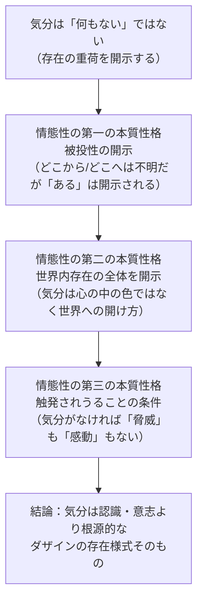

## 「§29」は何だと言っているのか

*ハイデガー『存在と時間』第29節*

---

### この節の結論を一言で言うと

**気分（Stimmung）は「感情的な色合い」ではなく、私たちが世界の中に投げ込まれている事実をそもそも開示する存在様式そのものだ。**

ハイデガーはこの節で「情態性（Befindlichkeit）」という概念を打ち立てる。日本語で言えば「気分の調律され方」に近いこの概念は、心理学的な感情論とは全く異なる文脈に置かれる。認識や意志よりも根源的な層で、私たちの存在の在り方を開いている——それが気分だ、というのがこの節の核心である。

---

### 前提：「情態性」と「気分」とは何か

まず用語を整理しておく。

| ハイデガーの語 | 意味のポイント |
|---|---|
| **ダザイン** | 「人間的存在者」のこと。「現－存在（そこに在る存在）」とも訳される |
| **情態性（Befindlichkeit）** | 「気分によってある状態に調律されていること」全般。「いかに自分があるか」という在り方そのもの |
| **被投性（Geworfenheit）** | 自分では選ばずに世界の中に「投げ込まれている」という事実 |
| **気分（Stimmung）** | 日常的な意味の気分。ただし存在論的には「世界全体を開示する様式」として捉えられる |

ハイデガーは言う。

> 気分の心理学……に先立って、この現象を根本的な実存範疇として捉え、その構造を素描しておく必要がある。

つまり、「喜怒哀楽の記述」を目的とするのではなく、気分という現象が存在論的に何をしているかを問うのがこの節の仕事である。

---

### 第一段階：気分は「何もない」ではない

私たちが普段「取るに足らない」と見なしているもの——日常の平静さ、ちょっとした不機嫌、気が塞ぐこと——これらは存在論的に無ではない、とハイデガーは言う。

特に注目すべきは「気分のなさ（Ungestimmtheit）」だ。何となく色あせた、気分とも言えないような状態。これすら「無」ではない。

> まさにこの「気分のなさ」においてこそ、ダザインはみずから自身に倦んでくる。存在が重荷として顕わとなるのである。

つまり気分のなさという状態においてすら、「自分が存在していること」が重荷として感じられる——つまり開示されている。逆に、高揚した気分はその重荷を一時的に免除するが、免除できるということ自体が重荷性の存在を証明している。

どちらの方向でも、気分は「自分がこうしてある」という事実を照らし出しているのだ。

---

### 第二段階：情態性の「第一の本質性格」——被投性の開示

ここで節の中心テーゼが現れる。

> ダザインの情態性において開示される「それがあり、かつあり続けねばならないということ」は……世界内存在という様式において存在する存在者の実存論的な規定性として把握されなければならない。

「被投性」とは、自分がどこから来てどこへ行くかは分からないのに、気がついたらすでに「ここに」いるという事実のことだ。

> 純粋な「それがあるという事実」が示される一方で、どこから（Woher）とどこへ（Wohin）は闇の中に留まる。

この「理由も行き先も分からないのに、ただ在る」という事実——それを開示するのが気分である。理性的認識ではなく、気分こそがこの事実を最初に「感じ取らせる」。これが情態性の第一の本質性格だ。

また、ダザインがしばしばこの開示から「身をかわす」こと（つまり気分の示す事態から目をそらすこと）も、それ自体が気分によって被投性が開示されている証拠だとハイデガーは言う。逃げることができるのは、逃げるべきものが開示されているからだ。

> 身をかわすことそのものにおいて、「ダ」は開示されているのである。

---

### 第三段階：情態性の「第二の本質性格」——世界内存在の全体を開示する

気分は「内側の心の色」ではない。ハイデガーはここで重要な転換を示す。

> 気分は「外」からでも「内」からでもなく、世界内存在の一様式として、この世界内存在そのものから立ち昇ってくる。

気分は心の中にあって外へにじみ出るものでも、外から押しつけられるものでもない。それは「世界の中にいること」という在り方そのものの様式だ。

だからこそ気分は、世界全体を一度に色づける。

> 気分はつねにすでに、世界内存在を全体として開示しており、……へと方向を定めることをはじめて可能にする。

悲しいとき、世界全体が灰色に見える。恐ろしいとき、世界全体が脅威として現れる。これは比喩ではなく、気分が「世界への開け方」を根本から規定しているという意味だ。これが第二の本質性格——世界全体の等根源的な開示——である。

---

### 第四段階：情態性の「第三の本質性格」——触発される可能性の条件

さらにハイデガーは踏み込む。私たちが何かに「触れられる・関わられる」こと自体、情態性があってはじめて成立する、と言う。

> 恐れないし無恐怖という被情性においてあるものだけが、環境世界の手許的な存在者を脅威的なものとして発見することができる。

たとえば「脅威」を脅威として感じ取れるのは、恐れという気分によって世界が脅威的な方向に開かれているからだ。純粋な理論的観察だけでは「危険」は発見できない。

> 純粋な直観は、たとえそれが眼前的な存在者の存在の最深の核心にまで踏み込むとしても、脅威的なものといったことを決して発見することができないであろう。

気分こそが、私たちを世界の出来事に「関わらせる」扉を開いている——これが第三の本質性格だ。

---

### 論証の全体像

---

### 三つの本質性格のまとめ

| 本質性格 | 内容 | 日常的な例 |
|---|---|---|
| **第一** | 被投性の開示 | 理由も分からず「存在が重荷」と感じる瞬間 |
| **第二** | 世界内存在の全体の開示 | 悲しいとき世界全体が暗く見える |
| **第三** | 触発されうることの条件 | 恐れがなければ「脅威」を脅威として感じ取れない |

---

### 認識・意志との関係——気分は制御できるか

ハイデガーはここで誤解に対して釘を刺す。確かに人間は意志の力で気分をある程度制御できる。しかしそれは気分を「存在論的に否認する」根拠にはならない。

> 気分においてこそ、あらゆる認識と意志に先立って、しかもそれらの開示しうる射程を超えて、ダザインは自己自身へと開示されているのである。

さらに重要な指摘がある。気分を制御しようとするとき、私たちは気分のない状態からそうするのではない。

> われわれは気分から自由な状態においてそうするのではなく、つねに反対の気分（Gegenstimmung）から出発してそうするのである。

落ち込んだ気分を振り払おうとするとき、そこにはすでに「振り払いたい」という別の気分がある。気分から完全に抜け出た純粋な「中立地点」などというものは存在しない。

---

### 補足：哲学史的位置づけ

ハイデガーは節の後半で、感情・情念の哲学史を簡単に振り返る。アリストテレスが『弁論術』で情念を論じたこと、その後ストア哲学、教父神学、スコラ哲学を経て近代に至っても「感情は表象・意志の隣に並ぶ第三の心的要素」として扱われるだけで、存在論的な根拠づけがなされてこなかったと批判する。

> 情感と感情は主題的に心的諸現象のもとへと繰り込まれ……随伴現象へと没落してしまうのである。

ここにハイデガーの問題意識がある。気分を「副次的な心の現象」から救い出し、「存在の開示という根源的な働き」として捉え直すこと——それがこの節全体の目的だ。

---

### この節の結末：次へのステップ

節の最後でハイデガーは予告する。情態性の具体的な様態として、次節（§30）では**恐れ（Furcht）**を、そして後の§40では**不安（Angst）**を分析すると述べる。不安はダザインの存在論的分析において特に重要な「根本情態性」として位置づけられている。

この節で描かれた「情態性の三つの本質性格」は、その分析の足場となる。
