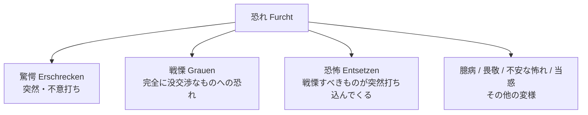
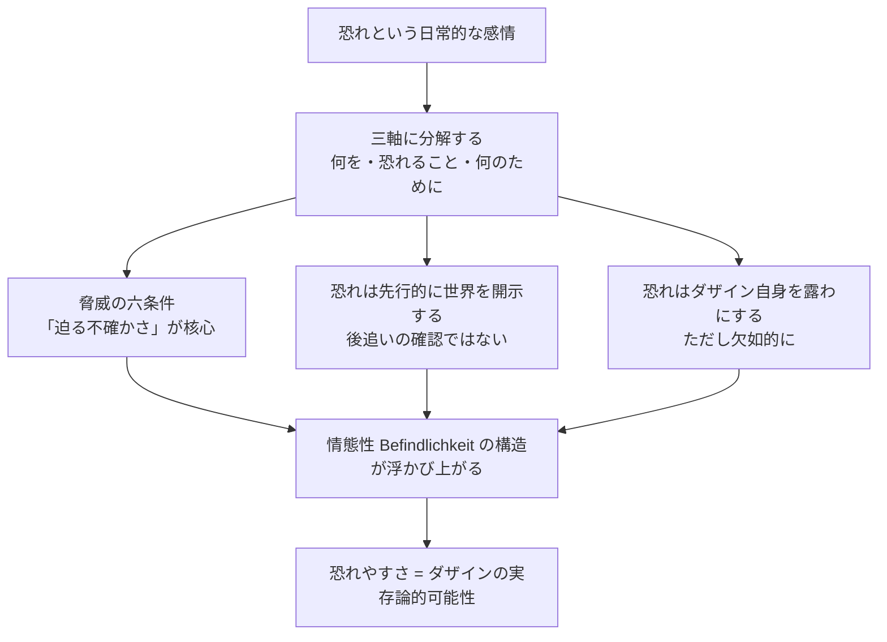

## 「§30」は何だと言っているのか

*ハイデガー『存在と時間』第30節*

---

### この節の結論を先に言う

「恐れ」という日常的な感情を分析することで、ハイデガーは一つのことを示したい——**恐れは、私たちが世界の中に「情態的に」投げ込まれて存在しているという事実の、最もわかりやすい例証である**。

「情態性（Befindlichkeit）」とは、「自分が今ここにいるという、気分によって色づけられた存在の在り方」のことだ。恐れはその一形態であり、この節ではそれを三つの軸に分解して検討することで、情態性がどういう構造をもつかを明らかにしていく。

---

### 三つの軸で「恐れ」を解剖する

ハイデガーはまず、恐れを三つの問いに分ける。

| 問い | ドイツ語 | 意味 |
|---|---|---|
| 何を恐れるか | *Wovor* | 恐れの「対象」——脅威 |
| 恐れること | *Fürchten* | 恐れる「行為」そのもの |
| 何のために恐れるか | *Worum* | 恐れが気遣っている「当事者」 |

この三つは「恐れ」という一つの出来事の、別々の側面として同時に成り立っている。どれかが単独で存在するわけではない。

---

### 第一の軸：「何を恐れるか」——脅威の六つの条件

「恐ろしいもの」は単に危険なだけでは足りない。ハイデガーは脅威が恐れとして成立するための条件を六つ挙げる。

1. **有害である**——何らかのかたちで私に悪影響を及ぼす関係にある。
2. **一定の方角から来る**——脅威はぼんやりと存在するのではなく、特定の方向から近づいてくる。
3. **その方角は知ってはいるが、安心できない**——まったく知らないものではなく、だからこそ不気味だ。
4. **まだ手の届かない近さにある**——支配できるほど近くはないが、近づいてきている。
5. **「当たるかもしれないし、そうならないかもしれない」という不確かさが増大する**——この宙吊り状態が恐れの核心だ。
6. **「通り過ぎるかもしれない」という可能性が恐れを消すのではなく、むしろ構成する**——「外れるかも」という希望が、かえって恐れを持続させる。

> 接近において、この「それはありうるが、結局そうならないかもしれない」が増大する。われわれはそれを恐ろしいと言う。

つまり恐れとは、**遠すぎず・近すぎず、不確かなまま迫ってくるもの**に対して開かれる情態だ。

---

### 第二の軸：「恐れること」——恐れは後追いではなく先行する

ここで重要な逆転がある。

私たちは日常的に「まず危険を確認し、それから恐れる」と思いがちだ。しかしハイデガーは言う——**恐れることが先に脅威を脅威として開示する**のだと。

> 恐れることが接近しつつあるものをはじめて確認するのでもなく、むしろそれに先立ってその恐ろしさにおいてそれを開示するのである。

言い換えれば、私たちが「あれは危ない」と見えるのは、すでに恐れという気分の中に身を置いているからだ。「顧慮的な見回し（Umsicht）」——日常の中で周囲を気にかけながら世界を見渡す視線——が脅威を発見できるのも、恐れという情態性が先に世界を色づけているからにすぎない。

さらにこの軸には「**恐れやすさ（Furchtsamkeit）**」という概念が出てくる。これは臆病な性格のことではなく、**そもそも人間（ダザイン）が恐れを向けられるような存在の構え**のことだ。恐れやすさによって、世界は「そこから脅威が近づきうる場所」として常にすでに開示されている。

---

### 第三の軸：「何のために恐れるか」——恐れは自己を露わにする

恐れが最終的に気遣っているのは、**恐れているダザイン自身**である。

「ダザイン（Dasein）」とはハイデガーが「人間」を指すために使う言葉で、「ここ・に・存在すること（Da-sein）」を意味する。

> 恐れが恐れるところのものは、恐れつつある存在者そのもの、すなわちダザインである。

「家のことが心配だ」「財産が心配だ」という場合も、実はそれは反論にならない。なぜならダザインは「世界内存在」として、つねに何かの傍らで気遣いながら生きているからだ。家や財産への脅威は、結局「そこに住んでいる私」への脅威に他ならない。

ただし恐れはダザインを**欠如的に**しか開示しない。恐れは人を混乱させ、「頭を失わせ」、かえって自分の置かれた状況を見えにくくする。

> 恐れは混乱させ、「頭を失わせ」る。恐れはまた同時に、危険にさらされた「内に存在すること」を遮蔽する。

---

### 「他者のために恐れること」という特別なケース

ハイデガーはここで一つの応用問題を解く。「他者のことを心配して恐れる」という経験をどう理解するか、だ。

他者のために恐れることは、「他者から恐れを引き受けてあげる」ことではない。むしろ、**他者と共にいるという自分の在り方そのものが脅かされること**への恐れだ。

> そこで「危惧される」のは、共に存在すること、すなわち自分から奪い取られかねない他者との共在である。

したがって「他者のために恐れること」は、「弱められた自己恐れ」ではなく、**共存という形での自己の在り方が脅かされる**という、独立した実存論的な様態だ。ここで問われているのは感情の強弱（程度の差）ではなく、存在の様式（構造の差）である。

---

### 恐れの変様——一本の木から枝が分かれる

最後にハイデガーは「恐れ」の変形を列挙する。

これらはどれも「恐れ」の三つの構成軸（何を・どう・何のために）のどれかが変様することで生じる。

| 変様 | 特徴 |
|---|---|
| 驚愕（Erschrecken） | 脅威が不意打ちで打ち込んでくる |
| 戦慄（Grauen） | 脅威がまったく没交渉・異質なものである |
| 恐怖（Entsetzen） | 戦慄すべきものが同時に不意打ちでもある |

---

### この節の構造をまとめる

---

### 一文で言い直すと

この節でハイデガーが示したいのは、**「恐れ」という感情はバラバラな心理現象ではなく、私たちが世界の中に情態的に投げ込まれているという存在構造を、最も透明な形で映し出す鏡である**ということだ。恐れを解剖することで、情態性の骨格が一般的に見えてくる——それがこの節の目的である。
