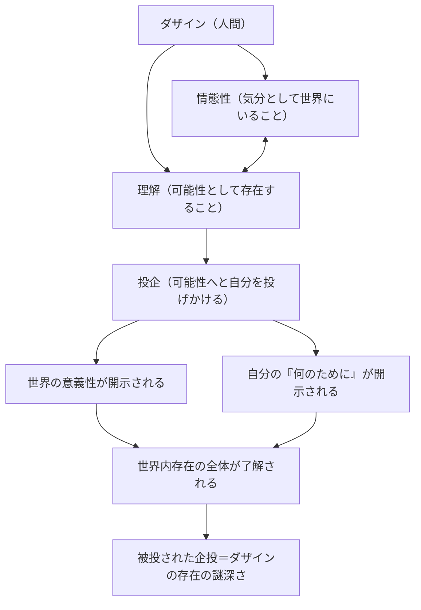

## 「§31」は何だと言っているのか

*ハイデガー『存在と時間』第31節*

---

### この節の結論を先に言ってしまうと

「理解（Verstehen）」とは、知識を頭に蓄えることでも、物事を説明できることでもない。それは**人間（ダザイン）の存在そのものの在り方**だ――というのがこの節の中心にある主張である。

ハイデガーはここで、「理解」という言葉を日常語から引き剥がし、「人間がそもそも世界の中に生きているとはどういうことか」を語るための哲学的な道具として作り直す。その核心に置かれるのが「**投企（Entwurf）**」という概念だ。人間はつねに「自分がなりうること」へと自分を投げかけながら生きており、その投げかけの動きそのものが「理解」なのである。

---

### 前提の整理――「情態性」と「理解」は対で働く

まず、この節が前の議論から引き継いでいることを確認しておきたい。

ハイデガーはすでに「情態性（Befindlichkeit）」を論じていた。これは「気分として世界の中にいる、そのただ中にある感じ」のことで、「なんとなく重苦しい」「世界が輝いて見える」といった、つねに何らかの色合いを帯びた「そこにいること」の感覚だ。

> 「情態性はつねにそれなりの理解をもっており……理解はつねに情態的に調律されている」

つまり、気分（情態性）と理解はセットであり、どちらか一方だけが単独で働くことはない。この節では、その「もう一方」である**理解**が正面から取り上げられる。

---

### 「理解」とは「できる」ということだ

日常言語にも、「理解する」を「できる・対処できる」という意味で使う表現がある。「あの人は世渡りをよく理解している」「状況を理解していない」といった言い方だ。ハイデガーはまさにその語感に着目する。

> 「実存カテゴリーとしての理解においてなしうるとされているものは、何らかの『何（Was）』ではなく、実存することとしての存在そのものである」

つまり、理解は「この概念を知っている」という知識の話ではない。「**自分がそのようにあること・そうなること**ができる」という**可能性の様式**そのものが理解なのだ。

ここから「**可能存在（Möglichsein）**」という概念が導かれる。

| 区別すべき「可能性」 | 内容 |
|---|---|
| 論理的可能性 | 「矛盾していなければ可能」という空虚な概念 |
| 現前的なものの偶然性 | 「この石に何かが起こりうる」という出来事の話 |
| **実存カテゴリーとしての可能性** | ダザインが**自分自身としてありうること**、存在の最も積極的な規定 |

ハイデガーが強調するのは三番目だ。人間は「能力を後付けでもつモノ」ではなく、根本から**可能性の束そのもの**として存在している。

---

### 投企――可能性へと自分を「投げる」こと

では、その「可能性」はどのように機能するのか。ここで「**投企（Entwurf）**」が登場する。

> 「了解は、ダザインの存在を、そのために（Worumwillen）へと投企するのと同じほど根源的に、それぞれの世界の世界性としての意義性へと投企する」

「投企」とは、設計図を意識的に引くことではない。人間はいつでも、すでに自分をある可能性へと「投げかけて」いる。それが存在しているということそのものだ、とハイデガーは言う。

重要なのは、**投企された可能性は主題的に把握されていない**という点だ。

> 「了解がそれへ向けて投企するもの、すなわち可能性を、それ自体としては主題的に把握しない。そのような把握はまさしく、投企されたものからその可能性の性格を奪い取り……所与物へと引き下ろしてしまう」

つまり、可能性を「意識的に計画・設計した対象」にした瞬間に、それは生きた可能性ではなくなる。投企とは、可能性を可能性のままに生きること、言わば**可能性を前方へ開いたまま生きる動き**なのだ。

---

### 「投げられた可能性」――自由だが、まったくの自由ではない

ここで「情態性」との連絡が戻ってくる。人間は確かに可能性へと投企するが、どこからでも好きに投企できるわけではない。

> 「ダザインは本質的に情態性を帯びたものとして、つねにすでに特定の可能性の中へと陥り込んでいる」

人間はすでに特定の時代、文化、状況、気分の中に「投げ込まれて」存在している。これが「**被投性（Geworfenheit）**」だ。だから、ダザインは「**投げられた可能性（geworfene Möglichkeit）**」――投げ込まれながら、しかも可能性へと投企する存在だ。

> 「汝のあるところのものとなれ！」

これはダザインが自分自身に向けて言いうる言葉としてハイデガーが引く。「あなたはすでに投げ込まれているが、その上で自分の可能性へと向かえ」という意味合いが込められている。

---

### 「視（Sicht）」――了解することは「見る」こと

了解はまた「視（Sicht）」という形で語られる。ただしここでいう「見る」は目で見ることではない。

> 「見ることの固有の性格、すなわち見ることがそれへとアクセス可能な存在者をその存在者自身において覆いなく出会わせるという性格のみが用いられている」

ハイデガーはここで、哲学の伝統が「見ること（直観）」を知の王座に置いてきたことに触れ、それを転覆させる。

> 「純粋な直観の優位は剥奪される……『直観』も『思惟』も、ともにすでに了解の遠隔した派生物である」

視・直観・思惟はすべて、より根源的な「了解＝存在の在り方としての理解」から派生したものにすぎない、というわけだ。

この流れで提示されるのが「**透視性（Durchsichtigkeit）**」という術語だ。これは「自己認識」を意味するが、内面をじっと観察することではなく、世界内存在の全構造を了解的に捉えることを指す。

---

### この節の構造をまとめると

| 段階 | 内容 | キーワード |
|---|---|---|
| ① 出発点 | 情態性と理解は対をなす「現（Da）」の構造 | 情態性・理解 |
| ② 理解の再定義 | 理解とは知識ではなく「ありうること」の存在様式 | 可能存在 |
| ③ 投企の導入 | 了解は可能性へと自分を投げかける動きそのもの | 投企 |
| ④ 被投性との結合 | 人間は「投げられた可能性」であり、完全な自由ではない | 被投性・被投的企投 |
| ⑤ 直観・思惟の格下げ | 視も直観も思惟も、了解から派生する | 透視性 |
| ⑥ 残された謎 | 被投的企投としての存在は、解くべき謎としてより深まる | 存在了解 |

---

### 最後に――なぜこれが重要なのか

ハイデガーがここで仕掛けていることを一言で言えば、「**人間とは、自分の可能性として存在する存在者だ**」という主張だ。人間は「今この瞬間にこうある固定したモノ」ではなく、つねに「これからありうること」へと開かれた動的な存在だ。

そして、その開かれ方そのものを「理解」と呼ぶ。認識は理解の一形態にすぎず、了解はそれよりずっと根本的な層にある。

この節はいわば、残りの『存在と時間』の議論全体が乗り込んでくるための**土台の整備**だ。「気分として世界にいる」（情態性）と「可能性として自分を投企する」（理解）という二つの柱が立った上で、次に「語り（Rede）」が加わり、「現（Da）」の全体構造が完成に近づいていく。
