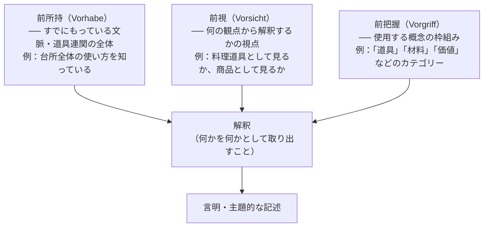

## 「§32」は何だと言っているのか

*ハイデガー『存在と時間』第32節*

---

### この節で言いたいこと――一言で

「世界を見るとき、人間はいつでもすでに『何かを何かとして』把握している。そしてその把握は、あらかじめもっている見方・文脈・概念の枠組みに必ず支えられている。これは欠陥ではなく、むしろ人間の理解というものの根本的な構造だ」――これが第32節の核心です。

節は「了解（Verstehen）」と「解釈（Auslegung）」の関係を整理したうえで、解釈に伴う「前-構造」、「として（Als）の構造」、「意味（Sinn）」の概念を導入し、最後に「解釈の循環」を弁護することで締めくくられます。

---

### 用語の手引き

この節には独特の言葉が集中して登場します。最初に整理しておきます。

| ハイデガーの語 | かみくだくと |
|---|---|
| **ダザイン** | 「人間」のこと。ただし世界の中に投げ込まれて存在している、という側面を強調した言い方 |
| **了解（Verstehen）** | 世界・状況を「分かる」こと。明示的な知識よりも先に働く、身体に染み込んだ「分かり方」 |
| **解釈（Auslegung）** | 了解を「取り出して形にする」こと。「これはテーブルだ」と取り出す行為 |
| **手許存在者（Zuhandenes）** | 使えるものとして手元にある道具・物 |
| **配慮（Besorgen）** | 日常的に何かを気にかけながら使ったり処理したりすること |
| **顧慮・見回り（Umsicht）** | 道具を使うとき周囲を見回す実践的な把握の仕方 |

---

### 第一段階――「了解」と「解釈」はどう違うのか

まずハイデガーは了解と解釈を区別します。

> 解釈において、了解は了解されたものを了解的に自らのものとする。解釈において了解は別の何ものかになるのではなく、それ自身となる。

「了解」は、世界に慣れ親しんでいる状態のことです。たとえば、台所に入れば何がどこにあるか、何のためにあるかを「なんとなく分かっている」状態です。「解釈」は、その分かり方をあらためて取り出して明示化する行為です。「このハサミは布を切るためにある」と改めて言葉にするような。

重要なのは方向性です。ハイデガーは「解釈が了解を生むのではない」と言います。先にある了解を解釈が形にするのです。

---

### 第二段階――「何かを何かとして見る」という構造

節の中心的なアイデアが「として（Als）の構造」です。

> 見回り的にその「何々のため」へと開示されたものそのもの、すなわち明示的に了解されたものは、「何かとしての何か」という構造を有する。

私たちが物を見るとき、「まず意味のない塊を見てから、そこに意味を貼り付ける」のではありません。はじめから「椅子として」「ドアとして」「邪魔なものとして」見ています。これが「として」の構造です。

> 解釈は、いわば裸の眼前存在者の上に「意味」を投げかけるのでも、それに価値を貼り付けるのでもない。

「素朴にただ見る」ことの方がむしろ特殊で、了解を「切り落とした」状態だとハイデガーは言います。「として」を持たない純粋知覚こそ、派生的で二次的なのです。

---

### 第三段階――解釈を支える三つの「前-」

解釈は必ず「前もって与えられているもの」に乗っかって動くとハイデガーは主張します。それが次の三つです。

> 解釈とは、与えられたものを前提なしに把握することでは決してない。

「テクスト解釈の際に〈そこに書いてあること〉に訴える場合でも、そこに持ち込まれているのは解釈者自身の前見解にほかならない」――ハイデガーはこう続けます。これは相対主義の宣言ではなく、解釈の構造を正直に記述しようとしているのです。

---

### 第四段階――「意味」とは何か

三つの「前-」の議論を踏まえて、ハイデガーは「意味（Sinn）」を定義します。

> 意味とは、前持ち・前視・前把握によって構造化された、投企の「それへの向かい先」であり、そこから何かが何かとして了解可能になる。

意味とは物に貼り付いている属性ではありません。ダザイン（人間）の了解の構造のうちに宿るものです。したがって：

> 「意味」を「もつ」のはダザインのみである。

ダザインではない石ころや自然現象は、それ自体としては「無意味（unsinnig）」です。ここで「無意味」は価値の低さではなく存在論的な記述で、「意味の構造を持たない」という意味です。

> そして、われわれが存在の意味を問うとき、その探究は深遠になるわけでも、存在の背後に潜む何かを探り出そうとするわけでもなく、存在それ自体を、それがダザインの了解可能性のうちへ入り込んでくるかぎりにおいて問うのである。

これは『存在と時間』全体の問い（「存在の意味とは何か」）が、神秘的な背後世界の探索ではないことを示す重要な一文です。

---

### 第五段階――「解釈の循環」は悪いことか？

節の後半では、この「前-構造」から生じる問題が取り上げられます。

了解は「すでに分かっていること」を前提にして解釈を行い、解釈はまた了解を更新する――この往復運動は**循環**です。文献学や歴史学ではこれが「循環論法（circulus vitiosus）」として問題視されてきました。

ハイデガーの答えは明快です。

> 決定的なことは、循環の外へ出ることではなく、正しい仕方で循環の内へと入ることである。

循環を「欠点」と見るのは、科学的証明の理想（前提なしに証明する）を人間の理解全般に押しつけているからです。しかしその科学的認識の理想自体、すでに特定の了解の一形態にすぎない。

> この循環は悪循環へと……貶められてはならない。そこには最も根源的な認識の積極的な可能性が潜んでいる。

「循環の内へ正しく入る」とは、自分がもっている前所持・前視・前把握を自覚し、「思いつきや通俗的な概念」に任せず、「事柄そのものから」それらを練り上げていく営みのことです。

---

### この節の全体構造をまとめると

| 論点の順序 | 主張の内容 | キーワード |
|---|---|---|
| ① | 了解が先にあり、解釈はそれを形にする | 了解→解釈の方向性 |
| ② | 世界の物はつねに「として」見られている | Als-構造（として） |
| ③ | 解釈は三つの「前-」に常に支えられている | 前所持・前視・前把握 |
| ④ | 「意味」はダザインの了解構造に宿る | 意味（Sinn） |
| ⑤ | 解釈の循環は欠陥ではなく実存論的な構造 | 解釈の循環の弁護 |

---

### まとめ――この節が『存在と時間』全体で果たす役割

第32節は、第31節で導入された「了解」という概念を、日常的な道具使用の場面から掘り下げ、「解釈」という概念に接続します。そして「意味」という言葉を厳密に定義することで、『存在と時間』の根本的な問い――「**存在の意味**を問う」――が何を問うことなのかの地盤を固めます。

解釈の循環の弁護は、同時に哲学的探究そのものの弁護でもあります。「前提なしに真理を示す」という自然科学的な理念の枠組みに哲学を合わせるのではなく、人間の理解というものが本来的にもつ循環構造の中で、より誠実に、より自覚的に動くことを求めているのです。
