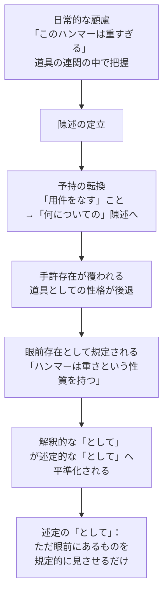

## 「§33」は何だと言っているのか

*ハイデガー『存在と時間』第33節*

---

### この節の結論を一言で

「陳述（命題・判断）は、了解と解釈という、より根源的なはたらきから**派生した**ものに過ぎない」――これがこの節の中心主張である。

論理学は長らく「判断こそ真理の宿る場所」として特権的に扱ってきた。しかしハイデガーは、陳述の構造を丁寧に解剖することで、陳述が日常的な「了解」と「解釈」を土台にして**後から成り立っている**ことを示す。そのうえで、アリストテレス以来の「論理学」が根ざしてきた基盤じたいの限界を指摘する。

---

### 準備知識：この節のキーワード

| 用語 | 簡単な説明 |
|---|---|
| ダザイン（Dasein） | 「人間的な存在」のこと。世界の中に投げ込まれて生きている存在。 |
| 了解（Verstehen） | 世界を「こういうものだ」と暗黙に把握しているはたらき。反省以前の理解。 |
| 解釈（Auslegung） | 了解を明示化すること。「このハンマーは重い」と気づく段階。 |
| 陳述（Aussage） | 「ハンマーは重い」のように語で言い表された判断・命題。 |
| 手許存在（Zuhandenheit） | 道具がそのはたらきの中にある状態。「使える」感覚の中にある存在。 |
| 眼前存在（Vorhandenheit） | 対象として目の前に置かれ、性質を観察される状態。 |
| ロゴス（Logos） | ギリシア語で「語り・言葉・理性」。古代哲学で存在へのアクセスの鍵とされた概念。 |

---

### 第一段階：なぜ「陳述」を分析するのか

ハイデガーはまず、陳述を分析する理由を三つ挙げる。

1. **「として」の構造を浮き彫りにするため**――解釈では「このハンマーを*重すぎる*ものとして」把握する。陳述の分析はこの構造がどう変形されるかを示す。
2. **古代存在論への問いのため**――古代ギリシアではロゴス（言葉・理性）が「存在者への接近」の唯一の手引きとされた。その来歴を問い直す。
3. **真理の問題を準備するため**――伝統的に「真理は判断の中にある」とされてきた。この前提を問い返す地盤を整える。

---

### 第二段階：陳述の三つの意味

ハイデガーは「陳述」という言葉に三つの意味を区別する。

#### 1. 提示（Aufzeigung）

> 「このハンマーは重すぎる」という陳述において、視覚のために開示されているのは「意味」ではなく、手許存在の様式における存在者そのものである。

陳述はまず、存在者を「それ自体として見させる」はたらきをする。「ハンマー」という語は意味を指すのではなく、あの道具そのものを指し示す。

#### 2. 述定（規定すること）

「ハンマー **は** 重すぎる」というとき、主語（ハンマー）を述語（重すぎる）によって規定する。しかしこの規定は、すでに存在者を見ているところから出発している。述語は新しい何かを付け加えるのではなく、すでに開示されているものを明示的に絞り込む。

#### 3. 伝達（Mitteilung）

陳述は他者と「共に見ること」を可能にする。語りに出されることで、その存在者のそばにいない人も、同じ存在者へと関わることができる。ただしそれが「語り継がれる」うちに、指示されたものが隠蔽されてしまう危険もある。

> 「語り継いでいくなかで、指示されたものはまさに再び隠蔽されることもある」

これら三つをまとめると、陳述の定義はこうなる。

> **命題とは、伝達的に規定する指示開示（mitteilend bestimmende Aufzeigung）である。**

---

### 第三段階：「妥当性」という議論の罠

ここでハイデガーは当時の判断論を俎上に載せる。ロッツェ以来、判断の根底に「妥当性（Geltung）」という概念を置く哲学が主流だった。ハイデガーはこの概念が**三つの意味を混同している**と指摘する。

| 意味 | 内容 |
|---|---|
| 観念的存在様式 | 「心理的な判断過程に左右されない不変の内容」としての妥当性 |
| 客観的妥当性 | 「対象と一致する」という意味での妥当性 |
| 普遍的妥当性 | 「理性的存在なら誰もが認めざるを得ない」という拘束性 |

> 「これらは、それ自体としても不透明であるのみならず、相互に絶えず混同される」

「妥当性」は三つの異なる問題を曖昧に束ねているだけで、陳述や意味の**存在論的な**根拠にはなっていない。だからハイデガーは「妥当性」を手引きにするのを拒否する。

---

### 第四段階：陳述はいかに「解釈」から派生するか

陳述が解釈の一種であるなら、「先持ち（Vorhabe）・先見（Vorsicht）・先取り（Vorgriff）」という解釈の三構造を持つはずだ。ハイデガーはそれを確認する。

- **先持ち**：陳述の前提として、存在者がすでに開示されていること（例：ハンマーがすでに「使うもの」として理解されている）。
- **先見**：述語として帰属させるべきものへの視線の向け方（例：「重さ」という観点で見ること）。
- **先取り**：言語の中にすでに埋め込まれた概念性（例：「ハンマーは重さという性質を持つ」という枠組み）。

> 「命題は解釈一般と同様に、必然的に、先持ち・先見・先取りにおけるその実存論的な基礎を持っている」

---

### 第五段階：「として」の構造がどう変様されるか

これが節の哲学的核心である。

日常の道具的な把握では、ハンマーは「重すぎる**ものとして**」顧慮されている。この「として」は連関整合性の全体（例：「この仕事に対してこの道具は不適合だ」という文脈）の中で機能している。

陳述においては何が起こるか。

ハイデガーはこの二つの「として」を区別する。

| 「として」の種類 | 内容 | 例 |
|---|---|---|
| **実存論的・解釈学的「として」** | 道具的連関の中で把握する根源的な了解 | 「重すぎる」と顧慮しつつ別のハンマーを手に取る |
| **述定的・開示的「として」** | 眼前の対象に性質を帰属させる | 「ハンマーは重さという性質を持つ」 |

陳述は根源的な「として」を**平準化**することによって成立する。それが「派生」の意味である。

---

### 第六段階：アリストテレスとロゴスの限界

ハイデガーは古代哲学へと視野を広げる。アリストテレスは、あらゆる命題が「総合（synthesis）」と「分析（diairesis）」を等しく含むことを洞察した。これは重要な着眼だった。しかし、アリストテレスはさらに問いを深めなかった。

> 「ロゴスの構造のうちなるいかなる現象が、あらゆる命題を総合と分析として特徴づけることを許し、かつそれを要求するのか」

この問いに答えられなかったために、「として」の現象が覆い隠されたまま、ロゴスの分析は「表象と概念の結合・分離」という外面的な判断論へと崩落した。その典型が**繋辞（コプラ）**「は（ist）」の問題である。「ハンマー**は**重い」の「は」が何を意味するかを問えば、それは単なる「結合の絆」ではなく、存在了解そのものに関わる現象であるはずだが、論理学はそれを「関係づけ」の形式へと解消してきた。

---

### まとめ：この節が言っていること

> 「さしあたり重要だったのは、言表が解釈と了解から派生していることの証示によって、ロゴスの「論理学」がダザインの実存論的分析論に根ざしていることを明らかにすることであった」

| 問い | この節の答え |
|---|---|
| 陳述とは何か？ | 伝達的に規定する指示開示 |
| 陳述はなぜ「派生的」か？ | 日常的な了解・解釈の「として」構造を平準化することで成立するから |
| 「として」に二種類あるとはどういうことか？ | 道具的連関の中の根源的「として」が、眼前性規定の「として」へと変様された |
| 古代論理学の問題は何か？ | ロゴス自体を「眼前存在するもの」として扱い、了解・解釈という根源的な地盤を見逃した |

論理学は長い間「判断の中に真理がある」と言い続けてきた。しかしその「判断」は、もっと根源的な了解のはたらきから生まれた**薄い派生物**に過ぎない――これがハイデガーのこの節を通じた主張である。
