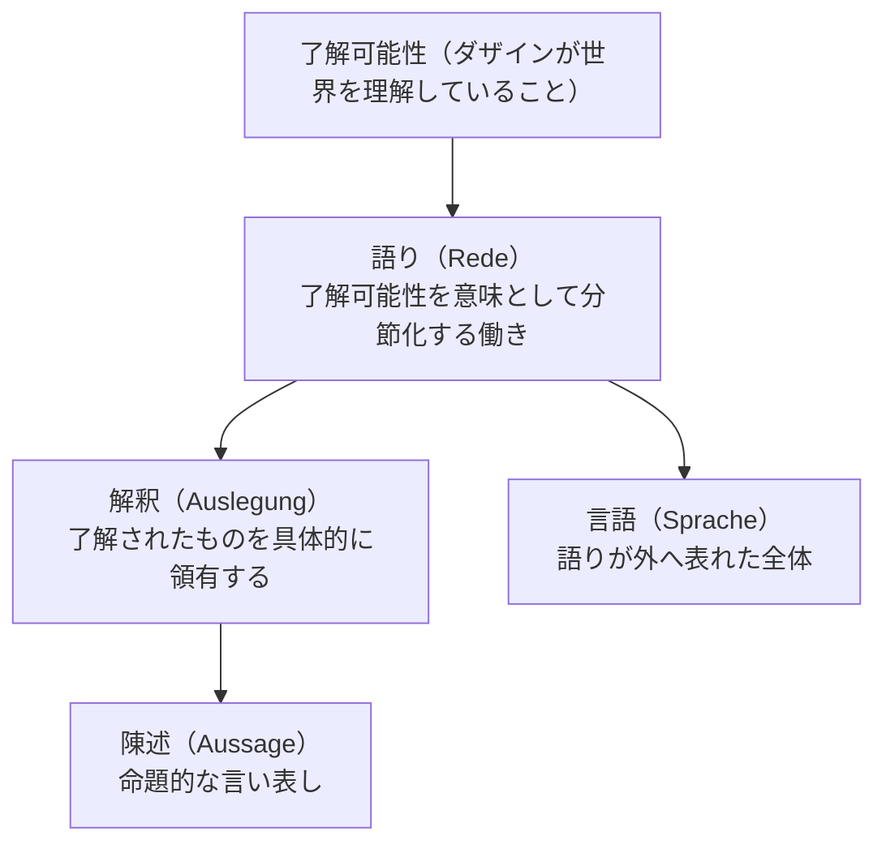

## 「§34」は何だと言っているのか

*ハイデガー『存在と時間』第34節*

---

### この節の結論を一言で言うと

「語り（Rede）」は言語よりも深いところにある、ダザインの存在そのものの構造だ——というのがこの節の核心である。

ハイデガーはここで、**言語（Sprache）は「語り」の外側に表れた結果にすぎず、その根っこには「了解可能性を意味として分節する」という実存論的な働きがある**と主張する。そしてその働きと不可分に結びつく「聴くこと」と「沈黙すること」を分析することで、語りがいかにダザインの開示性（世界に開かれていること）を根本から支えているかを示す。

---

### 前提：ここまでの議論の整理

この節は第32〜33節の積み重ねを受けている。それを簡単に確認しておこう。

| これまでの概念 | 内容のポイント |
|---|---|
| 情態性（Befindlichkeit）| 「気分」としてすでに世界に投げ込まれている在り方 |
| 了解（Verstehen） | 可能性として世界を先回りして理解している在り方 |
| 解釈（Auslegung） | 了解されたものを具体的に領有すること |
| 陳述（Aussage） | 解釈の派生的な形態。命題的な言い表し |

> 陳述の第三の意味、すなわち伝達（告示）としての陳述を解明することによって、これまで故意に顧みられることのなかった「言うこと」と「語ること」の概念へと導かれた。

ここで初めて「語り」が正面から主題になる。

---

### 第一段階：「語り」は言語より深いところにある

「語り（Rede）」という言葉は日常語の「しゃべる」に近いが、ハイデガーが使うときの意味は違う。それは**了解可能性を「意味として分節化する」働き**のことだ。

> 語りとは了解可能性の分節化（Artikulation）である。したがって語りは解釈と陳述にすでに先立って横たわっている。

ここで言う「分節化」とは、まだぼんやりとひとかたまりになっている理解を、区別・区画・構造をもったものとして整理することである。言葉を発する前に、すでにこの分節化が行われている——それが「語り」だとハイデガーは言う。

そして言語（Sprache）は何かと言えば、

> 語りの外へと語り出されたもの（Hinausgesprochenheit）が言語である。

つまり「語り」という内的な分節が世界の表面に出てきたもの、それが言語だ。言語は語りに意味を与えるのではなく、**意味から言葉が育ち出る**のである。



---

### 第二段階：語りの四つの構造契機

ハイデガーは「語り」に四つの構造的な要素があると整理する。

| 構造契機 | 説明 |
|---|---|
| **語られるもの（Worüber）** | 「何について語るか」という対象・テーマ。命令にも願望にも常にある。 |
| **語られたこと（das Geredete）** | 語りの中に実際に言われたこと・表明されたもの。 |
| **伝達（Mitteilung）** | 了解を「分かち合う」こと。意見を内面から外へ運ぶのではなく、すでに共に開かれている了解を明示化すること。 |
| **告知（Bekundung）** | 語りにおいて情態性（気分・調子）が現れること。声の抑揚・テンポ・語り方の種類など。 |

特に「伝達」については強調が必要だ。

> 伝達とは、例えば意見や願望を一方の主体の内面から他方の主体の内面へと運搬するようなものでは決してない。

私たちがふつうコミュニケーションのイメージとして持っている「Aの頭の中→言葉→Bの頭の中」という図式をハイデガーはここで否定する。共ダザイン（他者とともにある在り方）はすでに情態性・了解を共に持っている。語りはそれを「明示的に」分かち合うだけだ。

---

### 第三段階：聴くことは「語ること」に構成的に属している

語ることを正面から論じた後、ハイデガーは「聴くこと（Hören）」へと向かう。

> 聴くことは語ることにとって構成的である。

これは「話す人がいれば聴く人が必要だ」という当たり前の話ではない。**聴くことはダザインの開かれ（他者への開かれ、自己への開かれ）の実存論的な構造だ**という主張である。

そのことを示すために、ハイデガーは知覚の問題を持ち出す。私たちはまず「音」を聴いてから「荷車の音だ」と解釈するのではない。

> 「まずもって」私たちは、物音や音の複合体を聴くのではなく、軋む荷車を、オートバイを聴く。

私たちはすでに了解している存在者のもとにいるから、最初から「荷車」「北風」「キツツキ」として聴こえる。純粋な音響データを先に受け取るなどということは、きわめて人工的な態度を作り出した場合にしか起きない。

---

### 第四段階：沈黙は「語らないこと」ではない

節の終盤、ハイデガーは「沈黙（Schweigen）」を論じる。これが一般的な理解から最も遠い箇所かもしれない。

> 互いに語り合う中で沈黙する者は、言葉の尽きない者よりも、より本来的に「了解させること」、すなわち了解を形成することができる。

沈黙は、語りの欠如でも対義語でもない。**沈黙は語りの一つの様式**である。

そしてこの点が重要だ——

> 沈黙しうるためには、ダザインは何か言うべきことを持たなければならない。すなわち、自己自身の本来的で豊かな開示性を自由に使いうることが必要である。

何も言えない者は沈黙もできない。口を閉ざすこと（Verschwiegenheit）は開示性の豊かさから来るのであり、おしゃべり（Gerede）——後の節で詳しく扱われる日常的な言葉の流れ——を沈める力を持つ。

| | 内容 |
|---|---|
| **おしゃべり（Gerede）** | 了解を深めず、言葉が空回りしている状態。多弁。 |
| **沈黙（Schweigen）** | 語りの一様式。豊かな開示性を持つ者だけができる。 |
| **唖（口がきけないこと）** | 沈黙とは別。語りの可能性そのものを持たない。 |

---

### 第五段階：ロゴス・言語学・文法への批判

節の後半でハイデガーは一気に射程を広げ、西洋の言語観全体を批判する。

ギリシア人が人間を「ζῷον λόγον ἔχον（ロゴンを持つ動物）」と規定したのは、人間が語ることによって世界を開示する存在だからだ。しかし後世はこれを「animal rationale（理性的動物）」と訳し、「語り」の次元を見失ってしまった。

> 文法学はその基礎を、このロゴスの「論理学」に求めた。ところがこの論理学は、眼前的なもの（Vorhandenes）の存在論に基づいている。

「眼前的なもの」とは、ただそこに物として存在するもののこと。文法学も言語学も、言語を「物のようにそこにある道具」として扱う存在論を無意識に引き継いでいる。そのため、語りの実存論的な全体構造が捉えられてこなかった。

> 文法学を論理学から解放するという課題は、語り一般の先験的（apriorisch）な基本構造を実存論的契機として積極的に理解することを先行的に必要とする。

言語を問い直すためには、「言語哲学」として個別の問題を扱うのではなく、ダザインの存在論まで遡らなければならない——それがハイデガーの要求だ。

---

### まとめ：この節で言われたこと

```
語り（Rede）
  ├── 情態性・了解と等根源的（三つは同じ深さにある）
  ├── 了解可能性を意味として分節化する働き
  ├── 言語はその「外へ語り出されたもの」にすぎない
  │
  ├── 構造契機：語られるもの／語られたこと／伝達／告知
  │
  ├── 聴くこと　→　語りに構成的に属する。了解への開かれ。
  └── 沈黙すること　→　語りの一様式。豊かな開示性から来る。

言語学・文法学への要求：
  「物の存在論」を引き継ぐ現行の枠組みを超え、
  ダザインの存在論に根ざした基礎へ組み替えよ。
```

この節は、次に来る「おしゃべり（Gerede）」「好奇心（Neugier）」「曖昧さ（Zweideutigkeit）」というダザインの日常的退落の分析（第35〜38節）への橋渡しとなっている。語りが日常においてどのように「本来的でない」形で現れるかを見るためには、まず語りの本来の構造を押さえておく必要があった——それがこの節の位置づけである。
