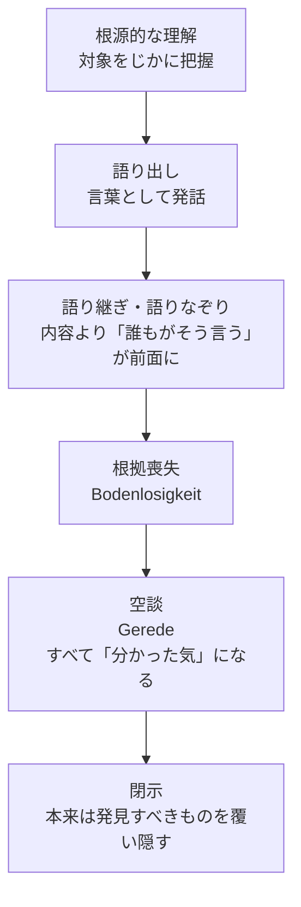
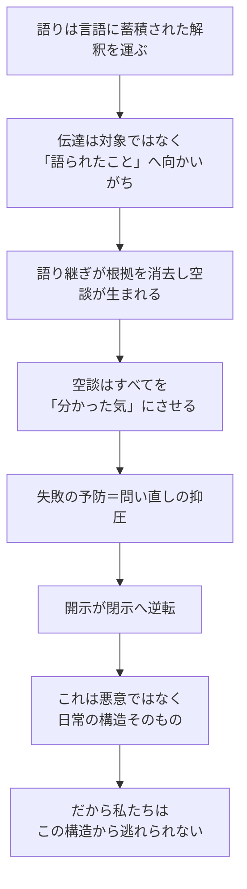

## 「§35」は何だと言っているのか

*ハイデガー『存在と時間』第35節*

---

### この節の結論を一言で言うと

「空談（Gerede）」とは、単なる「くだらないおしゃべり」ではない。それは私たちが日常的に言葉を使うときに必ずはまり込む構造的な落とし穴であり、しかもその落とし穴の中にいながら「何でも分かっている」と感じさせてしまう、という点で根本的に問題含みである——ハイデガーがこの節で示したいのは、この一点である。

---

### 前提：「語り」と「言語」の関係

ハイデガーは、私たちが世界を理解するはたらきを「語り（Rede）」と呼ぶ。そしてこの語りは、ほぼ常に言葉として外に出てくる。

> 語りはたいていの場合みずからを語り出し、すでに常に語り出されてきた。語りは言語である。

重要なのは、言語（すでに語り出されたもの）には、過去から積み重ねられた「解釈」があらかじめ埋め込まれている、ということだ。私たちは言葉を使い始める前から、その言語コミュニティの解釈に浸かっている。

| 用語 | かみくだいた意味 |
|------|-----------------|
| 語り（Rede） | 世界への理解・意味付けのはたらき全般 |
| 語り出されたもの（Ausgesprochenheit） | 言語として外に出てきた語り |
| 解釈されたもの（Ausgelegtheit） | 言語の中に蓄積された「世界の読み方」 |
| ダザイン | ここでは「私たち人間」とほぼ同義 |

---

### ステップ①：伝達はどう機能するか

語りが言葉として他者へ伝わるとき（伝達）、本来はどういうことが起きるはずか。

> その存在傾向は、聴く者を、語りの語られたもの（Beredetes）への開示された存在への参与へともたらすことを目指している。

つまり理想的な伝達とは、聴き手が話の「対象そのもの」をじかに理解する状態に到達させることだ。  
ところが実際には、こうなる——

> 人は語られた存在者をさほど了解するのではなく、すでにもっぱら語られたもの（das Geredete）そのものへと耳を傾けるのである。

**対象そのもの**ではなく、**「何が語られているか」という言葉の表面**に耳を傾けてしまう。これが空談への第一歩である。

---

### ステップ②：語り継ぎによって「根拠」が失われる

言葉は使われるたびに繰り返される。繰り返しの中で、もともと誰かが対象をじかに理解した上で語った「根拠」は薄れ、「みんなが言っているから」という重みだけが残る。

> 「ひと（man）」が言うから、事柄はそうなのである。

ここに登場する「ひと（das Man）」とは、特定の誰かではなく「世間一般」のことだ。権威の出どころが宙吊りになり、誰も責任を取らない了解が社会に広まる。

---

### ステップ③：「書き散らし」まで含む

空談は口頭だけではない。

> この閉示は……もはや耳伝えを主たる基盤とはしない。それは読み込まれたものを糧としている。

書かれた言葉でも同じことが起きる。読者は「何が根源的に理解されたものか、何が語りなぞりか」を区別できないし、区別しようともしない。「何もかも理解しているから」である。

---

### ステップ④：空談の逆説的な力

ここが節の核心部分だ。空談は「間違いを広める悪いもの」というより、もっと根本的な力を持っている。

> 空談は、事柄をあらかじめ自己のものとすることなしに、すべてを理解する可能性である。空談は、そのような自己化に際して失敗する危険をあらかじめ防いでくれる。

| 空談のはたらき | 具体的に何が起きているか |
|----------------|--------------------------|
| 「失敗の予防」 | 自分で真剣に理解しようとしなくてよくなる |
| 「公共性の助長」 | みんなが同じ言葉で話せるので参加しやすい |
| 「無差別的な了解可能性」 | 何でもすでに「オープン」に見えるが、じつは何も本当に開かれていない |

しかも空談は「嘘をつこう」という意図からは生まれない。

> そのためには欺こうとする意図は必要ではない。……根拠を欠いた語られ方と語り継がれ方だけで十分に、開示することが閉示することへと逆転するのである。

開示（ものごとを明らかにすること）がそのまま閉示（ものごとを覆い隠すこと）へ裏返る——これが空談の本質的な構造だ。

---

### ステップ⑤：私たちは空談から逃げられない

ハイデガーはここで、道徳的な批判に逃げない。

> ダザインがまず最初にその中へと育ち入っていくこの日常的な被解釈性から、ダザインはけっして逃れることができない。

私たちは生まれたときからすでに、ある言語・ある文化の「解釈済みの世界」の中に投げ込まれている。真正な理解でさえ、この被解釈性の中から、被解釈性に抗しながらしか遂行できない。空談は病気ではなく、人間存在の日常的な「現実性」そのものなのだ。

> この根こぎは、ダザインの非存在をなすどころか、むしろその最も日常的で執拗な「現実性」をなしているのである。

---

### まとめ：この節の論証の地図

---

### 節全体を通じて言われていること

ハイデガーは「空談」を責めているのではない。彼が示しているのは次の三つの点だ。

1. **言語には必然的に「解釈の蓄積」がある**——これは私たちの了解の土台であり、同時に足場を失う危険でもある。
2. **根拠を確かめずに言葉を使い回すことで、「理解した」という感覚だけが残り、本当の問いが押しとどめられる**——これが空談の構造だ。
3. **この構造は日常の「現実性」であり**、私たちはその中で宙吊りになりながら、しかもそれに気づかずに生きている——最後の一文で示されるこの「不気味さ（Unheimlichkeit）」こそ、次節以降の議論への伏線となっている。
