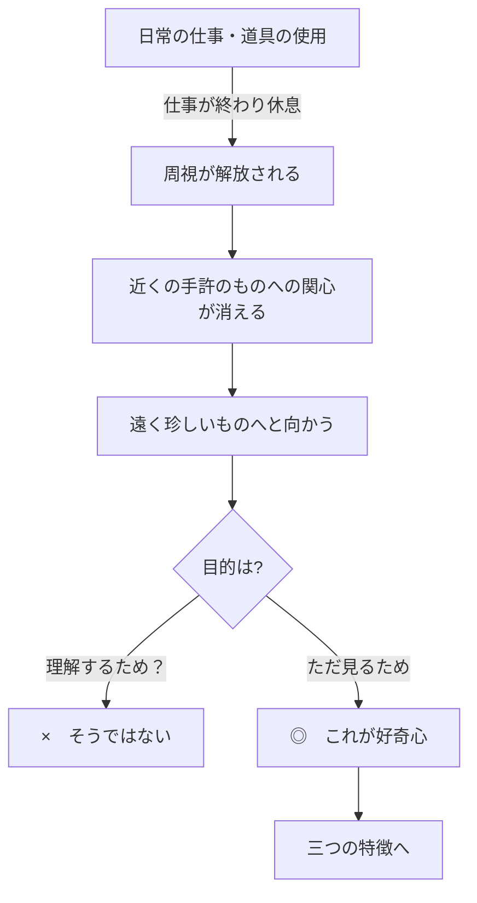

## 「§36」は何だと言っているのか

*ハイデガー『存在と時間』第36節*

---

### この節の結論を先に言う

好奇心（Neugier）とは、「何かを深く理解したいから見る」のではなく、「ただ見たいから見る」という存在のあり方である。ハイデガーはこれを認識論的な話としてではなく、**私たちが日常いかに世界に向き合っているか**、という実存の問題として分析する。その結果、好奇心は三つの特徴——①滞留の欠如、②散漫、③滞在なき性——をもつ日常の存在様式であり、「空談（Gerede）」と組み合わさって、ダザイン（人間存在）を根こそぎにする傾向を持つと結論づけられる。

---

### 第一段階：「見ること」はなぜ特別なのか

ハイデガーはまず、「見ること」が人間の認識と存在において圧倒的な優位を持ってきた、という長い哲学的伝統を指摘する。

アリストテレスの『形而上学』はこう始まる。

> πάντες ἄνθρωποι τοῦ εἰδέναι ὀρέγονται φύσει（すべての人間は、生まれながらにして知ることを欲求する）

ハイデガーはこれを「人間の存在の中には、本質的に見ることへの配慮（Sorge）が宿っている」と読む。さらにパルメニデスの命題——「思惟することと存在することは同一だ」——を引いて、西洋哲学が一貫して「存在は純粋な見ること（直観）の中に開示される」と考えてきたことを示す。

アウグスティヌスもこの「見ることの優位」を面白い角度から確認している。彼は、私たちが「聞く」「嗅ぐ」「触れる」ときでさえ、「見よ、どう鳴っているか」「見よ、どう香るか」と言うと指摘する。

> *Ideoque generalis experientia sensuum concupiscentia … oculorum vocatur*（それゆえ感官一般の経験は「目の欲情」と呼ばれる）

つまり「見る」という言葉は、目に限らず**認識一般の代名詞**になっている。ハイデガーはこの哲学史的背景を踏まえた上で、「見ること」の日常的なゆがんだ形として好奇心を分析する準備をする。

---

### 第二段階：「好奇心」が生まれる仕組み

ハイデガーの議論の出発点は、私たちの日常的な在り方——道具を使い、仕事をこなし、周りの世界を「役立つかどうか」という目で眺める生活——である。この日常の在り方を支えているのが、**周視（Umsicht）**：目的に沿って周囲を見回す能力だ。

ところが、仕事が一段落して「休息」の状態に入ると、周視は道具の世界から解き放たれる。何かを成し遂げるための見ることから自由になった周視は、どこへ向かうか。

> 解放された周視は、最も身近に手許にあるものから離れて、遠く異なった世界へと向かう傾向をもつ。

つまり「暇になった目」は、近くの日常的なものではなく、遠く珍しいものへ向かう。しかしそれは理解するためではない。

> ただ、遠いものをその外観において自らに手元へもたらすためにすぎない。

これが好奇心の根っこである。「外観だけ取り込む」——理解は伴わない。

---

### 第三段階：好奇心の三つの本質的特徴

ハイデガーは好奇心を三つの特徴で分析する。

| 特徴 | 言葉 | 意味 |
|------|------|------|
| ① | **滞留の欠如**（Unverweilen） | 見たものに留まらず、すぐ次の新しいものへ飛び移る |
| ② | **散漫**（Zerstreuung） | 常に新しい刺激を求めて注意が拡散し続ける |
| ③ | **滞在なき性**（Aufenthaltslosigkeit） | 「どこにでもいて、どこにもいない」という根なし草の状態 |

それぞれの関係はこうだ。まず、好奇心は「見ること自体」を目的とするので、見たとたんに満足せず次へ向かう（①）。その「次へ次へ」が連鎖することで注意が拡散する（②）。その結果、ダザインはどこかに腰を落ち着けて存在することができなくなる（③）。

ハイデガーはとりわけ、好奇心が**タウマゼイン（驚嘆）とは無縁**だと強調する。

> 好奇心は、存在者の驚嘆すべき観照、すなわちタウマゼイン（θαυμάζειν）とは何のかかわりもなく……ある知を気遣うが、それはただ知ったということのためにすぎない。

アリストテレスは哲学の出発点に「驚嘆（タウマゼイン）」を置いた。驚いて、分からないまま立ちすくみ、そこから問いが生まれる——これが本来の知への道だ。好奇心はその逆で、驚きを消費して次に進むだけである。

---

### 第四段階：好奇心と空談の結託

節の最後で、好奇心は**空談（Gerede）**と結びついているとされる。空談とは、言葉の意味をきちんと理解せずに「言われていること」をただ繰り返す日常的な語りのあり方で、第35節で論じられている。

> 空談はまた、好奇心の行く道をも支配し、何を読み、何を見たはずかを指図する。

好奇心が「見ること」の表面を流れ続けるように、空談は「語ること」の表面を流れ続ける。どちらも**「分かった気にさせる」が実際には何も根づかない**という点で同じ構造を持っており、互いを支え合っている。

> この見かけとともに、日常的ダザインの開示性を特徴づける第三の現象が姿を現す。

この「第三の現象」とは**曖昧性（Zweideutigkeit）**であり、次節（§37）の主題となる。

---

### まとめ：この節が言いたいこと

好奇心（Neugier）は単なる「好奇心旺盛な性格」の話ではない。ハイデガーにとってそれは、**日常的なダザインが世界を「外観だけ」でつかまえ、理解も滞留もなく流れ続けるという存在様式**の名前である。

この分析は「知ることの欲求は人間の本質だ」というアリストテレス以来の伝統を否定しているのではなく、その欲求が日常においていかに堕落した形をとるかを明らかにしている。根づかず、留まらず、ただ流れ続ける——それが好奇心であり、「空談」と合わさってダザインを**絶えず根こぎにする**力として働く。
