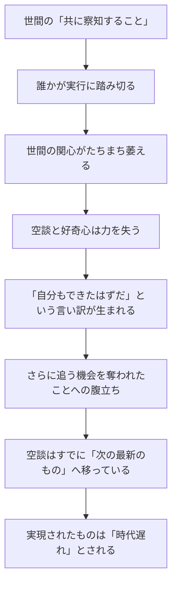

## 「§37」は何だと言っているのか

*ハイデガー『存在と時間』第37節*

---

### この節のひとこと結論

「世間の中で生きていると、何が本当で何がそうでないか、もはや見分けがつかなくなる」——それが**両義性**の正体だ、とハイデガーはここで言っている。そしてこの両義性は、うわさ話や野次馬根性と一体になって、私たちが本気で何かに取り組もうとする力をじわじわと奪ってしまう、と論じる。

---

### 「両義性」とは何か

まず言葉の確認から。**ダザイン**とは「人間存在」のこと——世界の中に投げ込まれて、他者とともに生きている存在者のことだ、とひとまず理解してほしい。

日常生活では、誰もが何にでもアクセスでき、何についても語ることができる。すると、次の問いが原理的に答えられなくなる。

> 何が真正な理解において開示されており、何がそうでないかは、やがて決しがたくなる。

これが「両義性」だ。本物の理解と、ただの見かけ上の理解とが、区別できなくなる状態のことである。

重要なのは、この曖昧さが「情報の不足」から来るのではない、という点だ。むしろ情報はあふれている。誰もが知っており、語っている——だからこそ何が本当かわからなくなるのである。

---

### 両義性はどこに巣くうか

ハイデガーはこう言う。両義性は、モノを使ったり楽しんだりする場面にとどまらず、

> 存在可能としての理解のうちに、ダザインの可能性の企投と先行的提示の様式のうちに、腰を据えてしまっている。

「存在可能」とは「自分が何かをできる、こうあれる」という可能性のこと。「企投」とは、未来の自分を先取りして投げかけること——つまり「志す」「目指す」という生の動きだ。

つまり両義性は、私たちの「これからこうしよう」という意欲の水準にまで浸透している。世間では、何かを「察知している」「感じ取っている」というだけで、もうそれを本当にやり遂げたも同然のような雰囲気が成立する。

> 誰もがつねにあらかじめ、他の者たちもまた感知し察知することを、感知し察知してきた。

この「共に察知すること」——風聞でもって何かを追いかけること——こそが、ハイデガーに言わせれば最も執拗な両義性の形だ。なぜなら、それはダザインの可能性を先回りして示しながら、同時にその可能性を内側から窒息させてしまうからだ。

---

### 「実行」が始まると何が起きるか

ここが節の中核をなす逆説だ。誰かが「察知」に終わらせず、本当に実行に踏み切ったとする。するとどうなるか。

実行に移されたとき、本来の行為者はそれ自身の仕事の中に「押し戻される」——つまり沈黙と真正な苦闘の時間の中に入る。その時間は「より速く生きる」世間話の時間よりも「本質的に遅い」。だから世間はとっくに次の話題へ乗り移っており、せっかく実現されたものは「時機を逸した」ものとして扱われてしまう。

> 真正に新しく創り出されたものが公共の前に現れ出るまさにその際に、すでに時代遅れとなるよう仕向ける。

これは現代のSNS的状況にも通じる鋭い指摘だ。「語ること」「予感すること」が「すること」よりも先行し、価値をもってしまう——それが両義性の働きである。

---

### 他者関係にまで及ぶ両義性

両義性は自分自身への関係だけでなく、他者との関係をも染め上げる。

| 表向きの姿 | 実際に起きていること |
|---|---|
| 互いへの関心・気遣い | 相互監視・ひそかな盗聴 |
| 協力・共感 | 互いへの対抗・競争 |
| 仲間としての連帯 | 「互いのためという仮面の下での対立」 |

> 根源的なともにあることのあいだに、さしあたりまず空談が割り込んでくる。

私たちは「生の他者」と出会う前に、「その人についての噂・評判」を通じてその人と出会う。他者はまず、世間から「そこに」いるのだ。

---

### 両義性は誰かの悪意ではない

重要な留保がここにある。ハイデガーは、この両義性を「嘘をつこうとした人がいるから生じる」とは言わない。

> 両義性がそもそも偽装と歪曲への明示的な意図から生じるのでは決してなく、個々のダザインによって初めて呼び起こされるのでもない。

両義性は、世界の中に投げ込まれて他者とともに生きるという、その構造そのものの中にすでに潜んでいる。誰が悪いのでもなく、「世間の中で生きること」自体の在り方として生まれるものだ——だからこそやっかいである。

そしてハイデガーは付け加える。「この分析が正しいかどうかを、世間の人々の同意で証明しようとするなら、それこそが誤解だ」と。なぜなら、当の世間こそが両義性によって覆われているからだ。

---

### 節のまとめ：三つの現象の連関へ

この節は、第35節の「空談」、第36節の「好奇心」に続く第三の現象として「両義性」を扱う。そして節の末尾でハイデガーは、この三つが「バラバラな特徴の列挙ではなく、存在論的に一つの連関をなす」と予告する。

| 現象 | 何を失わせるか |
|---|---|
| 空談 | 言葉の根拠と深さ |
| 好奇心 | 真の留まりと理解 |
| 両義性 | 本物と偽物の区別そのもの |

次節以降では、これら三つをまとめて「頽落（たいらく）」という概念のもとに捉えなおすことになる。§37 はその直前の「踊り場」であり、「世間の中で生きることの歪みをすべて出そろわせた」場所だと言えるだろう。
