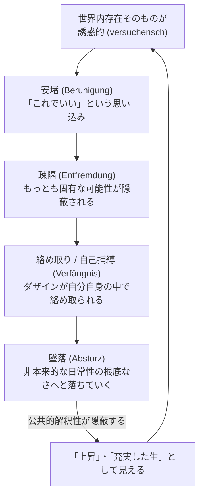

## 「§38」は何だと言っているのか

*ハイデガー『存在と時間』第38節*

---

### この節で言いたいこと——一言で

「頽落（Verfall）」は人間の「堕落」でも道徳的な欠陥でもない。それはダザイン（＝私たちひとりひとりの「ここにいる存在」）が**世界の中に生きているという、まさにその事実に伴う根本的な構造**だ——というのがこの節の核心である。

ここまで第五章（第35〜37節）で「おしゃべり・好奇・曖昧性」を分析してきたが、本節はそれらを束ねて「頽落」という一つの存在構造として提示し、さらにその**動き方（運動性）**を「誘惑→安堵→疎隔→絡め取り→墜落」という連鎖として描く。そして最後に、この分析全体が次章「配慮」の議論への足場を作ることを宣言する。

---

### 「頽落」とは何か——まず誤解を解く

「頽落（Verfall）」という言葉は、日本語でも英語（*falling*）でも「落ちる」「崩れる」という否定的な響きを持つ。ハイデガーはすぐにこの誤解を遮断する。

> 「この表題はいかなる否定的評価をも表現するものではなく、次のことを意味するにすぎない。すなわち、ダザインはさしあたりほとんどの場合、配慮された『世界』のもとに在る、と。」

つまり「頽落」とは、ダザインが**「世界（仕事・道具・他人・流行……）」へと引き寄せられ、そちらに没入して生きている**、というごく当たり前の状態を指す言葉にすぎない。

また「非本来性（Uneigentlichkeit）」（＝自分らしい自分として生きていない状態）という表現についても、次のように注意を促す。

> 「非本来性は、もはや世界内に在らぬことなどをほとんど意味しない。それはまさにひとつの際立った世界内存在を形成するものであり……」

「ひと（das Man）」の中に溶け込んで生きることは、ダザインが「消えてしまう」ことではない。それはダザインが**積極的に選び取っている、もっとも近しい存在様式**なのである。

| よくある誤解 | ハイデガーの主張 |
|---|---|
| 頽落＝道徳的な堕落・罪 | 価値判断ではなく、存在の構造的記述 |
| 非本来性＝自己を失う＝消滅 | 「ひと」の中に没入するという積極的な可能性 |
| より高い「原状態」からの転落 | そのような原状態の事実的根拠も存在論的手がかりも存在しない |
| 文化の進歩によって除去できる欠点 | ダザインの根本構造であり、除去できない |

---

### 頽落はどう「動く」か——四段階の連鎖

頽落は静止した状態ではなく、固有の**動き（運動性）**を持つ。ハイデガーはその動きを四つの性格で描く。

各段階を順に見ておこう。

**① 誘惑**：「ひと」の公共的な解釈性（世間の常識・流行の言葉）は、ダザインに向かって「すべてわかっている、すべてうまくいっている」という確信を与える。世界内存在はそれ自体として誘惑的であり、ダザインはみずから誘惑を準備してしまう。

**② 安堵**：「ひと」の自己確信は「本来的な情態的了解」への要求を消し去り、「すべて最善の秩序のうちにある」という安堵をもたらす。しかしこの安堵は停止ではなく——

**③ 疎隔**：安堵によって駆り立てられた「営み（Betrieb）」の奔走の中で、ダザインはあらゆる文化・解釈を比較・綜合し「すべてを了解した」と思い込む。しかしその過程でこそ、「自分にとって本来何が了解されるべきか」という最も固有な問いが隠蔽されてしまう。

> 「すべてとの、安堵しきったこの『すべてを了解する』自己比較のうちで、ダザインは一つの疎隔へと突き進んでいく。」

**④ 絡め取り（墜落）**：疎隔はダザインを外の存在者に引き渡すのではなく、むしろ非本来性という自分自身の可能性の中に閉じ込める。この動き全体が「墜落（Absturz）」であり、渦を巻いて加速する——これをハイデガーは**旋渦（Wirbel）**と呼ぶ。

> 「この本来性からの絶えざる引きはがし、しかもなお本来性の常なる偽装、これがひとのなかへの引きずりこみと一体となって、頽落の動性を旋渦として特徴づける。」

そしてこの墜落は、公共的解釈性によって「上昇」「充実した生」として偽装されるため、当事者には気づかれない。

---

### 被投性との結びつき——「旋渦」が明かすもう一つのこと

旋渦という動き方は、頽落の構造を描くだけでなく、同時に「被投性（Geworfenheit）」の意味を照らし出す。

**被投性**とは、ダザインがすでに「ここに投げ込まれている（thrown）」という事実——選ばずして生まれ、特定の時代・文化・状況の中に投げ込まれている——を指す。ハイデガーはこれを「完結した事実（済んだこと）」とは見ない。

> 「ダザインは、それがあるものとしてある限り、投擲のなかに留まり、ひとの非本来性のなかへと旋渦状に巻きこまれている。」

つまり被投性は過去の出来事ではなく、今この瞬間にもダザインを旋渦へと巻き込み続けている**現在進行形の力**なのである。

---

### 「頽落」は実存論性（Existenzialität）を否定しない

ここで一つの疑問が生じる。ダザインは「自分の存在しうること（Seinkönnen）が問題となっている存在者」だと定義されていたはずだ。しかし頽落の中でダザインは「ひと」に埋没し、自分を見失っている。これは矛盾ではないか？

ハイデガーの答えはこうだ。

> 「頽落においては、非本来性の様式においてではあれ、世界内存在しうること以外のいかなるものも問題とはなっていない。ダザインが頽落しうるのは、ただ了解的・情態的な世界内存在がダザインにとって問題となっているがゆえにすぎない。」

言い換えると：「頽落できる」ということ自体が、ダザインが世界内存在として存在しているという証拠に他ならない。頽落は実存論性の反証ではなく、**むしろその最も根元的な現われ**なのである。

---

### 「堕落（神学的意味）」との区別——存在論は信仰論の上位にある

ハイデガーは最後に、自分の言う「頽落」を神学的な「原罪・堕落（Fall）」と混同しないよう明確に線引きする。

> 「人間が『罪の中に溺れている』のか……これらのことは存在的には決定されない。」

「存在的（ontisch）」とは「事実としてどうか」という話のレベルを指す。ハイデガーの分析は「存在論的（ontologisch）」——つまり「そもそもどういう構造においてそのような問いが可能か」というレベルにある。信仰や世界観がダザインについて語るとき、それはこの存在論的な構造の上に乗っかっている。概念的に厳密に語るなら、その構造を先に明示しなければならない。

---

### 第五章のまとめと次章への橋渡し

本節は同時に第五章全体の締めくくりとして機能する。

| 第五章で分析したもの | 対応する日常的様式 |
|---|---|
| 情態性（気分・感情の構造） | — |
| 了解（可能性への先駆的把握） | — |
| 語り（言葉の根本構造） | — |
| おしゃべり（Gerede） | 了解の日常的様式 |
| 好奇（Neugier） | 情態性の日常的様式 |
| 曖昧性（Zweideutigkeit） | 語りの日常的様式 |
| **頽落（Verfallen）** | **上記すべての動的統一** |

> 「この分析によって、ダザインの実存論的構成の全体が主要な輪郭において露わにされ、ダザインの存在を配慮として『総括的に』解釈するための現象的地盤が獲得された。」

第五章で積み上げた分析は、ここで一つの「地盤」となり、次章「**配慮（Sorge）としてのダザインの存在**」へと向かう。

---

### まとめ——§38で起きていること

1. **「頽落」を定義する**：道徳的評価ではなく、ダザインが「世界・ひと」に没入して生きるという根本的な存在様式。
2. **誤解を四方向から排除する**：否定的評価でもなく、原状態からの堕落でもなく、文化的欠陥でもなく、実存論性の否定でもない。
3. **運動性を描く**：誘惑→安堵→疎隔→絡め取り→墜落→旋渦、という自己強化する連鎖構造。
4. **被投性を照らし出す**：旋渦は被投性の「現在進行形の力」を現象として見えるようにする。
5. **神学と存在論を区別する**：「原罪・堕落」は存在的な問いであり、存在論的な「頽落」はその問いが立てられる構造的条件に属する。
6. **次章への橋を架ける**：この地盤の上に「配慮」論が構築される。
