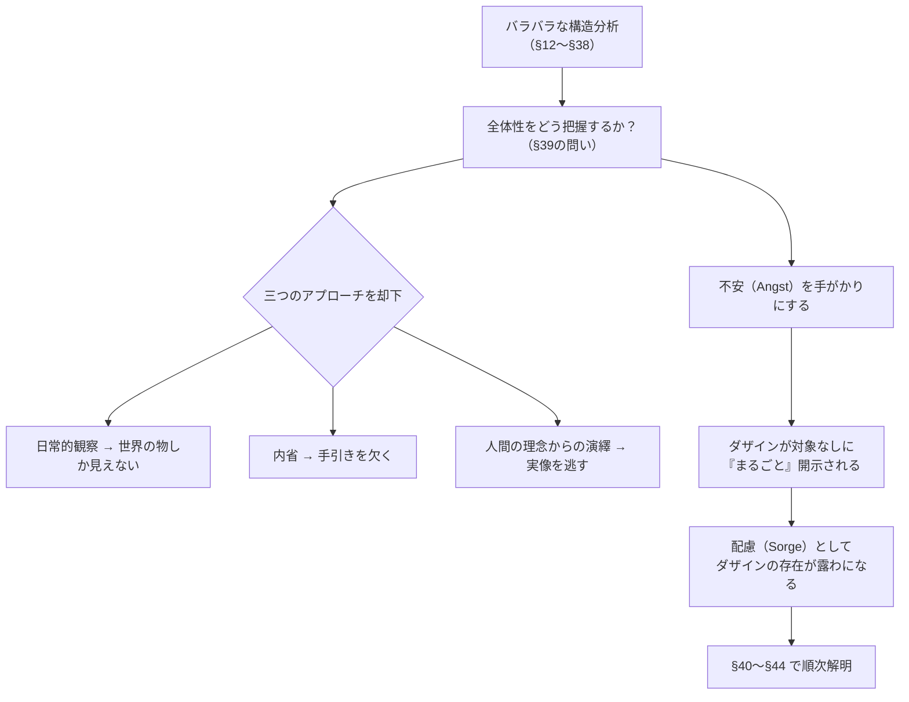

## 「§39」は何だと言っているのか

*ハイデガー『存在と時間』第39節*

---

### この節の結論を一言で言うと

「ダザインという存在者の全体像を一挙につかむには、**不安（Angst）**という気分（情態性）を手がかりにするしかない。そしてその全体像こそが**配慮（Sorge）**として現れる」——これが§39の核心にある宣言である。

この節は、第一篇の前半（§12〜§38）でばらばらに積み上げてきた分析を「一つの統一された全体像」へとまとめる**橋渡しの役割**を果たしており、続く§40〜§44の課題を見通す「ロードマップ節」でもある。

---

### まず「問題の立て方」を整理する

§39の冒頭は、こんな問いかけから始まる。

> ダザインの日常性のこの構造的全体を、その全体性において把握することは果たして可能であろうか。

ここで出てくる**ダザイン**とは「私たち人間のあり方そのもの」を指すハイデガーの用語である。私たちはいつも「世界の中に投げ込まれ、他者と共にいて、何かを気にしながら生きている」——その複合的な存在構造が、これまでの章で順番に解明されてきた。

問題は、その構造をバラバラに知っているだけでは不十分だ、ということだ。木の部品を全部知っていても「森」は見えない、というのに似ている。ハイデガーが求めているのは、森を一望できる**高台**に当たるものである。

---

### 「ただ積み上げれば全体になる」という考えを否定する

ハイデガーは、構造全体を把握する方法として「要素を足し算する」やり方を明確に退ける。

> 構造全体の全体性は、要素を組み合わせることによっては現象的に到達できない。

なぜか。全体は部品の総和ではなく、部品どうしを**根底でつなぎ合わせている何か**によって成り立っているからである。その「根底」を直接照らし出すような出来事・経験が必要だ、とハイデガーは言う。

同時に、次の三つのアプローチも却下される。

| 却下されるアプローチ | 却下される理由 |
|---|---|
| 日常的な「周囲世界」を見渡すこと | それはつねに世界の中の「物や道具」に向いており、ダザイン自身を映し出さない |
| 内省（体験の内的観察） | 存在論的な手引きを欠いており、何を見ているかが分からない |
| 「人間とはこういうものだ」という理念からの演繹 | ダザインを概念の型に押し込めるだけで、実際のあり方を取り逃す |

---

### では「何」を手がかりにするのか——不安の登場

ハイデガーが代わりに提案するのが、**不安（Angst）**という気分（情態性）である。

> このような方法的要求を満たす情態性として、不安（Angst）の現象が分析の基礎に据えられる。

なぜ不安なのか。ハイデガーの論理は次のようなものだ。私たちは気分によって「世界の中に置かれた自分のあり方」を丸ごと感じている。恐れや喜びも気分ではあるが、それらは「○○が怖い」「○○が嬉しい」という具合に、特定の対象に向いている。ところが**不安はそうではない**——何かが不安なのではなく、ただ漠然と、しかし圧倒的に不安なのである。その意味で不安は、ダザインを対象なしに「まるごと」照らし出す特別な気分だとされる。

この「まるごと照らし出す」という点が、全体性を把握する手がかりとして要求されていたものにぴったり合致する。

---

### 不安が照らし出すもの——「配慮」の予告

不安によって開示されるダザインの全体的な存在様式、それを**配慮（Sorge）**と呼ぶ、とハイデガーは予告する。「配慮」とは「気にかけること・世話をすること」に近い日常語であるが、ここでは「世界に投げ込まれ、他者とともに、自分の可能性へと向かって気をつかいながら存在すること」——そういうダザインの根本的なあり方全体を指す術語として使われる。

ただし、配慮は「意志」「欲望」「傾向」「衝動」とは違う、とも断言される。後者はむしろ配慮によって成り立っているのであり、配慮はそれらを足し合わせた先にあるのではない。

---

### 「常識」への先回りした応答

ハイデガーはここで、読者が感じるであろう違和感を自分で予想して答えている。

> 常識が存在論的に認識されたものを、それが存在的にのみ知っているものを顧みて異様に感じるとしても、驚くにはあたらない。

「配慮」という概念で人間のあり方を説明されても、日常的な感覚からすると「なんか大げさでは？」と思うのは当然だ、とハイデガーは認める。だからこそ、この解釈には**前存在論的な証示**——つまり「哲学が始まる前から、人間は自分のことをそう理解していた」という証拠——が必要だと言う。それが§42で扱われるローマの「クラ（cura）」神話の参照へとつながる。

---

### この節が予告する残りの課題

§39はロードマップとして、以下の順番で分析が進むことを宣言して終わる。

| 節 | 主題 |
|---|---|
| §40 | **不安**——ダザインを丸ごと開示する根本的な気分 |
| §41 | **配慮**——ダザインの存在そのものとしての実存論的解明 |
| §42 | 「クラ神話」による**前存在論的な証示** |
| §43 | ダザイン・世界性・**実在性**の連関 |
| §44 | ダザイン・開示性・**真理**の連関 |

---

### まとめ——§39が果たしている役割

§39は「新しい内容を論じる節」というより、**問いの立て直しと方針決定の節**である。前半の分析がバラバラに見えてきたところで、「全体を一挙につかむには不安という気分が鍵だ」「そこに配慮という全体構造が現れる」「そのことはローマの神話すら先取りしていた」——この三点を予告することで、第一篇の残り（§40〜§44）が何のために存在するかを一望させてくれる。言わば「地図を渡す節」である。
