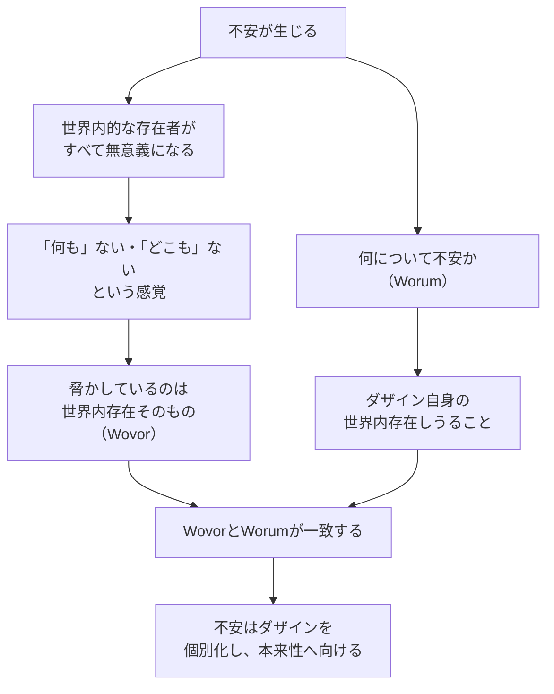

## 「§40」は何だと言っているのか

*ハイデガー『存在と時間』第40節*

---

### この節が言いたいこと——一行で

**「不安」という気分は、私たちの存在の構造全体を丸ごとむき出しにする、特別な情態性（気分のありよう）である。**

ハイデガーはこの節で、恐れ・退落・世界内存在といった前節までの議論の糸を引き寄せ、「不安」という現象が何をどのように開示するかを段階的に示す。最終的に、不安こそが「ダザインの構造的全体をつかむ」ための方法論的な鍵になることを主張する。

---

### 準備——なぜ「退落」の分析から始めるのか

ハイデガーはまず、前節までで示した**退落（Verfallen）**の現象を足がかりにする。

> ひとのうちへ、および配慮された「世界」のもとへの没入は、固有な自己でありうることとしてのダザイン自身からのダザインの逃走のようなものを明るみに出す。

- **ダザイン**（Dasein）とは、ここでは「私たち人間の存在のしかた」を指す哲学用語である。
- **退落**とは、人々の間に埋もれ、日常の「空気」に乗っかって自分を見失っていく動きのことだ。

一見するとこの「逃走」は、ダザインが自分自身の前に現れない現象だから、分析の出発点として役に立たないように見える。しかしハイデガーはそこに反転を見出す。

> 逃走の前方にあるものにおいて、ダザインはまさに「背後から」ダザインに迫ってくるのである。

つまり、「〇〇から逃げている」という事実そのものが、「何かが迫っている」ことを示している。だから、逃走の向こう側に視線を向けることで、何が脅かしているのかを間接的につかむことができる。

---

### 不安と恐れ——二つは似ているが決定的に違う

ここでハイデガーは「恐れ」との比較を通じて「不安」を浮き彫りにする。

| 比較軸 | 恐れ（Furcht） | 不安（Angst） |
|---|---|---|
| 何が脅かすか | 世界内的な特定の存在者（蛇、病気など） | 無規定——「何も」ない |
| どこから来るか | 特定の方向・場所から近づいてくる | どこにもない、しかし「すでにそこにある」 |
| 「なんだったのか」 | 対象を名指せる | 「実際には何でもなかった」と言うしかない |
| 根拠関係 | 不安から生まれる | 恐れを成立させる根源 |

恐れは「これが怖い」と対象を持つ。ところが不安には対象がない。

> 不安の前にあるものは、いかなる世界内的な存在者でもない。……世界内的に開示された連関全体は、それ自体として総じて無縁となる。それは内側から崩れ落ちる。世界は、完全な無意義性という性格をもつ。

いつも「これをすれば意味がある」「あの人に会いに行こう」と私たちを引っ張っていた世界の意味の網の目が、すっぽり抜け落ちる感覚——それが不安である。

---

### 不安は「世界内存在そのもの」を脅かす

なぜ意味の網の目が崩れるのか。ハイデガーの答えは鋭い。

> 不安の前にあるものは、世界内存在そのものである。

**世界内存在**（In-der-Welt-sein）とは「世界の中に住まうように存在している」という、ダザインの根本構造だ。不安が脅かすのは「これ」という特定の何かではなく、私たちが世界に足をつけて生きているそのありかた全体である。

そして同時に、不安は「何について不安がるのか」という問いに対してもこう答える。

> 不安が気遣って不安にするものは、ダザインの特定の存在様式や可能性ではない。……不安が不安にするものは、世界内存在そのものである。

「何に対して不安か」（Wovor）も「何について不安か」（Worum）も、ともに「世界内存在そのもの」に帰着する。これがこの節の核心的な構造だ。

---

### 不安は「家にいないこと」を暴く

ハイデガーはここで「不気味さ（Unheimlichkeit）」という日常語に着目する。日本語でも「不気味」という言葉には「なんとなく居心地が悪い」という肌感覚がある。ドイツ語の Unheimlich は文字通り「家（Heim）にいない（un-）」ことを意味する。

> 不安はダザインを「世界」への頽落的な埋没から引き戻す。日常的な親しさは内側から崩れ落ちる。ダザインは個別化される、しかし世界内存在として。内存在は「家にいないこと」という実存論的「様式」へと入る。

普段、私たちは「みんな」の空気に包まれ、安心して「我が家感」の中にいる。不安はその安心を剥ぎ取り、「実はずっと家にいたわけではなかった」ことを突きつける。

そして退落（日常への埋没）は、この「家にいなさ」から逃げるための逃走だったとわかる。

> 公共性という「我が家」への頽落的逃走は、「我が家でなきこと」、すなわち不気味さからの逃走である。

つまり構造はこうだ——

> 「不気味さ（＝家にいなさ）」が根源 → そこから逃げるために日常へ埋没（退落）→ 不安がその逃走を引き戻す

「家にいなさ」の方がより根源的な現象であり、「家にいる安心感」はその一時的な変様にすぎない、とハイデガーは言う。

---

### 不安の「個別化」機能——なぜ方法論的に重要か

不安はもうひとつの重要な働きをする。それが**個別化**だ。

> 不安はダザインを個別化し、かくして「ソルス・イプセ（solus ipse）」としてのダザインを開示する。

「ソルス・イプセ」はラテン語で「まさにそれだけが独り」の意。不安の中では「みんな」の声も日常の役割も消え去り、「この私」だけが残る。しかしこれは殻に閉じこもる独我論（自分だけの世界への閉鎖）ではない。

> この実存論的「独我論」は、孤立した主観的事物を……無害な空虚の中へ移し置くどころか、まさに極端な意味においてダザインをその世界の前に——世界として——、したがってダザイン自身を世界内存在として自己自身の前へと連れ出すのである。

「この私」が際立つことで、「私が世界の中に投げ込まれて存在している」というありかたそのものがくっきりと前景化する。

---

### なぜ不安は稀なのに分析に使えるのか

ひとつ予想される疑問がある。「不安なんてそうそう感じないのに、なぜそれが根本的なのか」というものだ。ハイデガーはこれを正面から認める。

> 本来的な不安という実存的事実が稀であるのに劣らず稀なのは、この現象をその根本的な実存論的＝存在論的な構成と機能において解釈しようとする試みである。

しかし稀であることは問題でない。むしろ逆だ。

> この現象の稀少性こそは、ダザインがふだんはみんな（das Man）の公共的解釈性によってその本来性を覆い隠されているにもかかわらず、この根本情態性においては根源的な意味で開示されうるということの指標なのである。

普段は日常の「みんな」の声に覆われている構造が、不安という稀な瞬間にだけ素顔を見せる。だからこそ分析の道具として使える。

---

### まとめ——この節の全体像

| 論点 | 内容 |
|---|---|
| 出発点 | 退落（日常への埋没）は「逃走」であり、逃走には「何かから逃げている」という構造がある |
| 恐れとの違い | 恐れは特定対象をもつ。不安は「何も」ない無規定の脅威 |
| 不安のWovor | 世界内的なものではなく、世界内存在そのもの |
| 不安のWorum | ダザイン自身の世界内存在しうること |
| WovorとWorumの一致 | 不安は世界内存在そのものを開示する |
| 不気味さ | 「家にいなさ」が根源であり、日常の「安心」はそこからの逃走にすぎない |
| 個別化 | 不安は「みんな」を剥ぎ取り、「この私」としてのダザインをあらわにする |
| 方法論的意義 | 稀であるがゆえに、日常に隠された構造を最も純粋に開示できる |

不安という気分は、単なる心理現象ではない。それは、私たちが「世界の中で存在している」という事実の全体構造を、まるで突然スポットライトが当たるように照らし出す——ハイデガーはそのことをこの節全体を通じて論証している。
