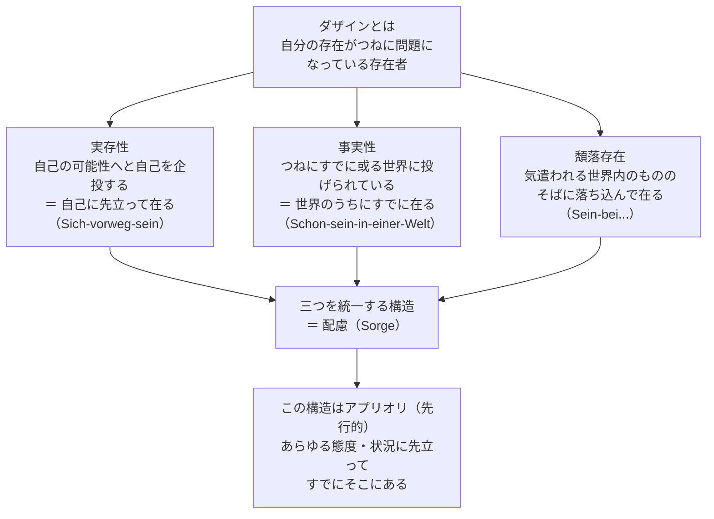

## 「§41」は何だと言っているのか

*ハイデガー『存在と時間』第41節*

---

### この節の結論を一行で言うと

ダザイン（人間の「ここにある存在」のこと）の存在全体は、**配慮（Sorge）** という一語で統一的に把握できる。配慮とは「自己に先立ちながら、すでに世界のうちに在り、世界内の存在者のそばに在ること」という三重の構造をもつ根本現象である。

---

### なぜ「配慮」という言葉が必要なのか

前節までの分析で、ダザインには三つの側面があることが明らかになっていた。

| 実存論的規定 | 日常語に近い言い換え | 不安との対応 |
|---|---|---|
| 実存性（Existenzialität） | 「自分の可能性へと向かって在る」こと | 不安の「何のために」 |
| 事実性（Faktizität） | 「すでに世界に投げ込まれて在る」こと | 不安の「前での何」 |
| 頽落存在（Verfallensein） | 「日常の世界に落ち込んで在る」こと | 不安が「情態性」として露わにするもの |

ハイデガーが問うのは、これら三つをバラバラの「部品」として並べるのではなく、**「これらを一つに貫く構造があるのではないか」** ということだ。その答えが「配慮」である。

> 「ダザインの存在論的な構造全体の形式的・実存論的な全体性は、以下の構造において把握されなければならない——ダザインの存在とは、（世界）のなかにすでに在ることにおいて己に先立って在ること＝（世界内で出会われる存在者の）もとへの在ること……を意味する。この存在が、配慮（Sorge）という表題の意味を充たすものである」

---

### 配慮の三層構造：論証の流れを追う



#### 第一層：「自己に先立って在る」とはどういうことか

ダザインは、自分の存在を常に「これからどうあるか」という問いとして抱えている。これは「まだ決まっていない可能性へと向かって在る」ということだ。しかしこれは「世界から切り離された孤独な主観」の話ではない。可能性へ向かう存在は、つねに世界内存在として行われる。

> 「『……が問題となっている』という本質的な存在構造を、われわれはダザインの自己先駆存在（Sich-vorweg-sein）として把握する」

#### 第二層：「すでに世界のうちに在る」との連結

自己へ先立って在ることは、真空の中では起きない。ダザインはつねにすでに**ある特定の世界に投げ込まれて**おり、そこから可能性を汲み取る。世界の「意義連関」（物事が互いに「～のために」という網の目でつながっている構造）は、ダザインの「自己先駆存在」と根源的につながっている。

> 「己に先立って在ることは、より十全に把握するならば次のことを意味する——或る世界のなかにすでに在ることにおいて己に先立って在ること」

#### 第三層：「世界内の存在者のそばへの頽落的な在り方」

さらに、事実的なダザインはたいていの場合、日々の気遣いの対象——道具、仕事、他者——の中に「落ち込んで」いる。この頽落は、故郷喪失性（自分が本来どこにも「収まりきらない」という不安）からの逃走として機能している。この逃走もまた配慮の一部であり、構造を壊すものではない。

---

### 「配慮」は「気遣い」や「心配り」とは違う

ここは誤解を防ぐために重要な点だ。

> 「この語は純粋に存在論的・実存論的な意味で用いられている。気遣い（Besorgnis）ないし無頓着（Sorglosigkeit）といった存在的に意図された存在傾向は、この意味から排除されたままである」

「配慮」は「心配すること」や「何かを気にかけること」という日常的な意味ではない。それは、ダザインが**存在している限り必ずそうである**という、存在そのものの構造を指している。

同様に、配慮は「理論より実践が大事だ」という主張でもない。

> 「目の前にある存在者をただ直観的に規定することも、『政治的行動』や休息のうちで楽しみにふけることと同様に、配慮の性格を帯びている」

どんな態度も、配慮という地盤の上に成り立っている。

---

### 意欲・願望・傾向・衝動はどこへ行くのか

ハイデガーはここで、心理学的に人間を語るときによく使われる「意欲」「願望」「傾向」「衝動」といった概念を一つ一つ取り上げ、それらを配慮の**変様（ヴァリエーション）**として位置づける。

| 概念 | 配慮構造のどこが前面に出るか | 特徴 |
|---|---|---|
| 意欲（Wollen） | 自己先駆＋世界への了解 | 可能性を把握して動く、配慮の透明な形 |
| 願望（Wünschen） | 自己先駆が優位・現実性に盲目 | 充足の見込みのない可能性を追いかける |
| 傾向（Hang） | 「すでに……のそばに在る」が優位 | 世界に「引きずられて」動かされる |
| 衝動（Drang） | 内側から「……へと向かう」が優位 | 他の可能性を排除して突き進む |

これらはどれも「配慮の外にある」のではなく、配慮の三重構造のどの部分が際立って現れるかの違いにすぎない。

> 「ダザインは……いかなるときも、『単なる衝動』であるのではない……むしろダザインは、充全な世界内存在の変様として、つねにすでに配慮なのである」

---

### 配慮は「理論」でも「古い発見」でもない

節の最後でハイデガーは二つの点を強調して締める。

**①配慮は「単純」ではなく、さらなる問いへの入り口である。**
配慮の三重構造は統一されているが、その統一を「もっと根源的な何か」が支えているはずだ。この問いは第41節ではまだ答えられない。これは後続の節（時間性の分析）へと続く布石である。

**②配慮は「作り話」ではなく、人々がずっと存在的に知っていたことの概念化である。**

> 「ダザインの存在を配慮として解明することは、ダザインを作為的な理念のもとに押し込めるのではなく、存在的・実存的にすでに開示されているものを、実存論的に概念へともたらすのである」

哲学的に「新しく聞こえる」配慮の概念は、実は人間が昔から生き方の中で感じ取っていたことを、初めて概念として明示したものにすぎない。（次節ではその証拠として古代ローマの寓話が引用される。）

---

### まとめ：第41節で起きていること

```
不安の分析（§40）
        ↓
「不安が一度に示すもの」＝ 実存性・事実性・頽落 という三規定
        ↓
三つは「部品」ではなく「根源的な連関」をもつ
        ↓
その統一を表す名前 ＝ 配慮（Sorge）
        ↓
配慮は「心配する」という日常語ではなく存在構造の名前
        ↓
意欲・願望・傾向・衝動もすべて配慮の変様にすぎない
        ↓
しかし配慮の「統一の根拠」はまだ問われていない → 次の問いへ
```

第41節は、ここまでの長い分析の「集約点」であると同時に、「時間性」へと向かう次の問いへの**踏み台**として置かれている。
