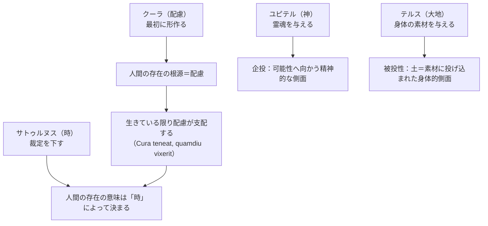
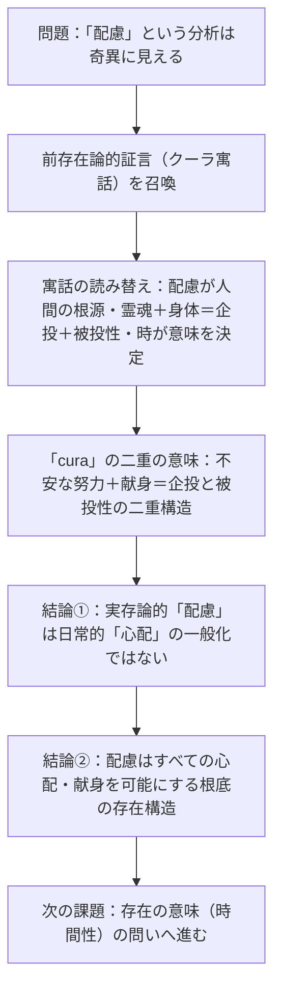

## 「§42」は何だと言っているのか

*ハイデガー『存在と時間』第42節*

---

### この節を一言でいうと

「配慮（Sorge）」というハイデガーの難解な概念は、哲学者が机上で作り上げた空理空論ではない。人間自身がずっと昔から、自分の存在を「配慮」によって語ってきた——その証拠として古代の寓話を引き、それを哲学的な言葉に翻訳してみせる節である。

> 実存論的・存在論的な解釈は、存在的解釈に対してたんに理論的・存在的な一般化にとどまるものではない。

この一文が節の要点を端的に表している。「配慮」は人間の特定の気持ちや状態を指すのではなく、人間が存在している在り方そのものの構造を指している、という主張だ。

---

### 用語の地図

この節を読むうえで避けられない用語を、最初に整理する。

| ハイデガーの言葉 | 平たくいうと |
|---|---|
| **ダザイン（Dasein）** | 「人間」とほぼ同義だが、「世界のなかに投げ込まれ、そこで生きている存在者」という意味合いを込めた言い方 |
| **配慮（Sorge）** | 不安げに何かを気にかけ、かつ何かに献身する、という人間の存在全体の在り方。日常的な「心配」より広い概念 |
| **前存在論的（vor-ontologisch）** | 哲学的に理論化する前の、生きた経験のレベルの、という意味 |
| **実存論的（existenzial）** | 人間の存在構造を分析する哲学的なレベルの、という意味 |
| **被投性（Geworfenheit）** | 自分では選ばずに特定の状況・世界に「投げ込まれている」こと |
| **企投（Entwurf）** | 自分の可能性へと向かって自分を投げかけていること。可能性への開けのこと |

---

### 段階①：なぜ「証人」を呼んでくるのか

ハイデガーはこれまでの節で、人間（ダザイン）の存在を「配慮」として解析してきた。ところがこの分析は、伝統的な人間理解（「理性的動物」など）とはかけ離れており、読者には「奇異なもの」に映りかねない。

そこで彼は、哲学的な論証とは別の回路を開く。

> 前存在論的な一つの証言を引用することにしたい。その証言においてダザインは自己について「根源的に」語っている——理論的な解釈によって規定されることなく。

「理論以前の場所で、人間はすでに自分の存在を「配慮」として語っていた」と示すことで、自分の哲学的分析が現実の地盤をもつと訴えるのだ。

---

### 段階②：クーラ寓話の内容

引用される証言はローマ時代に伝わる寓話（ヒュギーヌス寓話集第220番）である。

**あらすじ**

川を渡っていた女神「クーラ（Cura ＝配慮）」は、川岸の粘土を見つけて人の形に作った。ユピテル（神）が通りかかったので、その形に霊魂を吹き込んでくれるよう頼むと、快く承諾した。

ところが被造物の「名前」をめぐって争いが起きた。

- **クーラ**：自分が形作ったのだから、自分の名をつけたい
- **ユピテル**：霊魂を与えたのだから、自分の名をつけたい
- **テルス（大地）**：材料の土を提供したのだから、自分の名をつけたい

仲裁に立ったサトゥルヌス（時の神）の裁定はこうだった。

> 「されど「配慮（Cura）」が最初にこれを形作りたるゆえ、その者が生きる限り「配慮」がこれを保持すべし。……この者は「フムス（土）」より作られたるがゆえに「ホモ（人間）」と呼ばるべし。」

---

### 段階③：寓話を哲学に翻訳する

ハイデガーはこの寓話を、ただの逸話として引くのではない。各登場人物を実存論的な構造へと読み替える。

| 寓話の要素 | ハイデガーが読み取るもの |
|---|---|
| クーラが「最初に」形作った | 配慮は人間の存在の根源である |
| 生きている限りクーラが保持する | 人間は世界に存在する限り、配慮から逃れられない |
| 霊魂（ユピテル）＋身体（テルス） | 企投（精神的な前へ向かう動き）＋被投性（すでに素材に投げ込まれている事実） |
| サトゥルヌス（時）が裁定する | 人間の存在の意味は「時間性」によって決まる |
| 名は「フムス」から「ホモ」 | 人間は存在の根拠ではなく、材料（何から）で名付けられる |

---

### 段階④：「配慮」の二重の意味

ハイデガーはさらに、ラテン語「cura」が持つ二重の意味に着目する。

> ブルダッハは「cura」という術語の二重の意味に注意を促している。それによれば、この語は「不安にみちた努力」を意味するだけでなく、「心がけ（Sorgfalt）」や「献身（Hingabe）」をも意味する。

そしてセネカの言葉を引く。

> 「神においては、その本性がその善を完成させ、人間においては、配慮（cura）がそれを完成させる。」

「不安をもって何かを気にする」という後ろ向きの意味と、「何かに打ち込んで自分を完成させる」という前向きの意味——この二重性は偶然ではない。ハイデガーによれば、それは人間が同時に二つの方向を生きていることを映している。

- **前向きの方向**（企投）：自分の可能性へと向かい、何者かになろうとすること
- **後ろ向きの方向**（被投性）：すでに投げ込まれた世界に引き渡されていること

「配慮」という一語の中に、この二方向の構造が「根源的に二重」なものとして刻み込まれている、というわけだ。

---

### 段階⑤：「前存在論的証言」の意義と限界

ハイデガーは寓話の証明力について正直に留保する。

> その証明力は確かに「単なる歴史的なもの」にすぎない。

つまり「古い話に書いてあるから正しい」と言いたいのではない。むしろ次のロジックだ。

1. 人間（ダザイン）の存在は**歴史的**である。
2. 歴史の中から生まれ、理論以前に語られた言葉は、人間の存在の在り方を「生の内側から」証言している。
3. 哲学的分析がそれと一致するなら、その分析は「作り話（単なる構築）」ではなく、現実の地盤をもつと言える。

したがって寓話は「哲学の証明」ではなく、「哲学的分析が現実に根ざしていることの傍証」として機能する。

---

### 段階⑥：実存論的「配慮」は日常的な「心配」の一般化ではない

ここが節の最も重要な哲学的主張だ。

> この「一般化」はアプリオリに存在論的なものである。それが意味するのは、つねに生起する存在的な諸性質ではなく、いずれの場合にもつねにすでに根底に横たわっている存在態勢である。

平たく言い直すとこうなる。

| 混同されがちな理解 | ハイデガーが主張する正しい理解 |
|---|---|
| 「人間は日常的に何かを心配している、だから配慮が多い」 | 「心配できるのは、そもそも配慮という存在態勢があるからだ」 |
| 配慮＝心理的状態の集まり | 配慮＝それらを可能にする存在構造そのもの |
| 「一般化」によって抽象された概念 | アプリオリ（経験に先立って）根底にある構造 |

人間が「心配する」「献身する」という具体的な経験は、「配慮」という存在構造があってはじめて可能になる——この順序の逆転が、ハイデガーの要点だ。

---

### まとめ：§42 の論証の地図

この節は「外から証拠を集めて哲学を正当化する」というより、「ダザインが自分の存在について前理論的に語ってきた言葉と、存在論的分析とが照応している」ことを示すことで、分析の地盤の確かさを確認する節である。そしてその確認の上に立って、次の問い——人間の存在の意味、すなわち「時間性」——へと歩みを進める準備をするのだ。
