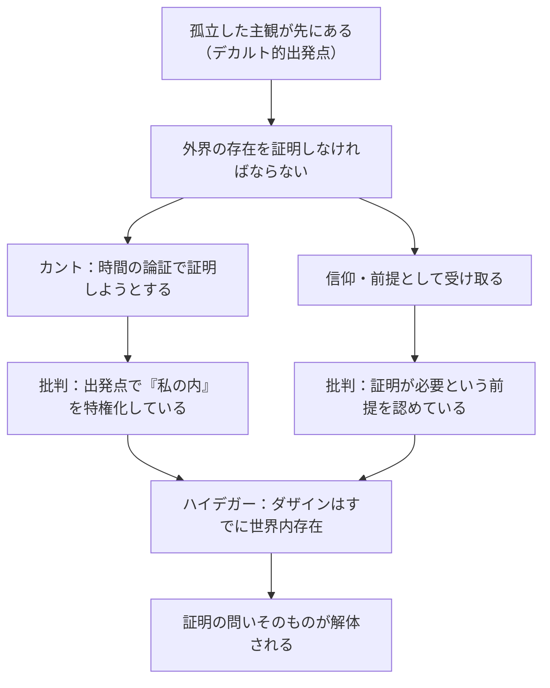

## 「§43」は何だと言っているのか

*ハイデガー『存在と時間』第43節*

---

### この節の結論を一言で

「実在性（もの・世界が実際に存在するという問題）」は、孤立した主観が「外の世界の存在を証明できるか」という認識論の問いとして立ててはいけない。実在性の問題は最初から、**世界のなかにすでに存在しているダザインの存在論**として捉え直されなければならない——これが§43全体の主張である。

---

### 前提：なぜ「実在性」が問題になるのか

ハイデガーはまず、私たちが日常の存在理解においてどんな誤りを犯しているかを整理する。

私たちは世界を理解するとき、周囲の道具や事物——**手許存在性**（道具のように使える存在の仕方）——を飛び越えて、世界を「目の前にただ存在しているもの（現前存在）」の集まりとして把握しがちである。その結果「存在」は「実在性」と同一視され、実在性が存在論の中心に君臨してしまう。

> 「存在は実在性という意味を帯びる。存在の根本的な規定性は実体性となる。」

この実在性偏重は、ダザイン（人間存在）の分析にも影響を及ぼす。ダザインさえも「現前する物体」と同列に捉えられ、他の存在様式（道具的存在、ダザイン的存在）が「欠如した実在性」として否定的に定義されてしまう。§43の任務は、この転倒を正すことである。

---

### 三つの問いを立てる

節は実在性問題を次の三つに分けて順番に論じる。

| 区分 | 問いの内容 | ハイデガーの結論 |
|------|-----------|-----------------|
| a）外界の証明可能性 | 「外の世界が存在することを証明できるか」 | そもそも問いの立て方が間違っている |
| b）存在論的問題としての実在性 | 「実在性とは何か」を存在論として問う | 世界内存在・配慮のうちに根拠がある |
| c）実在性と配慮 | 実在性と「存在理解」はどう関係するか | 存在は存在理解が存在する限りで「与えられる」 |

---

### a）外界の証明——なぜ問いそのものが間違いなのか

ここでハイデガーはカントの「観念論の論駁」を詳しく検討する。カントは「外界が存在することを証明することが哲学のスキャンダルだ」と言い、自分でその証明を試みた。

カントの論証の骨格はこうである。「私の内に変化する表象がある→変化には持続するものが必要→その持続するものは私の外にある」。

ハイデガーはこの論証を丁寧に評価しつつ、根本的な欠陥を指摘する。

> 「哲学の『スキャンダル』は、この証明がこれまでいまだ欠如しているという点にあるのではなく、そのような証明が繰り返し期待され試みられるという点にある。」

なぜ証明の試み自体が間違いなのか。カントは出発点を「私の内」に置いている。つまり「まず孤立した主観がいて、後から外界との橋を渡す」という構図を前提している。しかし**ダザインはそもそも世界のなかにすでに存在している**。「外界があるか」を後から証明する必要などなく、ダザインは最初から世界内存在として存在している。

> 「正しく理解されたダザインは、そのような証明に抵抗する。なぜなら、ダザインはその存在においてつねにすでに、後からの証明が初めて論証して見せようと必要だと考えるところのものだからである。」

「信じることで補う」試み（ディルタイ的な「外界への信仰」）も同様に批判される。信仰を持ち出した瞬間、「原則として証明が必要だ」という前提を認めてしまっているからである。

---

### リアリズムと観念論——どちらも不十分な理由

外界問題をめぐって伝統的に対立してきた二つの立場も、ハイデガーは両方に欠陥を見る。

**リアリズム（実在論）**は「外界は実在的に現前している」と言う点で結果的には正しい。しかしリアリズムは「世界の実在性を証明が必要なものと見なし、かつ証明可能と見なす」。この姿勢自体が、外界を事後的に証明しようとするデカルト的構図から抜け出していない。

**観念論（理念論）**は「存在は存在者によっては説明できない、意識のうちにある」と主張する点で、存在と存在者を混同しないという意味でリアリズムより一歩進んでいる。しかし「意識そのものの存在様式は何か」を問わないまま終わる。意識（res cogitans）の存在を未規定のままにしていては、存在論的に宙に浮いた観念論になってしまう。

> 「存在が『意識のうちに』ある、すなわちダザインのうちで了解されうるからこそ、ダザインは独立性、『それ自体における存在（An-sich）』、そして実在性一般といった存在性格を了解し、概念へともたらすことができる。」

つまりリアリズムも観念論も、**ダザインの実存論的分析が先行しなければ地盤を持てない**、というのがハイデガーの診断である。

---

### b）存在論的問題としての実在性——ディルタイとシェーラーへの応答

ハイデガーはここで、実在性を「抵抗性（Widerständigkeit）」として捉えようとしたディルタイとシェーラーの試みを紹介する。

ディルタイは「実在的なものは衝動と意志において、抵抗として経験される」と論じた。これは実在性を「意識に与えられた表象」ではなく「行為のなかで感じる手ごたえ」として捉える点で、一歩先を行く。

しかしハイデガーはこう反論する。「抵抗にぶつかる」ためには、そもそも何かに**向かっている**（目指している）ことが必要である。その「向かう」構造はすでに、世界の開示性（有意義性の連関全体）を前提にしている。

> 「抵抗経験は、存在論的には世界の開示性を基盤としてのみ可能である。」

抵抗を経験できるのは、世界のなかで配慮（Sorge）という存在様式をもつ存在者だけである。抵抗性は実在性の「一つの」性格を捉えているが、それを基礎に実在性全体を説明しようとすると、世界の開示がすでに前提されていることを見落とすことになる。

---

### c）実在性と配慮——存在理解への依存

節の最後でハイデガーは、実在性と「存在理解」の関係を精密に整理する。

重要な区別がある。「実在的なもの（存在者）がダザインの実存のあいだだけ存在する」と言っているのではない。そうではなく、**「実在性」という存在様式の意味が了解可能となるのは、ダザインが存在理解を持つ限りにおいてだ**、と言っている。

> 「ダザインが存在する限りにおいてのみ、すなわち存在理解の存在的可能性が存在する限りにおいてのみ、存在は『与えられる』。ダザインが実存しないならば、『独立性』も『それ自体において』も『存在』しない。」

これは「ダザインがいなければ石も消える」という素朴な観念論ではない。ダザインがいなければ「存在する」「しない」という問いそのものが成立しない、ということである。存在者の問題ではなく、存在の意味の問題である。

---

### まとめ：§43の論証の流れ

| 段階 | 内容 |
|------|------|
| ① 問題の診断 | 実在性概念が存在論を一面的に支配している |
| ② カント批判 | 外界証明の試みは問いの立て方そのものが誤り |
| ③ 既存の立場の整理 | リアリズムも観念論も実存論的地盤を欠く |
| ④ ディルタイ・シェーラー批判 | 抵抗性による実在性分析も世界の開示を前提している |
| ⑤ 根本的結論 | 実在性は配慮・世界内存在に基礎づけられており、存在理解への依存は存在者の消滅を意味しない |

§43が全体として示すのは、「実在性問題」を哲学の中心に置くこと自体がダザインの頽落（日常的な存在理解への埋没）によって引き起こされた転倒であり、それを正すには**ダザインの実存論的分析論から出発する**しかない、という根本的な方向転換の宣言である。
