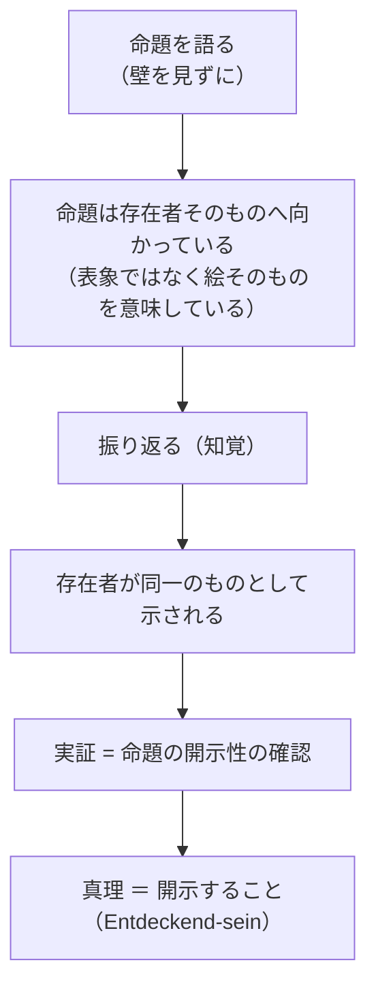
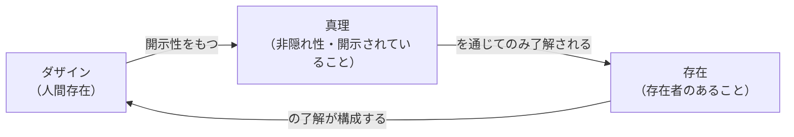

## 「§44」は何だと言っているのか

*ハイデガー『存在と時間』第44節*

---

### この節の結論を先に言う

この節の主張を一言でまとめると、こうなる。

> 真理とは「命題が対象と一致すること」ではない。真理の根っこは、ダザイン（人間存在）が世界を開示すること、すなわち隠れていたものを「現れ」のなかへ取り出すことにある。

ハイデガーはこの結論を三段階で論証する。まず**伝統的真理論を解体し（a）**、次に**より根源的な真理を現象として取り出し（b）**、最後に**「真理はある」とはどういう意味かを問う（c）**。以下、その順に見ていこう。

---

### 導入：哲学は昔から「真理＝存在」と感じていた

節の冒頭でハイデガーは、古代ギリシアにさかのぼる。パルメニデスは「考えることと存在することは同じだ」と言い、アリストテレスは哲学を「真理についての学」と呼んだ。

> ὑπ' αὐτῆς τῆς ἀληθείας ἀναγκαζόμενοι（真理そのものによって強いられて、彼らは探究した）

ハイデガーが注目するのは、ここで「真理」が認識論的な概念（「正しい判断の性質」）ではなく、「事柄そのもの」「おのずから自らを示すもの」と同義で使われている点だ。つまり古代人は、存在と真理が切り離せないと感じていた。この感覚を存在論的に根拠づけることが、本節の課題として設定される。

---

### a）伝統的真理概念とその問題点

#### 「一致」という通説

西洋哲学が長く受け継いできた真理の定義は、**adaequatio intellectus et rei**（知性と事物との一致）だ。カントも「真理の名辞的説明は……認識とその対象との一致である」と前置きなく受け入れている。

しかしハイデガーはここで問う。**「一致」とは具体的に何と何がどのように一致しているのか？**

- 数の 6 と 16-10 の「一致」は「等しさ」だ。これは量という共通の基準で測れる。
- では「知性（intellectus）」と「事物（res）」は、何という点で「一致」するのか？

両者はそもそも存在の種類が違う（心のなかの表象と、外の物）。それなのに「一致する」と言えるのはなぜか。

#### 「判断作用」と「判断内容」に分けても解決しない

伝統的哲学はさらに、判断を「現実的な心的過程（判断する行為）」と「理念的な内容（判断された命題）」に分け、後者が「真理の場所」だと言う。しかしこの分割はむしろ問題を増やす。「現実的なもの」（行為）と「理念的なもの」（内容）の関係は何か？ その関係が「成立する」とはどういう意味か？ 存在論的に解明されないまま問いが二千年間宙に浮いている、とハイデガーは言う。

---

### 認識の「証示」の場面から出発する

問いを解くカギとして、ハイデガーは**「命題が真であることが確かめられる瞬間」**を分析する。

例として使われる場面はこうだ。

> 壁に背を向けた人が「絵が斜めに掛かっている」と言う。振り返って実際に確かめる。

このとき何が起きているか。「表象と物が一致しているかを見ている」のではない。**「命題が指し示す存在者そのもの（絵）が、言われた通りに現れている」ことを確認している**のだ。

> 証示されるのは、命題の開示的存在（Entdeckend-sein）である。

つまり命題が真であるとは、命題が**存在者を開示している（隠れから取り出して見えるようにしている）**ことにほかならない。

---

### b）真理の根源的な現象：「開示性」

#### αλήθεια（アレーテイア）という語

ギリシア語の「真理」= ἀλήθεια は、**a（否定）＋ lēthē（隠れ）**、すなわち**「非隠れ性」**という構造を持つ。ハイデガーはこれを偶然の語源として退けない。ヘラクレイトスの断片でも、ロゴス（言葉・理）を理解しない者たちは「隠れのうちにとどまる」と言われる。

古代人はすでに、真理を「隠れからの取り出し」として前存在論的に感じ取っていた。ハイデガーの真理定義はその発見を明示化したものだ。

#### 真理の三層構造

ハイデガーは真理に重層的な構造を見る。

| 層 | 内容 | 専門語 |
|---|---|---|
| 最も根源的な真理 | ダザインが「現（Da）」として開かれていること＝世界が開示されていること | 開示性（Erschlossenheit） |
| 第一次的な真理 | ダザインが世界内部の存在者を発見すること | 発見しつつあること（Entdeckend-sein） |
| 派生的な真理 | 発見された存在者が「発見されている」こと | 被発見性（Entdecktheit） |
| さらに派生した真理 | 命題が存在者を開示すること | 命題的真理 |

最も根源的なのは**ダザインの開示性そのもの**であり、それが情態性（気分）・了解・話し言葉によって構成されている点は、この節以前の分析（第28〜34節）で示されていた。

#### ダザインは「真理のうち」にも「非真理のうち」にもある

開示性は完全なものではない。ダザインは**頽落（Verfall）**——日常的な「世間（Man）」のうちに沈み込んでいく傾向——を本質的に持つ。そこでは存在者は「ひっそりと歪曲され、仮象のうちに現れる」。

> ダザインは、本質的に頽落するものであるがゆえに、その存在構造に従えば「非真理」のなかにある。

これは道徳的な批判ではない。存在論的な事実だ。だからこそ、

> 真理（開示態）は、存在者からつねにまず奪い取られなければならない。存在者は隠蔽性から引き剥がされる。

真理は「与えられているもの」ではなく、**常に新たに奪い返される略奪物**だ。ギリシア語の「真理」が「非隠れ性」という否定形をとるのは、まさにこの事実を言い表している。

#### 「一致」という伝統的真理はどこから来たか

では、なぜ人は「一致」という誤解に陥るのか。ハイデガーはその派生過程を示す。

1. ダザインが開示したことを「命題（言明）」として語り出す。
2. 命題は「手許的なもの」（道具のように使えるもの）として世界に流通する。
3. 命題と存在者の関係が、**眼前に存在するもの同士の関係（知性 vs. 事物）**として捉え直される。
4. 「開示性」が「二つの現前的なものの一致」という姿に変じてしまう。

> 開示性としての真理は……世界内で眼前的に存在するものどうしの一致としての真理へと変じてしまっている。

「一致」という真理概念は間違いではなく、根源的な真理現象の**二次的な変様**である。

---

### c）「真理がある」とはどういうことか

#### 真理はダザインの存在とともに「ある」

ハイデガーはここで挑発的な主張を展開する。

> ニュートンの法則も、矛盾律も、すべての真理一般も、ダザインが存在するかぎりにおいてのみ真である。

ダザイン以前には「真」でも「偽」でもなかった、ということは、「法則が示す存在者が存在しなかった」ことを意味しない。**「真であること」という事態が成立していなかった**、ということだ。真理とは、存在者が開示されるという出来事であり、開示するダザインなしには成立しない。

#### 「主観的」ではないのか

これは、真理をダザインの「勝手な思い込み」に帰着させることではない。むしろ逆だ。

> 開示すること（Entdecken）はその最も固有な意味からして、言明を「主観的」な恣意から引き離し、開示するダザインを存在者そのものの前へ連れ出す。

真理がダザインに根ざしているのは、ダザインが存在者を「それ自体として」現す力を持つからこそだ。

#### なぜ「真理を前提しなければならない」のか

「真理は存在する」という前提を疑わない理由は何か。ハイデガーの答えはこうだ。

> 「真理」を前提するのはわれわれではなく、むしろ真理こそが……われわれが何かを「前提しうること」を存在論的にそもそも可能ならしめる。

ダザインは「自己に先んじてある」構造を持つ（配慮の構造）。何かを「前提する」という行為そのものが、すでに開示性を必要とする。つまり前提を可能にするのが真理であって、われわれが真理を前提するのではない。

懐疑論者を「論駁」しようとする試みも結局は失敗する。懐疑論者が本気でダザイン（存在すること）を否定するなら、彼はすでにダザインの開示性を自らの存在において使っており、論駁するまでもなく自己矛盾に陥っている、あるいは真の懐疑論者なら最終的に「自殺という絶望のうちでダザインを抹消した」と言うほかない。

---

### 節の末尾：存在・真理・ダザインの等根源性

節はこの命題で締めくくられる。

> 存在は「ある」のは、ただ真理が存在するかぎりにおいてのみである。そして真理は、ダザインが存在するかぎりにおいて、またそのあいだのみ存在する。存在と真理は「等根源的に」「存在する」。

この三者の結びつきを図で示せば、以下のようになる。

そして節全体の論点を整理すると、次のようになる。

| 問い | ハイデガーの答え |
|---|---|
| 真理とは何か | 存在者を隠れから取り出して開示すること（発見すること） |
| 真理の根源的な「場所」はどこか | 判断・命題ではなく、ダザインの開示性 |
| 「一致」という真理観はなぜ生まれたか | 開示性が命題として流通し、眼前的なものの関係に還元された派生的結果 |
| 「真理がある」とはどういう意味か | ダザインが存在するかぎりにおいてのみ成立する出来事 |
| 真理は「主観的」か | 否。開示することこそがダザインを存在者そのものへ拘束する |
| なぜ真理を前提せねばならないか | 真理こそが「前提する」という行為を可能にしているから |

---

### まとめ：この節の位置づけ

§44 はダザイン分析（第一篇）の締めくくりとして、**「これまで何を明らかにしてきたか」を真理という概念によって集約する**役割を持つ。

情態性・了解・話し言葉・頽落・配慮といった、先行する節で登場したすべての概念が、ここで「真理の諸次元」として読み直される。そして最後に、「存在の意味」への問い（第二篇以降のテーマ）を問うためには、真理とダザインの連
