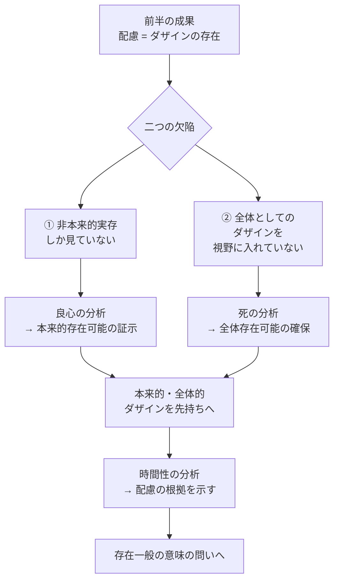

## 「§45」は何だと言っているのか

*ハイデガー『存在と時間』第45節*

---

### この節の結論を一言で言うと

前半（§1〜§44）の分析は「途中までの仕事」だった。ダザイン（人間という存在者）を**本来的に・全体として**つかめていないまま議論を進めてきた。だからこれから、その欠陥を埋めるために「死」「良心」「時間性」を順番に分析していく――それがこの節の宣言である。

---

### これまで何が得られたか

第45節は、まず「前半の成果」を整理するところから始まる。

> 主題とされた存在者の根本的な体制、すなわち世界内存在を、われわれは見出した。その本質的な諸構造は開示性において集中している。この構造全体の全一性は配慮として明らかになった。

ここで使われている言葉を簡単に説明しておこう。

| 用語 | 一言で言うと |
|------|-------------|
| **ダザイン** | 「ここにいる存在」＝人間のこと。つねに「自分の存在が問題になっている」存在者 |
| **世界内存在** | 人間は世界の外から世界を眺める観察者ではなく、はじめから世界の中に投げ込まれている、という構造 |
| **開示性** | ダザインが「世界」と「自分自身」をすでに何らかのかたちで開いて（理解して）いること |
| **配慮（Sorge）** | 世界内存在の構造全体をまとめて指す名前。「気にかけること」「関わること」という含意がある |

つまり前半の収穫は「人間存在の全体的な仕組みは**配慮**という構造で成り立っている」という見取り図だった。

---

### では何が足りなかったのか

ここがこの節の核心部分になる。ハイデガーは三つの問題を重ねて提起する。

**問題①：「非本来的な実存」しか見ていなかった**

> これまでの解釈は、平均的な日常性から出発するにあたり、無差別的あるいは非本来的な実存の分析に限定されていた。

「非本来的」というのは、自分自身の存在を正面から引き受けず、世間の流れに埋もれて生きている状態のことだ。前半の分析はこの「ふだんの自分」だけを相手にしてきた。しかし実存（＝自分の存在を問題にして生きること）には**本来的な実存**もあるはずで、それを取り込まないかぎり分析は片手落ちになる。

**問題②：「全体としてのダザイン」を見ていなかった**

> 日常性とはまさしく、誕生と死との「あいだ」の存在にほかならない。

ダザインは「存在しうること」を本質としているがゆえに、生きているかぎりつねに「まだ何かが未決」な存在者だ。死ぬまで完結しない。だとすれば、ダザインの全体を一望に収める視点がないまま「配慮が構造の全体だ」と言い切るのは、出発点からして怪しい。

> ダザインの根源的な存在論的解釈は——主題となる存在者そのものの存在様式に——挫折せざるをえないのではないかという問いすら生じてくる。

ハイデガーはここで自分の分析の限界をはっきりと認めている。

**問題③：解釈の「先持ち・先見・先把握」が不十分だった**

解釈とはつねに「何かを前提にして行う読み解き」だ（これを解釈学的状況と呼ぶ）。前半の分析は、その出発点の前提として①日常的・非本来的なダザイン、②全体でないダザイン、しか置いていなかった。この二つの欠陥を抱えたまま「配慮がダザインの根源的な存在だ」と言っても、根源性の保証がない。

---

### 欠陥を埋めるために何が必要か

この図が示すように、欠陥①を埋めるのが**良心**の分析、欠陥②を埋めるのが**死**の分析であり、その両方をつなぐ根拠として**時間性**が登場する。

> しかし本来的な存在可能の証示（Bezeugung）を与えるのは良心（Gewissen）である。……この実存的可能性は、その存在意味からして、死への存在による実存的な被規定性へと傾く。

---

### 後半全体の道程

節の末尾でハイデガーは、以降の章立てをそのまま提示する。これは本書の「地図」として機能している。

| 章 | テーマ | 欠陥との対応 |
|----|--------|-------------|
| 第一章 | 死への存在 | 全体性の確保 |
| 第二章 | 良心・決意性 | 本来性の確保 |
| 第三章 | 時間性と配慮 | 配慮の根源的意味 |
| 第四章 | 時間性と日常性 | 前半分析の遡及的検証 |
| 第五章 | 時間性と歴史性 | 歴史・歴史学の根拠 |
| 第六章 | 時間性と内時間性 | 通俗的「時間」の起源解明 |

最終的にハイデガーが目指しているのは「存在一般の意味」という問いに答えること、つまり「なぜ何かが存在するのか・存在とはそもそも何か」を問う地平を開くことだ。しかしそのためにはまず、**存在を理解しているダザイン自身を根源的に解釈**しなければならない。§45はその地固めをする節である。

---

### まとめ：§45の「役割」

§45は新しい主張を積み上げる節ではなく、**折り返し地点の自己点検**の節だ。

> 一つのことが紛れもなく明らかになった。これまでのダザインの実存論的分析は、根源性の要求を提起することができない。

この自己批判がそのまま、後半（§46以降）への踏み台になる。前半の分析は無駄だったのではなく、「土台としては正しいが、まだ根源的ではない」。それを根源的にするために、死・良心・時間性の三段構えの分析が始まる。
