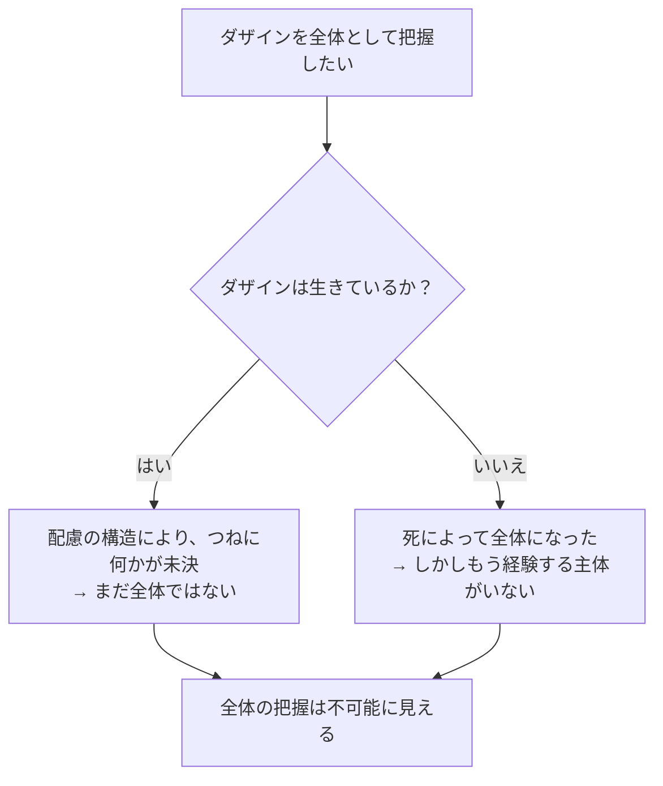

## 「§46」は何だと言っているのか

*ハイデガー『存在と時間』第46節*

---

### この節の結論をひと言で

「ダザインの全体を生きたまま把握するのは不可能に見える――しかしその結論を出す前に、問いを立て直さなければならない。そして以降の節でその問いを正面から扱う。」

これが第46節の核心である。節タイトルが「みかけ上の不可能性」と言っている点が決定的で、ハイデガーは「本当に不可能だ」と結論を下しているわけではない。むしろ、「不可能に見える理由を丁寧に解きほぐし、問いの立て方そのものを問い直す」ための準備の節である。

---

### 前提：なぜ「全体」が問題になるのか

まず用語を確認する。

| 用語 | 一言で言えば |
|------|------------|
| **ダザイン** | 「そこに存在している」われわれ人間のこと。ハイデガーは「人間」という言葉を避け、存在の問いを担う特別な存在者としてこう呼ぶ |
| **配慮（Sorge）** | ダザインの存在全体を貫く構造。「気にかけながら世界の中で生きている」という在り方 |
| **先行所持（Vorhabe）** | 何かを解釈・分析するとき、あらかじめ手元に持っておかなければならない「見渡し」 |
| **実存** | ダザインが自分の存在可能に関わりながら生きていること |

ハイデガーがここで向き合う問いは次のものだ。「ダザインを分析するなら、分析対象の全体をあらかじめ視野に入れておかなければならない（先行所持として持たなければならない）。しかしそれはそもそも可能なのか？」

---

### 第一の壁：配慮の構造が「全体」を許さない

ダザインの存在構造の核心は**配慮**である。その配慮の第一の契機が「**己れへの先駆（Sichvorweg）**」、すなわち「ダザインはつねに自分の将来の存在可能へと関わりながら生きている」という在り方だ。

> 「それが存在するかぎり」、終わりに至るまで、それは自らの存在可能（Seinkönnen）へと関わり続ける。

この構造が意味するのは、ダザインが生きている間は**つねに何かがまだ未決のまま残っている**ということだ。絶望していても、すべてを覚悟していても、「先駆」の構造は消えない。生きている以上、ダザインは完結しない。

> ダザインの根本構制の本質のうちには、恒常的な未完結性が横たわっている。

---

### 第二の壁：全体になった瞬間、もう「そこ」にいない

ではダザインが「全体」になる瞬間はあるのか。ある。**死**である。しかし：

> 存在の未決を取り除くことは、その存在の抹消を意味する。

死によってダザインが完結した途端、そのダザインはもはや「現（Da）」に存在しない。生きて経験できる者がいなくなる。したがって「全体としてのダザイン」を経験しようとすれば、その経験の担い手がいなくなるというパラドクスが生じる。

この二つの壁をまとめると次のようになる。

---

### 第三の壁：認識の問題ではなく、存在の問題

ここでハイデガーが強調するのは、この困難が「われわれの認識能力の限界」から来るのではないという点だ。

> 障碍はこの存在者の存在の側にある。

つまり、「もっとよく観察すれば全体がわかる」という話ではない。ダザインという存在者の在り方そのものが、全体として把握されることを構造的に回避している、というのだ。

---

### しかし：問い方が間違っていたかもしれない

ここで節は転換する。ハイデガーは「だから不可能だ」と結論を下すのではなく、「そもそもこの論証が正しいか」と問い返す。

具体的な疑問は四つ提示される。

| 疑問 | 内容 |
|------|------|
| ① | ダザインをうっかり「手前的存在者（モノ）」として扱っていなかったか？ |
| ② | 「まだ存在しないこと」と「先駆」を本当に実存論的な意味で把握していたか？ |
| ③ | 「終わり」と「全体性」をダザインに即して語っていたか？ |
| ④ | 「死」を十分に画定された意味で使っていたか？ |

「手前的存在者（Vorhandenes）」とは、石や道具のように「ただそこにある」モノのことだ。ハイデガーの懸念は、ダザインを生きて実存する者として見るのではなく、知らずしらずのうちに「まだ届いていない部品があるモノ」として扱っていたのではないか、という点にある。そうだとすれば、論証全体が的外れになる。

---

### 節の締め：問いを先に送り出す

第46節はこうして「不可能性の証明」を棚上げし、問いを以降の節へ送り出す。

> ダザインの全体性への問いは……これまで先送りにされてきた実存の諸現象のポジティヴな分析という課題をそのうちに秘めている。

その課題の中心に置かれるのが「**死の実存論的概念**」の獲得である。第47節から第53節にわたって展開される分析の地図が、ここで示される。

---

### まとめ：この節の位置づけ

| フェーズ | 内容 |
|---------|------|
| 問いの提示 | ダザインの全体を先行所持として持てるか？ |
| みかけの不可能性（その①） | 配慮の「先駆」構造→つねに未決が残る |
| みかけの不可能性（その②） | 死で全体になった途端、経験主体が消える |
| 転換 | 論証の前提（ダザインをモノ扱いしていないか？）を疑う |
| 展望 | 死の実存論的分析へ向けて、問いを整備して送り出す |

この節は、答えを出す節ではない。**「問い方を正しく立て直すための、問題の地ならし」**である。これを踏まえて第47節以降の「死の分析」が始まる。
