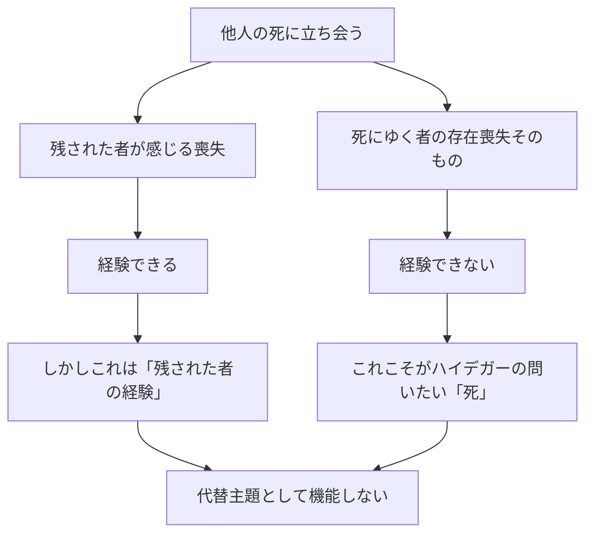

## 「§47」は何だと言っているのか

*ハイデガー『存在と時間』第47節*

---

### この節で言いたいことを一言で

**「他人の死を観察することは、自分の死を理解する代わりにならない」**

これが第47節の結論です。もう少し丁寧に言えば、「自分が死ぬときに到達する『まとまり（全体性）』を、他人の死を観察することで代わりに把握しようとする試みは、存在的にも哲学的にも失敗する」——そう主張する節です。

ハイデガーが否定するだけでなく、否定の先に「死は各自が自分で引き受けるしかない実存論的現象だ」という積極的な方向を示している点も見逃せません。

---

### なぜそもそも「他人の死」が候補に上がるのか

前の節（§46）では、「ダザイン（人間の在り方そのもの）は、まだ生きている間は常に何かが未完のまま残っており、死んで初めて全体が揃う。しかし死んだ瞬間に本人はもう経験できない」というジレンマが示されました。

> 死における現存在の全体性への到達は、同時に「そこ」（Da）の存在の喪失である。

ここで「そこ」（Da）とは、人間が世界に「居合わせている」という事実そのもの。全体になるとき、居合わせることが消える——だから自分の死を自分で経験することは原理的に不可能です。

そこで提案されるのが「代替案」です。

> 現存在は、それが本質的に他者とともにある（Mitsein）であるゆえに、死についての経験を獲得することができる。

人間はそもそも「他者と共に存在する」もの。ならば、他人が死ぬ場面を観察すれば、死という全体性を外から把握できるのではないか？　これが第47節が検討する問いです。

---

### 「他人の死」を観察したら、何が見えるのか

ハイデガーはまず、現象を丁寧に整理します。

人が死ぬとき、残るのは何か？

| 残るもの | ハイデガーの評価 |
|---|---|
| 物体（肉体・死体） | 「ただ現前しているもの」に過ぎない。純粋な物質ですらない |
| 解剖学の対象としての遺体 | 「生命」という観念に向けられた理解の対象。生きた存在の痕跡を帯びる |
| 「逝去者」（遺族が悼む故人） | 手許の道具でも純粋な物体でもなく、敬意ある「顧慮」の対象 |

> 「逝去者」——死者とは異なり、「遺族」から奪い去られた者——は、葬送、埋葬、墓所の崇拝という仕方での「配慮」の対象である。

注目すべきは「逝去者（Verstorbene）」と「死者（Gestorbene）」の区別です。前者は「遺族との関係において奪われた者」、つまり共存在の網の目の中に留まっている存在。後者はもっと中立的な「死んだ者」。この区別はすでに、他人の死を観察することで見えるのは「死にゆく者の経験」ではなく「残された者の喪失」だということを示唆しています。

---

### 「そばにいること」と「経験すること」は違う

ここが節の核心です。

> 私たちは本来的な意味で他者の死ぬことを経験するのではなく、せいぜいのところ、常に「そのそばにいる」にすぎない。

死は確かに「喪失」として経験される。しかしそれは**残された者たちの喪失**であって、死にゆく者が「被る」存在の喪失そのものではない。



この非対称性は原理的なものです。「もっとよく観察すれば」「心理学的に分析すれば」克服できる限界ではありません。

> たとえそばにいることのうちで他者の死ぬことを「心理学的に」明瞭にすることが可能であり許容されるとしても、その際に意味されている存在の様式——すなわち終わりへの到来として——は決して把握されない。

---

### 「代替可能性」の限界

「では、日常生活で人は互いに代わり合えるではないか」という反論をハイデガーは自ら取り上げます。

確かに、仕事・役割・用事の多くは他人が代わりにできます。これは「配慮（Besorgen）」の領域における代替可能性です。「あなたの代わりに買い物してきた」「あなたの代わりにその仕事を引き受けた」——こうした代替は日常の相互共存在の構造に属しています。

しかし死においてはどうか。

> 誰も他者に代わってその死を引き受けることはできない。誰かが「他者のために死へと赴く」ことは確かにできる。しかしそれが意味するのは、つねに「ある特定の事柄において」他者のために自己を犠牲にするということにすぎない。

| 代替できること | 代替できないこと |
|---|---|
| 買い物・仕事・役割の遂行 | 自分の死を死ぬこと |
| 「あなたのために」危険を引き受けること | 「あなたの代わりに」あなたの死を消すこと |
| 配慮（Besorgen）の圏域 | 実存の最終的な全体性 |

「あなたのために死ぬ」ことはできても、「あなたの死を肩代わりする」ことはできない。この区別は、死の「そのつど私のもの（Jemeinigkeit）」という性格から来ています。

> 死ぬことはいかなるダザインもそのつど自ら引き受けなければならない。死は、それが「ある」かぎりにおいて、本質的にそのつど私のものである。

---

### 否定の後に何が残るか

この節は「試みの挫折」を確認する節です。しかしハイデガーは「結果は否定的にとどまるわけではない」と明記しています。

否定的考察から見えてきたこと：

1. **死は出来事ではなく「実存論的現象」である**　——カレンダーに記された日付のような事実ではなく、各自の存在の在り方に関わる問題だ。
2. **死の分析はそのつど「自分自身」に向けられなければならない**　——他人という迂回路は原理的に閉じている。
3. **「息絶えること（Verenden）」と「死ぬこと（Sterben）」は区別されなければならない**　——動物が終わるのと、ダザインが終わるのは同じではない。医学の「死亡（Exitus）」概念も「息絶えること」とは一致しない。

> こうして、ダザインの全体的存在を現象的に適切な仕方で開示しようとする試みは、ふたたび挫折した。しかし考察の結果は否定的にとどまるわけではない。

---

### まとめ：この節の段取り

第47節は「一見もっともらしい代替案を丁寧に退ける」節です。その段取りはこうなっています。

```
①　他人の死は「客観的に」観察できる → 代替主題として使えそうだ
　　　　↓
②　しかし他人の死に立ち会って見えるのは「残された者の喪失」だけ
　　　　↓
③　日常では確かに人は互いに代替できる → しかし死においてはその代替が根本的に挫折する
　　　　↓
④　死は「そのつど私のもの」という性格を持つ実存論的現象
　　　　↓
⑤　したがって、分析はそのつど自己自身へと向けられなければならない
```

次節以降でハイデガーは、この方向を引き受けて「自分自身の死」の実存論的分析へと正面から踏み込んでいきます。第47節は、その準備として「迂回路を塞ぐ」役割を担った節です。
