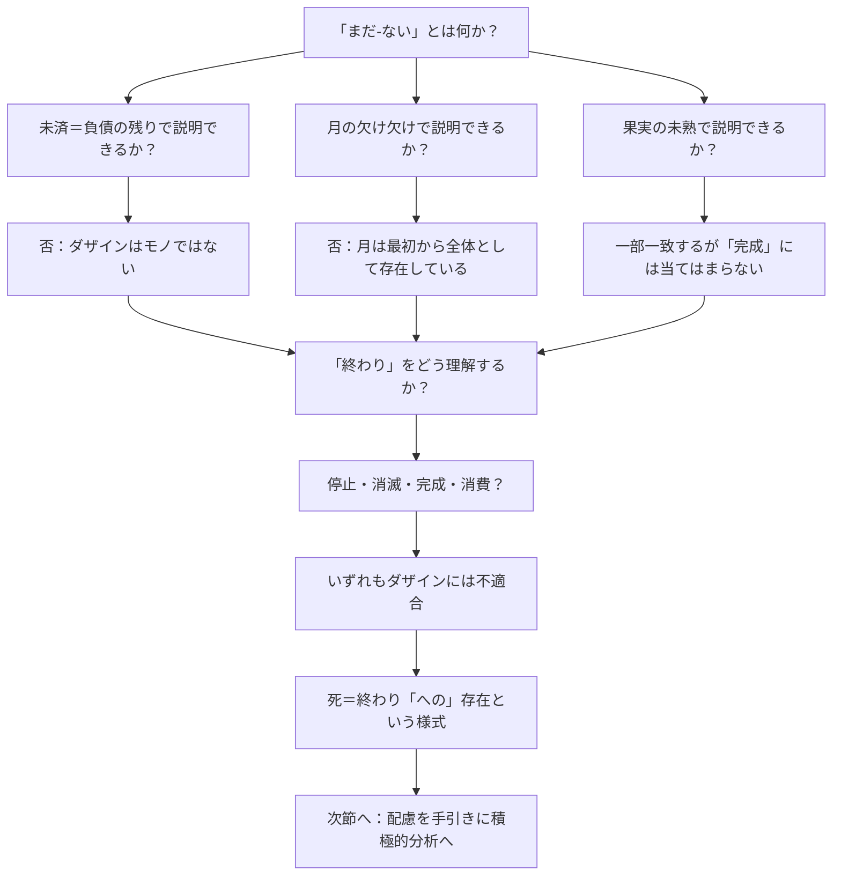

## 「§48」は何だと言っているのか

*ハイデガー『存在と時間』第48節*

---

### この節の結論を一言で

「死」をふつうの意味での「終わり」や「未済（未払いの残り）」と同じように考えても、ダザインにはまったく当てはまらない。だから「死とは何か」を正面から問う前に、まずその*的外れな理解を丁寧に退けておく*必要がある——そしてその退け方の道筋こそが、正しい問い方への地図になる。

> ダザインは、それがある限り、つねにすでにその終わりでもある。

これが節全体の核心文である。「死」は外から訪れる出来事ではなく、生きているあいだずっと「死へと向かって存在している」という存在の様式なのだ、とハイデガーは言いたい。

---

### 節が始まる前の「予防線」

節の冒頭でハイデガーはいきなり、この節でやろうとしていることの*限界*を宣言する。

> 終わりと全体性の存在論的な性格規定は、この研究の枠内ではあくまで暫定的なものにとどまらざるをえない。

なぜ暫定的なのか。「終わり」や「全体」という概念をきちんと分析するには、「存在とは何か」という問いへの答えがすでに出ていなければならない。しかしその答えこそが、この本全体でこれから求めているものだ。つまり、答えが出るまえに答えを使わなければならないという*循環*が最初からある、と正直に認めているのである。

---

### 節の進み方を地図にする



---

### ステップ①「未済」モデルの退け方

**ダザイン**（人間的な存在者、ここでは「私たちが存在していること」とほぼ同義）には、生きているかぎり「まだ死んでいない」という意味での「まだ‐ない」が常についてまわる。ハイデガーはまず、これを「未済」（未払いの借金の残り）と同じ構造で説明できるかどうかを検討する。

未済の論理はこうだ——

| 概念 | 内容 |
|------|------|
| 未済（Ausstand） | 本来ある場所に集まるべきものが、まだ揃っていない |
| 解消のしかた | 残りが逐次「入金」され、累積的に充填される |
| 存在様式 | 手許にある道具・モノと同じ（手許的存在者） |

しかし、ダザインの「まだ‐ない」はこの論理で動かない。

> ダザインは、その「まだ‐ない」が充填されたときに初めて出揃うのではない。むしろそのとき、ダザインはまさにもはや存在しないのである。

死んだとき、部品が揃ったわけではない。ダザイン自体がもう存在しない。ダザインは道具や商品のように「残りが届いて完成する」ものではない、とハイデガーは言う。

---

### ステップ②「月の欠け」モデルの退け方

次に月の満ち欠けを使った比喩が検討される。「まだ満月ではない」という「まだ‐ない」は、月の側の問題ではなく、あくまで私たちが月を「どこまで見えているか」という知覚の問題にすぎない。月はすでに常に全体として現前している。

> ここでの「まだ‐ない」は……もっぱら知覚的な把握にかかわるにすぎない。

これに対し、ダザインの「まだ‐ない」は認識の問題ではない。死はまだ「現実的でない」という意味での「まだ‐ない」であって、見えていないだけではない。だからこのモデルも的外れである。

---

### ステップ③「果実の未熟」モデル——一致点と限界

果実は、熟するまえから「熟成へと向かっている」という仕方で存在している。外から何かが付け足されるのではなく、果実自体がその未熟を内部から抱えて変化していく。

> 「まだ～ではないこと」はすでにその固有の存在のうちに組み込まれており……構成的契機としてそうなのである。

この点でダザインと似ている——「まだ‐ない」が外から付け加わるのではなく、存在の内部に組み込まれている。

**しかし**、果実は熟したときに「完成」する。死はその意味での完成ではない。

> ダザインが到達するところの死は、この意味における完成（Vollendung）であるのだろうか。……むしろそれらの可能性はまさに奪い去られるのではないか。

多くの場合、人は可能性を使い果たして死ぬのではなく、未完成のまま、あるいは消耗し果てて終わる。「熟成＝完成」モデルも外れる。

---

### ステップ④「終わり」の複数の意味を整理する

「終わること（enden）」という言葉自体にも、複数の意味が混在している。

| 終わりの種類 | 例 | 存在論的性格 |
|---|---|---|
| 停止して消滅 | 雨が止む | 眼前的存在者（目の前にある物）が消える |
| 途中で断絶 | 道路工事が打ち切られる | 未完成の眼前的存在者 |
| 仕上がり・完成 | 絵が最後の一筆で完成 | 眼前的・手許的存在者の完結 |
| 使い果たし | パンがなくなる | 手許的存在者（道具・素材）の消費 |

これらはいずれも、モノ（眼前的存在者）や道具（手許的存在者）に関する「終わり」である。ダザインを死によってこのどれかに当てはめようとすると、ダザインをモノ扱いすることになってしまう。

> 死において、ダザインは完成されてもなく、単純に消失したのでもなく、まして仕上がってしまったのでも手許的存在者として完全に利用可能になったのでもない。

---

### ステップ⑤「終わりへの存在」という転換

以上の退けをすべて経て、ようやくハイデガーは積極的な定式化に踏み込む。

> 死とともに意味される終わりは、ダザインの終わり——への——存在を意味するのではなく、この存在者の終わりへの存在を意味する。死は存在の一様式であり、ダザインはそれがある瞬間から、この様式を引き受ける。

「終わりへの存在（Sein-zum-Ende）」とは、死が最後にやってくる出来事だということではない。生まれた瞬間から、私たちは「死へ向かって存在している」という様式のなかにいる、ということだ。ハイデガーはここで中世の言葉を引く——

> 「人間が生へとやって来る瞬間から、彼はただちに死ぬのに十分な年齢に達している。」

---

### この節が全体の中で果たす役割

この節は、次の分析への「橋渡し」である。積極的な答えを出すのではなく、間違った地図を次々と破棄することで、正しい問い方の輪郭を描いている。

> 当初の試みが、ダザインの真正な全体性に到達する道を示せなかったのは、それが目標に至らなかったからである。それはただ否定的に示したにすぎない。

そしてこう宣言して節を閉じる——

> 死の積極的な実存論的分析……は、これまでに獲得されたダザインの根本体制、すなわち配慮（Sorge）という現象を手引きとして、遂行されなければならない。

**配慮**（Sorge）とは、ダザインの存在全体を支える根本的な構造のことで、ハイデガーがこれまでの節で解明してきたものだ。次の節以降では、この「配慮」を手がかりにして、死の正しい分析がはじまる。

---

### まとめ：この節でやっていること

```
「まだ‐ない」を「未済」で説明できない
        ↓
「まだ‐ない」を「月の欠け」で説明できない
        ↓
「終わり」を「果実の熟成」で説明できない（一部は合う）
        ↓
「終わること」の通常の意味はすべて不適合
        ↓
死＝「終わりへの存在」という様式
        ↓
次節：配慮を手引きに積極的分析へ
```

この節の貢献は、正解を出すことではなく、**間違った答えを丁寧に排除することで、正しい問いを立てること**にある。哲学の世界では、これは「否定的な準備作業」と呼ばれ、じつはきわめて重要な仕事である。
