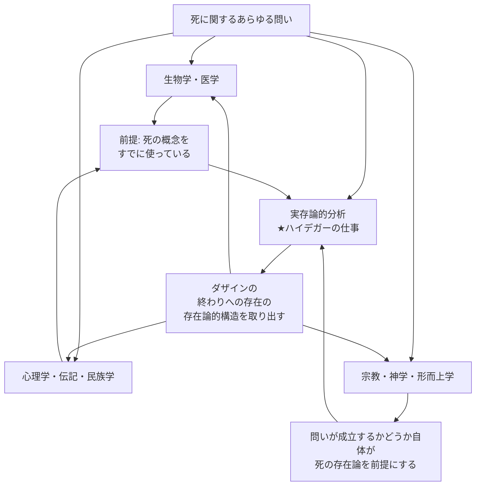

## 「§49」は何だと言っているのか

*ハイデガー『存在と時間』第49節*

---

### この節で言いたいことを一言で

第49節は「死の実存論的分析（ハイデガー自身の分析）はどこまでの仕事をするのか、そしてどこからは手を引くのか」を宣言する節です。本論（死の分析）に入る前の**仕切り直し**にあたります。

ハイデガーが繰り返し強調するのは一点だけです。

> 死の生物学・心理学・神義論・神学に向けられた諸問いに対して、実存論的分析は方法論的に先行する。

つまり、生物学・心理学・宗教・形而上学はそれぞれ死について大量の知識を持っていますが、それらはすべて「死とは何か」について**あらかじめ何かを前提している**。その前提を根元からきちんと検討するのが実存論的分析の仕事であり、それが先に来なければ他の問いはすべて砂上の楼閣になる、という主張です。

---

### 登場する専門語の簡単な説明

| 語 | この解説での意味 |
|---|---|
| **ダザイン** | 「そこに存在している」人間のあり方。単なる「人間」より広い概念 |
| **実存論的分析** | ダザインという存在のあり方を、構造として記述する哲学的な手続き |
| **オントロギッシュ／存在論的** | 「〜はそもそもどういう存在か」を問うレベル |
| **オンティッシュ／存在的** | 「〜についての事実や経験」を扱うレベル（例：統計、事例） |
| **終滅（Verenden）** | 動物や植物が単純に「尽きる」こと |
| **臨終（Ableben）** | 人間が生理的・医学的な意味で息絶えること |
| **死ぬこと（Sterben）** | ダザインが「自分の死へと向かっている」という存在様式そのもの |

---

### 段階１：生物学・医学の問いとその限界

ハイデガーはまず、死の研究として最もなじみ深いアプローチ——生物学・生理学——を取り上げます。

動植物の寿命データ、死の原因、老化の統計……これらはたしかに死を扱っています。しかしこうした研究は、「死とは何か」についての**前概念**（定義しないまま使っている概念）をすでに持ち込んでいます。

> 生と死についての、多かれ少なかれ明確化された前概念がその研究のなかで働いている。

さらにハイデガーはここで三つの概念を区別します。

| 概念 | 誰に・何に使う | 内容 |
|---|---|---|
| **終滅**（Verenden） | 生き物一般 | 単純に「尽きる」こと |
| **臨終**（Ableben） | 人間の生理的死 | 医学的・生命的な息絶え |
| **死ぬこと**（Sterben） | ダザインとしての人間 | 自分の死へと存在しているあり方そのもの |

この区別のポイントは次の一文に凝縮されています。

> ダザインは終滅することがない。しかしダザインが臨終しうるのは、それが死にゆくかぎりにおいてのみである。

動物のように「単純に尽きる」ことはダザインには起きない。息絶える（臨終）ことができるのは、そもそもダザインが常に自分の死へと向かって存在している（死にゆく）からだ、というわけです。

---

### 段階２：心理学・伝記・民族学の問いも「後続」する

死にゆく人の体験を描写する心理学、偉人の死に方を記録する伝記、「未開人」の死の観念を調べる民族学——これらもまた、死の概念を前提せずには一歩も進めません。

> 「死にゆくこと」の心理学は、死にゆくこと自体よりも「死にゆく者」の「生」についてより多くを明らかにするにすぎない。

心理学的な「死にゆく体験」の記述がどれだけ豊かでも、それはダザインが死に対してどういう**存在様式**にあるかを教えてくれません。体験を記述するためには、すでに死の概念が要る——その概念を下支えするのが実存論的分析なのです。

---

### 段階３：宗教・形而上学の問いは「外側」にある

「死後の世界はあるか」「魂は不死か」「死はなぜ世界に存在するのか」——これらはきわめて重大な問いですが、ハイデガーはそれらに**答えることも否定することもしない**と明言します。

> 死がダザインの「終わり」として規定されるとき、それによって「死の後」になお別の存在が可能であるかどうかについて、何ら存在的な決定が下されるわけではない。

なぜか。「死後に何があるか」を問う前に、そもそも「死とはどういう存在論的な構造を持つか」が明らかでなければ、その問い自体が成立するかどうかすら分からないからです。

> 死の後に何があるかを問うことが、方法論的に確かなかたちで意味と正当性をもって問われうるのは、死がその全き存在論的本質において把握されて後のことにすぎない。

同様に「死の形而上学」（死の意味、悪としての死など）も、死の存在論的性格の理解を前提にするため、この分析の「外側」に置かれます。

---

### 全体の流れを整理する

生物学・心理学・宗教はそれぞれ死を研究しますが、その研究が成立するための土台を提供するのが実存論的分析です。だから「方法論的に先行する」と言われます。

---

### 段階４：では実存論的分析は何に依拠するのか

先行するとはいえ、「思いつきで勝手に死を定義してもよい」わけではありません。

> この恣意性に歯止めをかけるのは、ただ、「終わり」がダザインの平均的日常性の中にどのように立ち現れているかという、そのあり方についての先行的な存在論的性格規定のみである。

ハイデガーの分析が依拠するのは、**ダザインが日常的にどう死と関わっているか**という観察です。宗教的な確信でも、生物学的なデータでもなく、「ふだんの生き方の中に死がどう顔を出しているか」——これが出発点になります。

そして重要な留保が付け加えられます。

> 実存論的概念規定には実存的な非拘束性が伴わなければならない。

「死についてこう構造を記述する」ということは、「あなたは死に対してこう向き合うべきだ」と命じることではない。構造の記述と、個々の人間の実際の態度（実存的な立場）は別の話である——この一線がここで引かれています。

---

### この節の結論：分析の射程と限界の地図

第49節はひとことで言えば「免責事項と管轄宣言」です。

| ハイデガーの分析が**する**こと | ハイデガーの分析が**しない**こと |
|---|---|
| 死の存在論的構造（終わりへの存在）を記述する | 死後の世界の有無を決定する |
| 他の諸学問の「前提」を明示・検討する | 死への望ましい態度を規定する |
| 日常性の中に死がどう現れるかを分析する | 死の形而上学的意味（悪・苦しみなど）を論じる |
| 生物学的な「終滅」と実存論的な「死にゆくこと」を区別する | 生物学・心理学の問いに答える |

この地図を確認したうえで、次節以降の本論——ダザインが日常的に死をどう「知っている」か、そして「死への本来的な向き合い方」とは何か——へと議論が進んでいきます。
