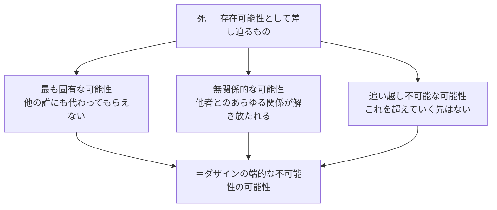
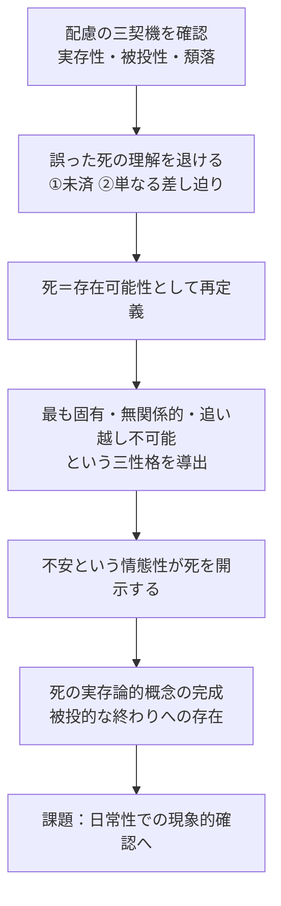

## 「§50」は何だと言っているのか

*ハイデガー『存在と時間』第50節*

---

### この節の結論を先に言ってしまう

第50節の仕事は一言でいえば、**「死とは何か」を存在論的に正確に定義すること**である。

ハイデガーはここで、「死 ＝ 消えてなくなること」でも「死 ＝ まだ来ていない出来事」でもなく、死を**「最も固有で、無関係的で、追い越し不可能な可能性」**として描き出す。そしてこの定義が、ダザインの根本構造である**配慮（Sorge）**と深くつながっていることを示す。

> 死とは、最も固有な、無関係的な、追い越し不可能な可能性として開示される。

この一文が節の核心である。以下では、そこへ至る段取りを丁寧に追う。

---

### ここまでの議論の確認：配慮という土台

まず前提の整理から入る。ハイデガーは以前の節で、人間（＝ダザイン）の存在の根本構造を**配慮（Sorge）**と呼んだ。

「ダザイン」とは、ハイデガーが「存在することを問い続けている人間」を指す術語である。「配慮」は「気にかけながら生きていること」とほぼ同義だが、より精密には次の三つの側面を含む。

| 配慮の三契機 | 意味 | 専門用語 |
|---|---|---|
| 自己への先駆 | 未来の自分に向かって投企している | 実存性 |
| すでに～の中にある | 自分では選ばなかった状況に投げ込まれている | 被投性 |
| ～のもとへの存在 | 世界の中のモノや他者に引き付けられている | 頽落 |

この三つは分離可能な部品ではなく、「生きている人間の一つの全体的な構造」の三つの顔である。ハイデガーが問うのは、「死」もまたこの三つから説明できるのか、ということだ。

---

### 「死＝まだ来ていないもの」では不十分な理由

第50節の冒頭で、ハイデガーはまずいくつかの誤った死の理解を退ける。

#### 誤り①：死は「未払いの借り」のようなもの

「いまだ～でない（Noch-nicht）」という解釈、つまり「死はまだ来ていない、あとで来るもの」という見方がある。果物がまだ熟していない、ローンがまだ払い終わっていない、そういう意味での「残り」として死を理解する立場だ。

ハイデガーはこれを否定する。

> 終わりに至ること（Zu-Ende-sein）は、実存論的には、終わりへの存在を意味する。

果物や借金は「モノ」として存在している。だが人間は「モノ」ではない。「いまだ来ていない出来事」として死を捉えることは、人間をモノと同列に扱う誤りを犯している、とハイデガーは言う。

#### 誤り②：死は「近づいてくる出来事」のようなもの

では「差し迫り（Bevorstand）」という概念で死を捉えればよいか？ 嵐が近づく、引っ越しが近づく、友人が訪ねてくる——そういう意味での「差し迫り」として死を理解することもできそうだ。

しかしこれも不十分である。嵐や引っ越しは外から来る出来事であり、私の外側にある「世界の中のモノ」に属する。死はそういう種類の存在ではない。

---

### 死の正確な定義：三つの性格

では死とは何か。ハイデガーはここで、死を**「存在可能性（Seinkönnen）」**として捉えることを提案する。「存在可能性」とは「自分がこうあれる、こうなれる」という可能性のことだ。旅に出る、議論する、何かを諦める——これらは全て自分自身の可能性として差し迫ってくる。

死もまた、この種の可能性である。ただし、他のあらゆる可能性とは異なる特別な可能性だ。ハイデガーはその特別さを三語で言い表す。

| 性格 | 意味をほぐすと |
|---|---|
| **最も固有（eigentlich）** | 死は自分自身が引き受けるしかなく、誰かに代わってもらえない |
| **無関係的（unbezüglich）** | 死においては、他の誰かとの関係が全て切り離される。死は根本的に一人称のものだ |
| **追い越し不可能（unüberholbar）** | どんな可能性も「その先」を想像できるが、死だけは超えていく先がない。これが究極の可能性だ |

そしてこの三つが揃ったとき、死は「端的なダザインの不可能性の可能性」という逆説的な表現で語られる。「もはや存在できなくなること」が、まさに一つの可能性として自分に差し迫っている——それが死だ。

---

### 三つの配慮の契機と死のつながり

ここで節の冒頭で確認した「配慮の三契機」が戻ってくる。死は配慮の全ての側面によって色付けられている。

| 配慮の契機 | 死における現れ |
|---|---|
| **実存性**（自己への先駆） | 死への存在は、ダザインが自己を先取りして（Sich-vorweg）あるという構造の最も根源的な具体化である |
| **被投性**（すでに投げ込まれている） | 死の可能性は自分で「入手」するものではなく、実存し始めた瞬間からすでに被投されている |
| **頽落**（世界に引き付けられている） | 日常においてダザインはたいていの場合、死から目を逸らし、退落の様式で死に向かっている |

> ダザインが実存する以上、ダザインはすでにつねにこの可能性のなかへと被投されている。

死は外から「やってくる」ものではなく、最初から自分の存在構造の中に組み込まれている——これがハイデガーの主張の核心だ。

---

### 不安：死を開示する情態性

死への被投性は、**不安（Angst）**という気分の中で最も鋭く開示される。ハイデガーは不安と「死去への恐れ」を区別する。

「恐れ」は特定の何かを恐れる。たとえば「痛いのが怖い」「別れが怖い」という形で、恐れの対象は特定できる。だが**不安**の前に立つものは、「世界内存在そのもの」である。つまり、何かが怖いのではなく、「そもそも自分が世界の中にこうして存在していること自体」が不安の源泉になる。

> 死への不安を、死去への恐れと混同してはならない。

この不安は弱い人間の個人的な感情ではなく、「被投された存在として自らの終わりへと向かって実存するということの開示性」——つまりダザインの根本的な在り方を照らし出す情態性だ。

---

### 節の末尾：残された課題

節の最後で、ハイデガーは重要な留保を置く。

死への存在と配慮の構造的なつながりを「予描」しただけでは不十分だ、と言う。このつながりが本当に正当化されるためには、**日常性の中で現象として確かめられなければならない**。

> 死への存在が根源的かつ本質的にダザインの存在に属するのであれば、それはまた——さしあたりは非本来的なかたちにおいてではあれ——日常性において示されうるのでなければならない。

つまり第50節は「結論」ではなく「骨格を描いた設計図」であり、次以降の節でその日常的な現われを検証していく、という宣言でもある。

---

### まとめ：§50 の論証の流れ

第50節は、死を「まだ来ていない出来事」から「今ここで私の存在構造を貫いている可能性」へと転換させる節である。そしてその可能性こそが、ダザインの根本構造である配慮——自己への先駆・被投性・頽落——の全てを最も先鋭な形で照らし出す、とハイデガーは言う。
